# Wazuh Indexer Installation

---

# Table of Contents

1. Requirements
2. Create the Certificates
3. Edit the `config.yml` File
4. Run the `wazuh-certs-tool.sh` Script
5. Compress the Certificates
6. Remove the `wazuh-certificates` Directory
7. Copy the Compressed Certificates
8. Install Missing Packages (Part 1)
9. Install Missing Packages (Part 2)
10. Download and Configure the Public Key
11. Add the Official Wazuh Repository
12. Update the Package List
13. Install the Wazuh Indexer Package
14. Edit the Indexer Configuration File
15. Configure the Firewall Ports
16. Deploy the Certificates
17. Start the Service
18. Lock the Process Address Space in RAM
19. Initialize the Security Configuration
20. Verify the Memory Lock Configuration
21. Test the Cluster Installation
22. Test the Cluster Functionality
23. Disable Wazuh Updates

---

## 1 - Requirements

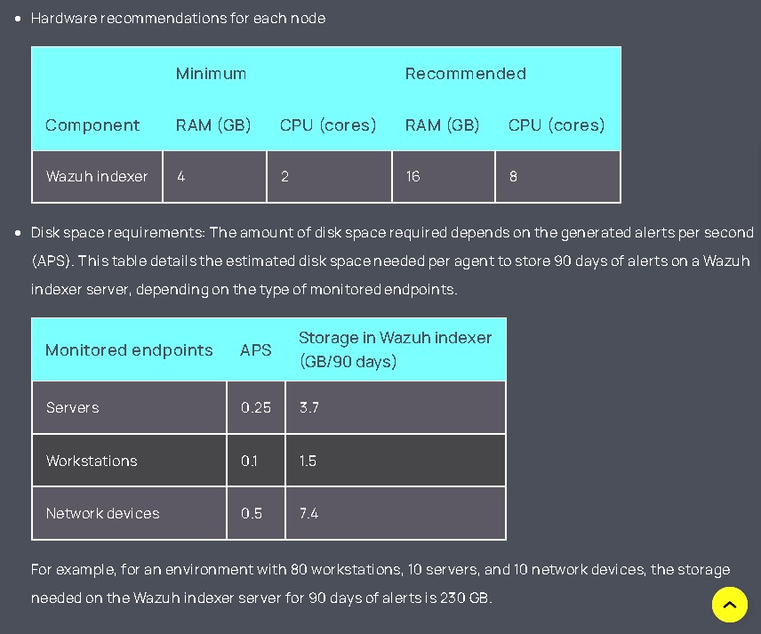

---

## 2 - Create the Certificates

Download the Wazuh certificate generation tool.

```bash
sudo curl -sO https://packages.wazuh.com/4.14/wazuh-certs-tool.sh
```

Grant execution permissions.

```bash
sudo chmod +x wazuh-certs-tool.sh
```

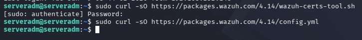

---

## 3 - Edit the `config.yml` File

Edit the `config.yml` file and replace the node names and IP addresses with the corresponding values.

This must be done for every Wazuh Indexer, Wazuh Server, and Wazuh Dashboard node.

Add the required node definitions.

```bash
sudo nano config.yml
```


Before editing:

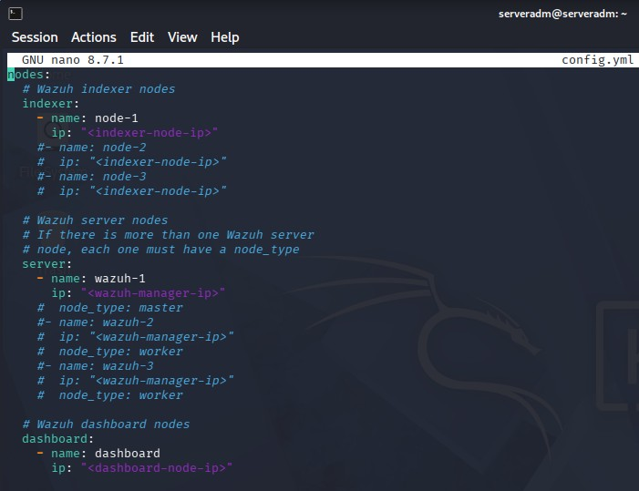

After editing:

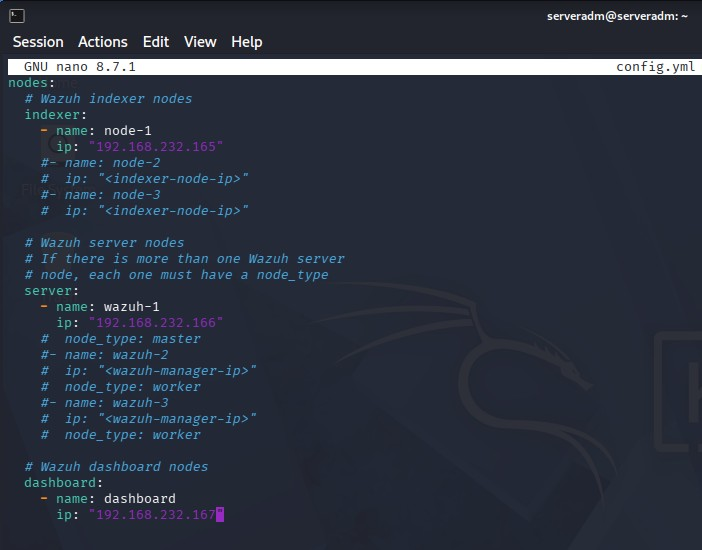

Save the file.

```
Ctrl + X
Y
Enter
```


---

## 4 - Run the `wazuh-certs-tool.sh` Script

Run the certificate generation script.

```bash
sudo ./wazuh-certs-tool.sh -A
```

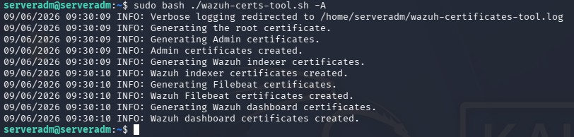

---

## 5 - Compress the Certificates

Compress the generated certificates.

```bash
sudo tar -cvf wazuh-certificates.tar wazuh-certificates/
```
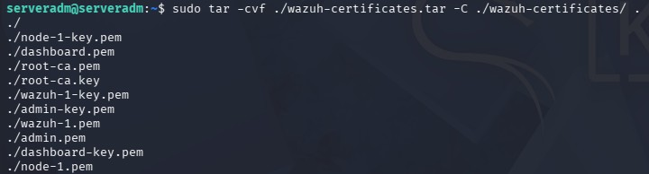

---

## 6 - Remove the `wazuh-certificates` Directory

Remove the extracted certificates directory.

```bash
rm -rf wazuh-certificates/
```


---

## 7 - Copy the Compressed Certificates

Copy the `wazuh-certificates.tar` file to the Wazuh Server and Dashboard.

```bash
scp /home/<USER>/wazuh-certificates.tar <user>@<IP_SERVER>:/home/<USER>
scp /home/<USER>/wazuh-certificates.tar <user>@<IP_DASHBOARD>:/home/<USER>
```
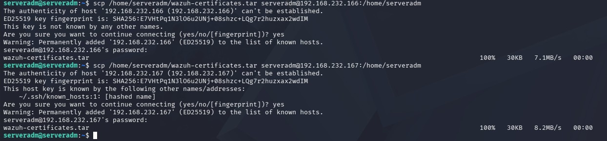

Verify if the file is on the Wazuh server

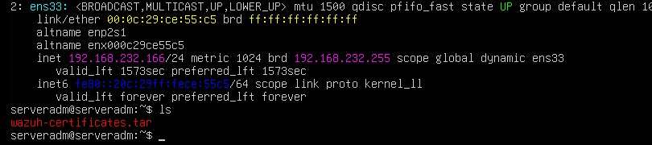

Verify if the file is on the Wazuh dashboard

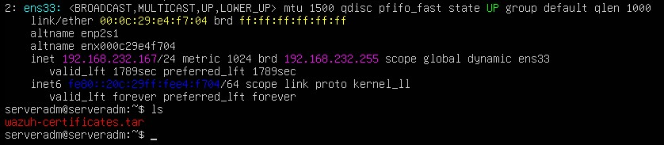

---

## 8 - Install Missing Packages (Part 1)

Run the following command to install the required packages if they are missing.

```bash
sudo apt-get install debconf adduser procps
```
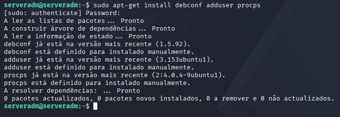

## 9 - Install Missing Packages (Part 2)

Run the following command to install the required packages if they are missing.

```bash
sudo apt-get install gnupg apt-transport-https
```

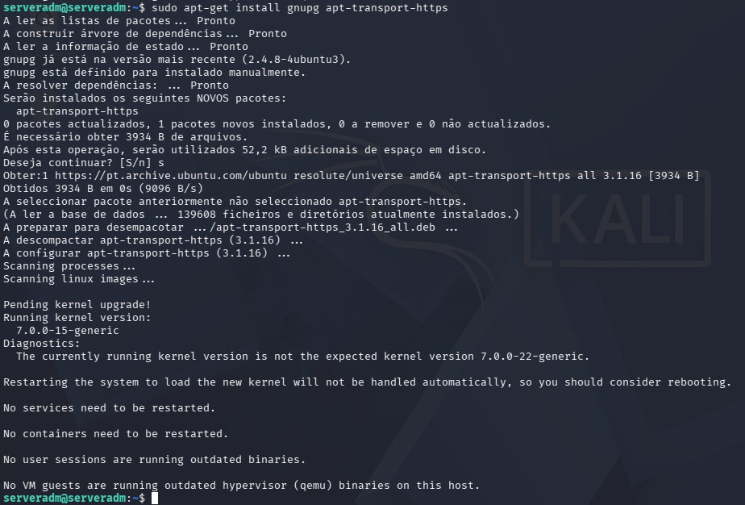

---

## 10 - Download and Configure the Public Key

Download and import the official Wazuh GPG key.

```bash
curl -s https://packages.wazuh.com/key/GPG-KEY-WAZUH | sudo gpg --no-default-keyring --keyring gnupg-ring:/usr/share/keyrings/wazuh.gpg --import && sudo chmod 644 /usr/share/keyrings/wazuh.gpg
```

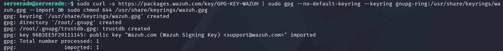

---

## 11 - Add the Official Wazuh Repository

Add the official Wazuh repository to the APT sources list.

```bash
echo "deb [signed-by=/usr/share/keyrings/wazuh.gpg] https://packages.wazuh.com/4.x/apt/ stable main" | sudo tee /etc/apt/sources.list.d/wazuh.list
```

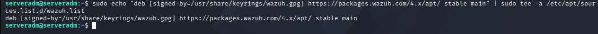

---

## 12 - Update the Package List

Update the package information.

```bash
sudo apt-get update
```

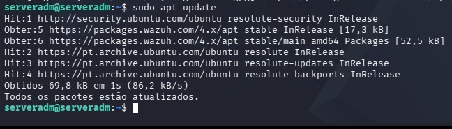

---

## 13 - Install the Wazuh Indexer Package

Install the Wazuh Indexer package.

```bash
sudo apt-get -y install wazuh-indexer
```

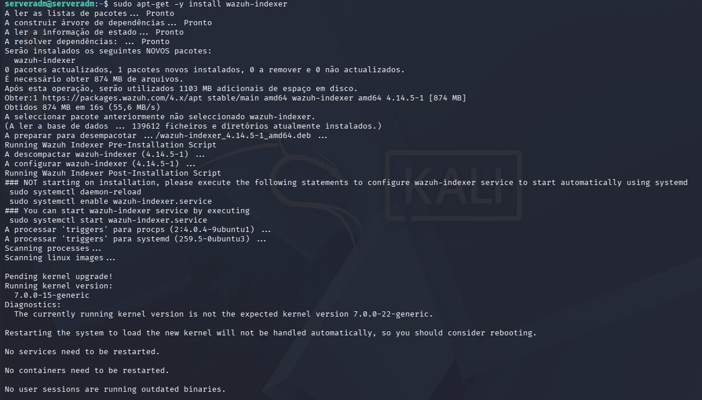

---

## 14 - Edit the Indexer Configuration File

Open the Wazuh Indexer configuration file.

```bash
sudo nano /etc/wazuh-indexer/opensearch.yml
```

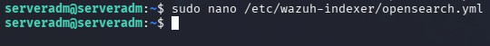

Before editing, configure the Indexer IP address as the `network.host`:

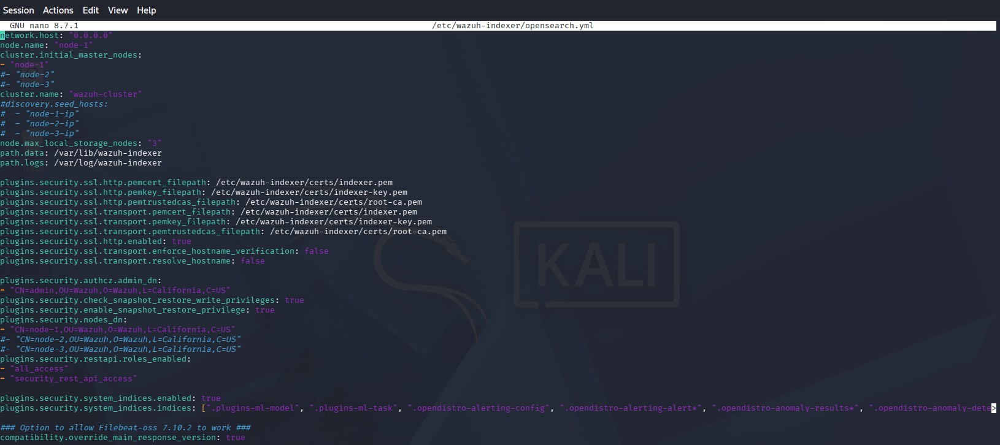

After editing:

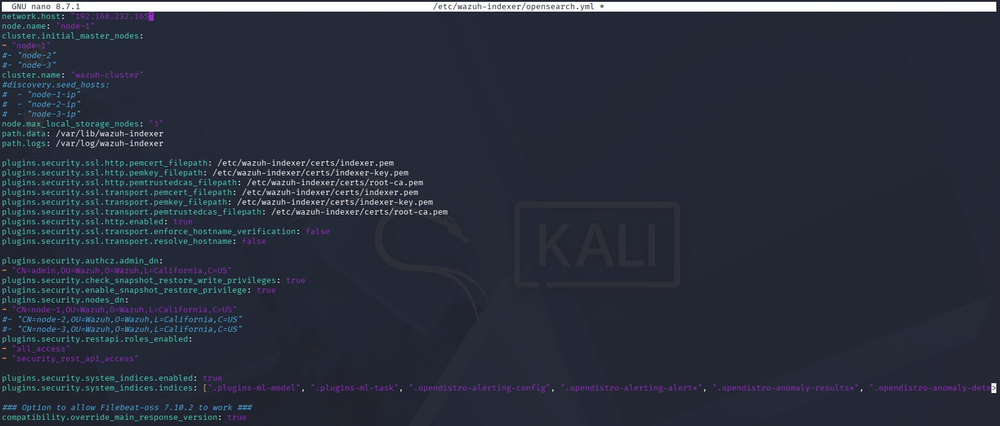

Save the file.

```text
Ctrl + X
Y
Enter
```

---

## 15 - Configure the Firewall Ports

Allow communication between the Wazuh Server and the Wazuh Indexer.

```bash
sudo ufw allow from <IP_SERVER> to any port 9200 proto tcp comment 'wazuh server to indexer'
```

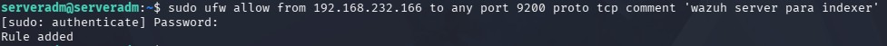

Allow communication between the Wazuh Dashboard and the Wazuh Indexer.

```bash
sudo ufw allow from <IP_DASHBOARD> to any port 9200 proto tcp comment 'wazuh dashboard to indexer'
```


Verify that the firewall rules have been applied.

```bash
sudo ufw status verbose
```

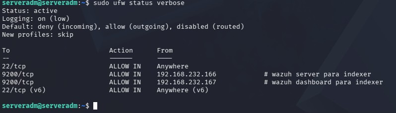

---

## 16 - Deploy the Certificates

Create the `certs` directory inside the Wazuh Indexer configuration directory.

```bash
sudo mkdir /etc/wazuh-indexer/certs
```


Verify that the directory has been created.

```bash
sudo ls /etc/wazuh-indexer/
```

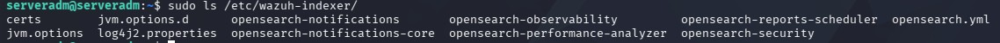

Extract the `wazuh-certificates.tar` archive and copy the required certificates.

```bash
sudo tar -xf ./wazuh-certificates.tar \
-C /etc/wazuh-indexer/certs/ \
./node-1.pem \
./node-1-key.pem \
./admin.pem \
./admin-key.pem \
./root-ca.pem
```

Verify that the certificates have been extracted.

```bash
sudo ls /etc/wazuh-indexer/certs
```

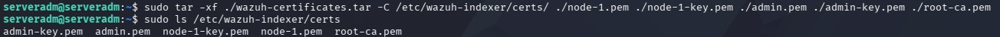

Rename `node-1.pem` to `indexer.pem`.

```bash
sudo mv -n /etc/wazuh-indexer/certs/node-1.pem /etc/wazuh-indexer/certs/indexer.pem
```

Verify the new filename.

```bash
sudo ls /etc/wazuh-indexer/certs
```

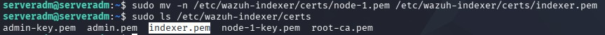

Rename `node-1-key.pem` to `indexer-key.pem`.

```bash
sudo mv -n /etc/wazuh-indexer/certs/node-1-key.pem /etc/wazuh-indexer/certs/indexer-key.pem
```

Verify the new filename.

```bash
sudo ls /etc/wazuh-indexer/certs
```

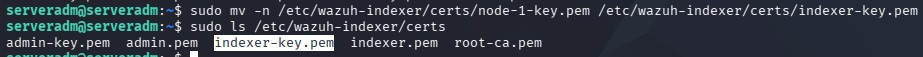

Enter a root shell.

```bash
sudo -i
```


Set the directory permissions.

```bash
chmod 500 /etc/wazuh-indexer/certs
```


Set the file permissions.

```bash
chmod 400 /etc/wazuh-indexer/certs/*
```


Set the owner of the directory and files.

```bash
chown -R wazuh-indexer:wazuh-indexer /etc/wazuh-indexer/certs
```


Exit the root shell.

```bash
exit
```


Remove the compressed certificate archive.

```bash
sudo rm -f ./wazuh-certificates.tar
ls
```

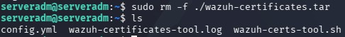

---

## 17 - Start the Service

Reload the systemd daemon.

```bash
sudo systemctl daemon-reload
```

Enable the Wazuh Indexer service.

```bash
sudo systemctl enable wazuh-indexer
```

Start the Wazuh Indexer service.

```bash
sudo systemctl start wazuh-indexer
```

Verify the service status.

```bash
sudo systemctl status wazuh-indexer
```

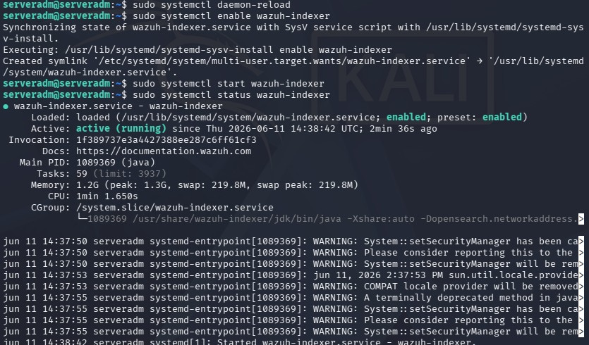

---

## 18 - Lock the Process Address Space in RAM

Edit the `opensearch.yml` configuration file.

```bash
sudo nano /etc/wazuh-indexer/opensearch.yml
```

Before editing:

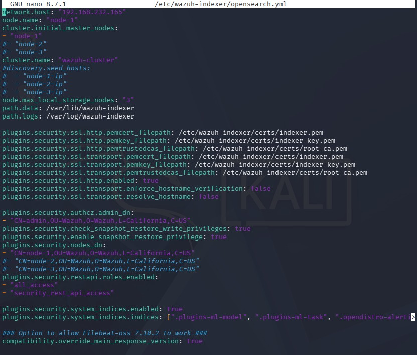

Add the following line:

```yaml
### Memory locking ###
bootstrap.memory_lock: true
```

After editing:

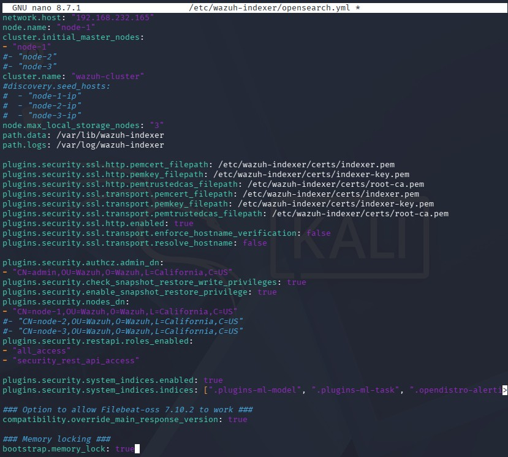

Save the file.

```text
Ctrl + X
Y
Enter
```

Create the directory for the systemd override file.

```bash
sudo mkdir -p /etc/systemd/system/wazuh-indexer.service.d/
```


Verify that the directory has been created.

```bash
sudo ls /etc/systemd/system/
```

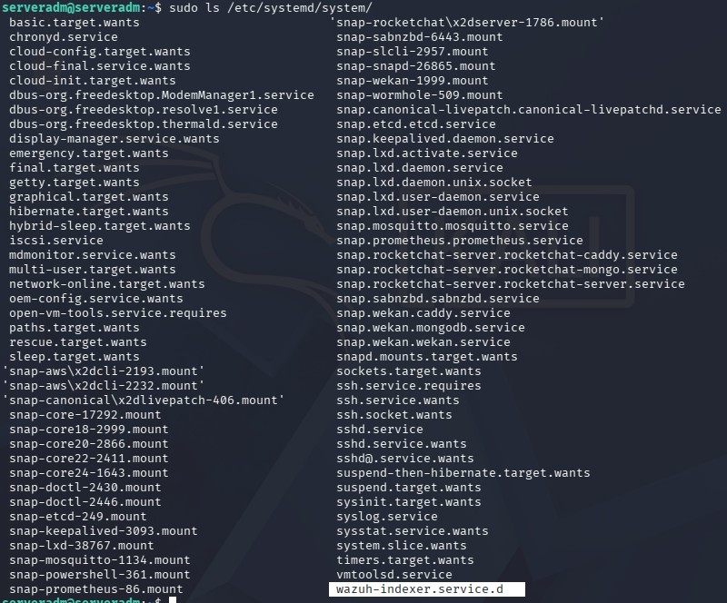

Create the `wazuh-indexer.conf` file with this content:

```bash
sudo tee /etc/systemd/system/wazuh-indexer.service.d/wazuh-indexer.conf << 'EOF'
[Service]
LimitMEMLOCK=infinity
EOF
```

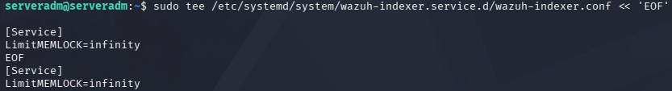

Edit the JVM configuration.

```bash
sudo nano /etc/wazuh-indexer/jvm.options
```


Before editing:

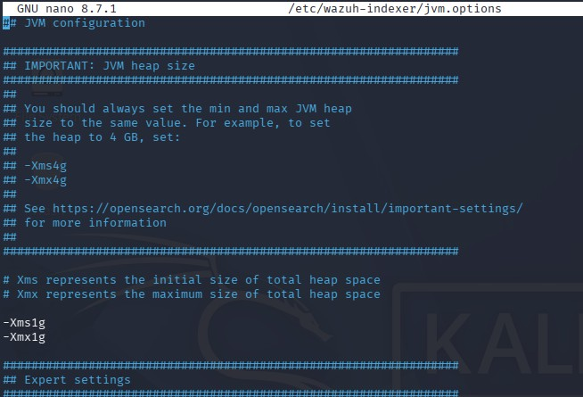

Since this machine has **4 GB of RAM**, configure the JVM to use half of the available memory.

```text
-Xms2g
-Xmx2g
```

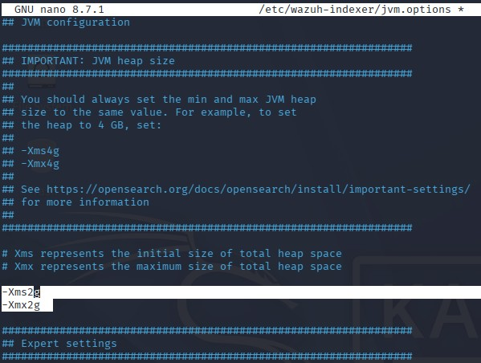

Save the file.

```text
Ctrl + X
Y
Enter
```

Restart the Wazuh Indexer service.

```bash
sudo systemctl daemon-reload
sudo systemctl restart wazuh-indexer
sudo systemctl status wazuh-indexer
```

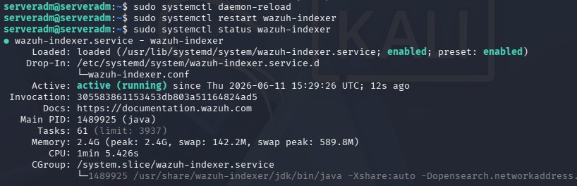

---

## 19 - Initialize the Security Configuration

Run the security initialization script.

```bash
sudo /usr/share/wazuh-indexer/bin/indexer-security-init.sh
```

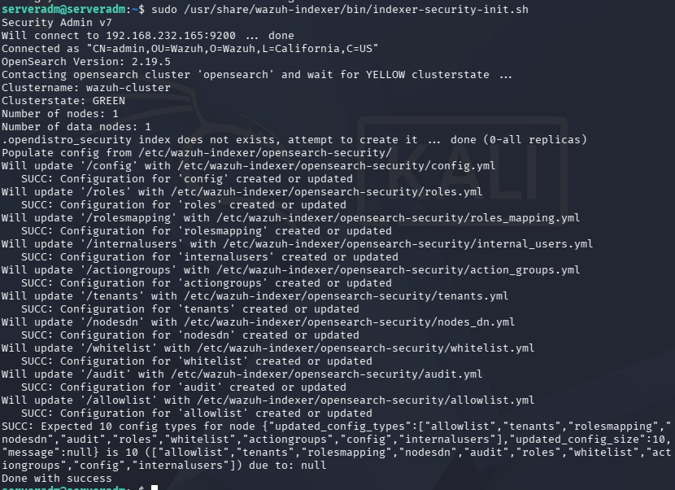

---

## 20 - Verify the Memory Lock Configuration

Verify that `memory_lock` is enabled.

```bash
curl -k -u admin:admin "https://<IP_INDEXER>:9200/_nodes?filter_path=**.mlockall&pretty"
```

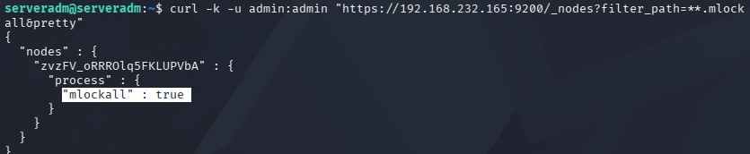

---

## 21 - Test the Cluster Installation

Test the Wazuh Indexer installation.

```bash
curl -k -u admin https://<IP_INDEXER>:9200
```

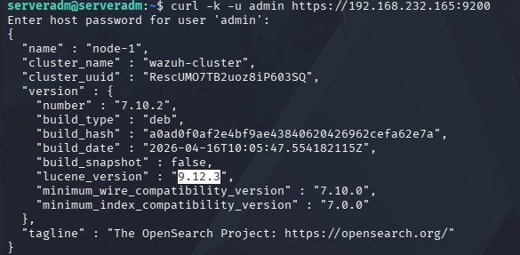

---

## 22 - Test the Cluster Functionality

Verify that the cluster node is running correctly.

```bash
curl -k -u admin https://<IP_INDEXER>:9200/_cat/nodes?v
```

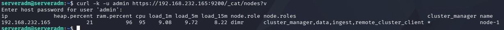

---

## 23 - Disable Wazuh Updates

Disable the Wazuh repository to prevent automatic updates.

```bash
sudo sed -i "s/^deb /#deb /" /etc/apt/sources.list.d/wazuh.list
sudo apt update
```

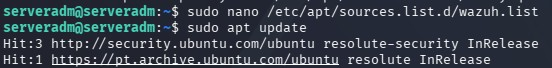

---

# Next Step

Continue with the Wazuh Server installation.

[02 - Wazuh Server Installation](02-wazuh-server.md)