# Wazuh Server Installation

---

Table of Contents

1. Requirements
2. Install Missing Packages
3. Install the GPG Key
4. Add the Official Wazuh Repository
5. Update the Package List
6. Install the Wazuh Server
7. Configure the Firewall Ports
8. Install Filebeat
9. Configure Filebeat
10. Create an Encrypted Keystore
11. Add the Default Username and Password
12. Download the Alert Templates
13. Install the Wazuh Filebeat Module
14. Deploy the Certificates
15. Configure the Wazuh Indexer Connection
16. Configure the Indexer Host
17. Start the Wazuh Server Service
18. Start the Filebeat Service
19. Disable Wazuh Updates

---

## 1 - Requirements

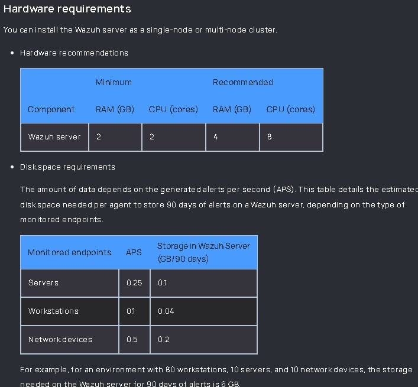

### Nice to know
If the installation is complete but the server does not have enough resources, monitor the following files.

```
/var/ossec/var/run/wazuh-analysisd.state
```

The `events_dropped` value indicates whether events are being discarded because of insufficient resources.

```
/var/ossec/var/run/wazuh-remoted.state
```

The `discarded_count` value indicates whether agent messages are being discarded.

Both values should remain **0** while the environment is operating correctly.

If either value increases, consider adding additional nodes to the cluster.

---

## 2 - Install Missing Packages

Run the following command to install the required packages.

```bash
sudo apt-get install gnupg apt-transport-https
```

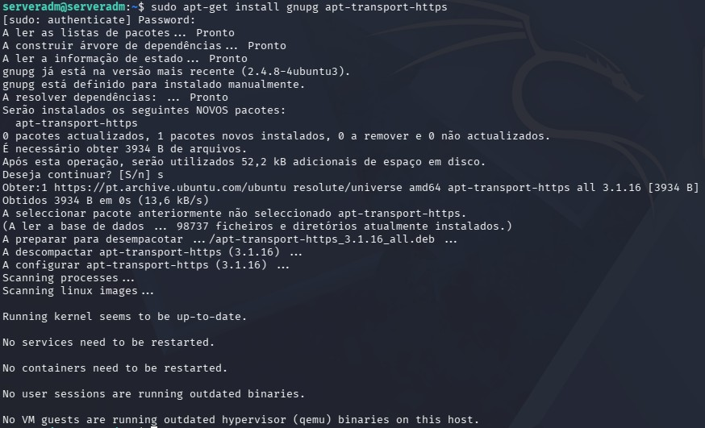

---

## 3 - Install the GPG Key

Download and import the official Wazuh GPG key.

```bash
sudo curl -s https://packages.wazuh.com/key/GPG-KEY-WAZUH | sudo gpg --no-default-keyring --keyring gnupg-ring:/usr/share/keyrings/wazuh.gpg --import && sudo chmod 644 /usr/share/keyrings/wazuh.gpg
```

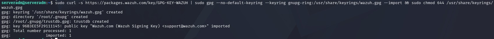

---

## 4 - Add the Official Wazuh Repository

Add the official Wazuh repository to the APT sources list.

```bash
echo "deb [signed-by=/usr/share/keyrings/wazuh.gpg] https://packages.wazuh.com/4.x/apt/ stable main" | sudo tee /etc/apt/sources.list.d/wazuh.list
```


---

## 5 - Update the Package List

Update the package information.

```bash
sudo apt-get update
```

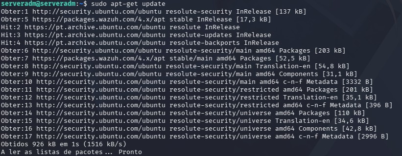

---

## 6 - Install the Wazuh Server

Install the Wazuh Server package.

```bash
sudo apt-get -y install wazuh-manager
```

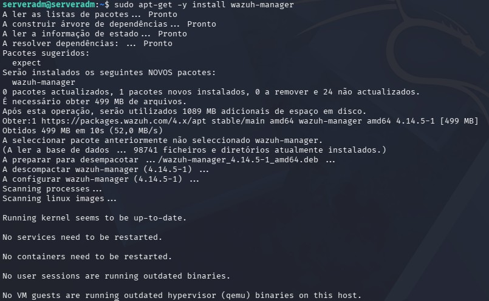

---

## 7 - Configure the Firewall Ports

Allow agent communication.

```bash
sudo ufw allow 1514/tcp comment ‘Wazuh agent communication’
```

Allow agent registration.

```bash
sudo ufw allow 1515/tcp comment ‘Wazuh agent enrollment’
```

Allow access to the Wazuh API.

```bash
sudo ufw allow from <IP_DASHBOARD> to any port 55000 proto tcp
```

Verify that the firewall rules have been applied.

```bash
sudo ufw status verbose
```

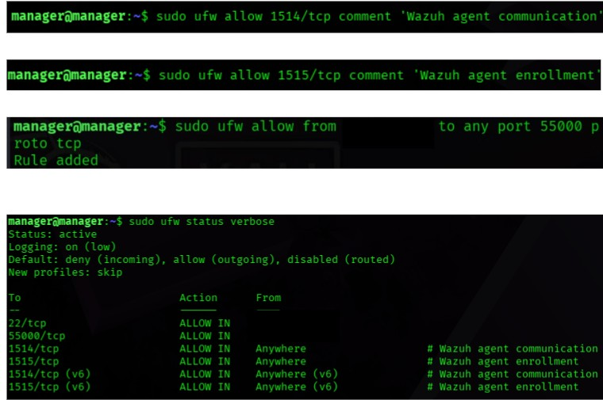

---

## 8 - Install Filebeat

Install the Filebeat package.

```bash
sudo apt-get -y install filebeat
```

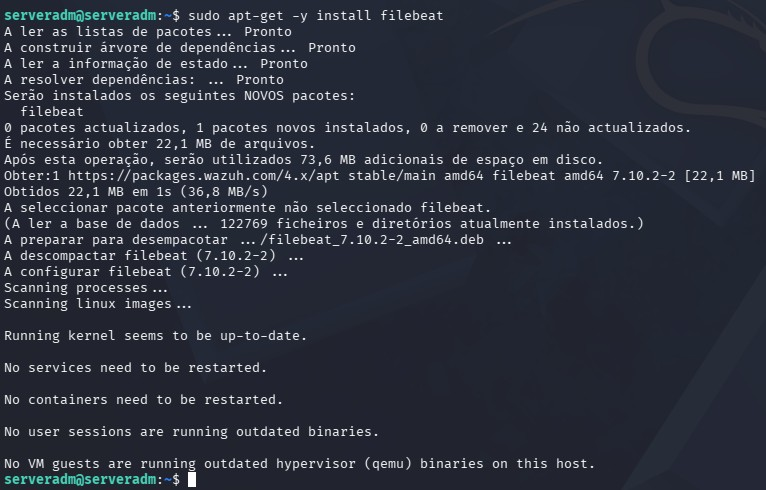

---

## 9 - Configure Filebeat

Download the preconfigured Filebeat configuration file.

```bash
sudo curl -so /etc/filebeat/filebeat.yml https://packages.wazuh.com/4.14/tpl/wazuh/filebeat/filebeat.yml
```

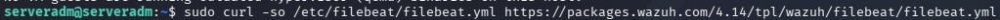

Verify that the file has been downloaded.

```bash
sudo ls /etc/filebeat
```

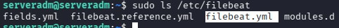

Open the Filebeat configuration file.

```bash
sudo nano /etc/filebeat/filebeat.yml
```


Before editing, configure the Indexer IP address as the `hosts`:

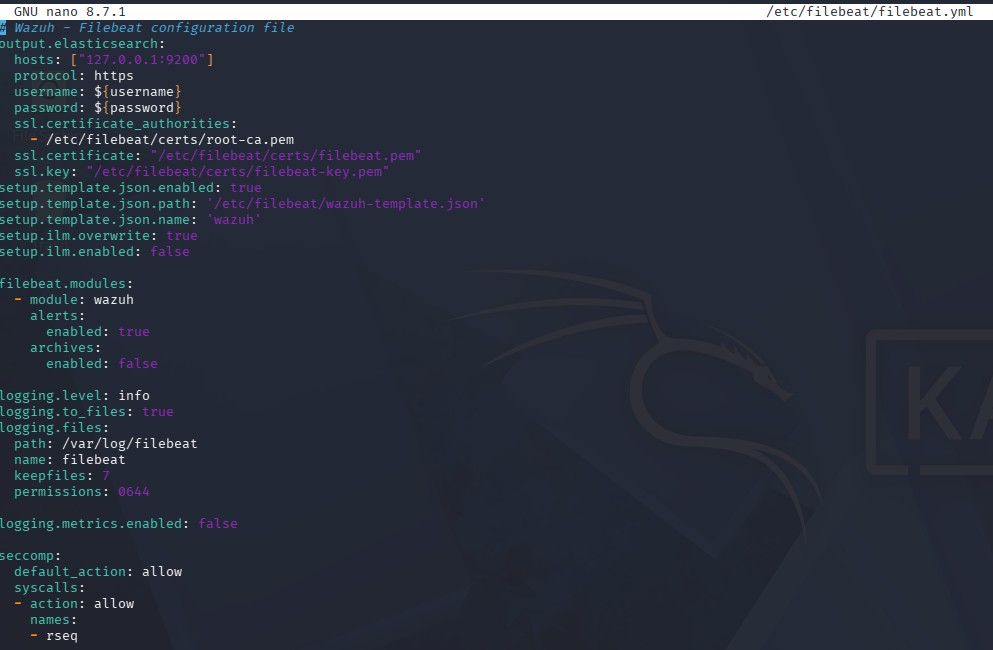

After editing:

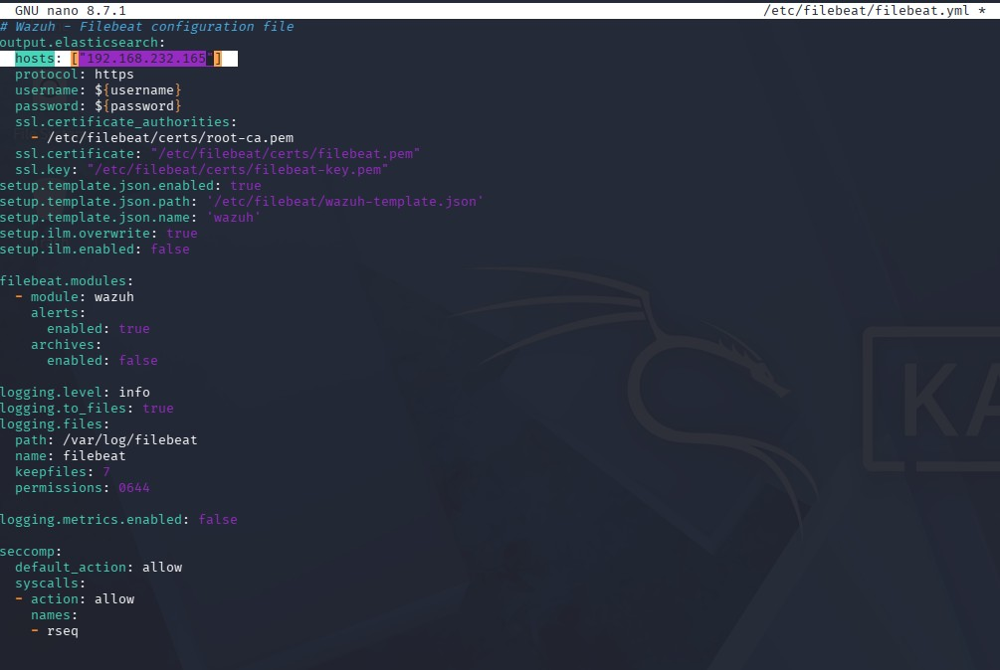

Save the file.

```text
Ctrl + X
Y
Enter
```

---

## 10 - Create an Encrypted Keystore

Create the Filebeat encrypted keystore.

```bash
sudo filebeat keystore create
```

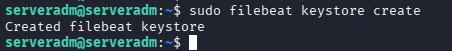

---

## 11 - Add the Default Username and Password

Add the default username to the Filebeat keystore.

```bash
echo admin | sudo filebeat keystore add username --stdin --force
```

Add the default password to the Filebeat keystore.

```bash
echo admin | sudo filebeat keystore add password --stdin --force
```

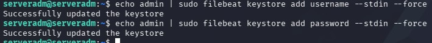

---

## 12 - Download the Alert Templates

Download the Wazuh Indexer template.

```bash
sudo curl -so /etc/filebeat/wazuh-template.json https://raw.githubusercontent.com/wazuh/wazuh/v4.14.5/extensions/elasticsearch/7.x/wazuh-template.json
```


Verify that the template has been downloaded.

```bash
sudo ls /etc/filebeat
```

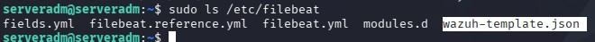

Grant read permissions to the template file.

```bash
sudo chmod go+r /etc/filebeat/wazuh-template.json
```

Verify the permissions.

```bash
sudo ls -ld /etc/filebeat/wazuh-template.json
```

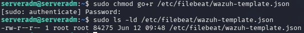

---

## 13 - Install the Wazuh Filebeat Module

Install the Wazuh Filebeat module.

```bash
sudo curl -s https://packages.wazuh.com/4.x/filebeat/wazuh-filebeat-0.5.tar.gz | sudo tar -xvz -C /usr/share/filebeat/module
```

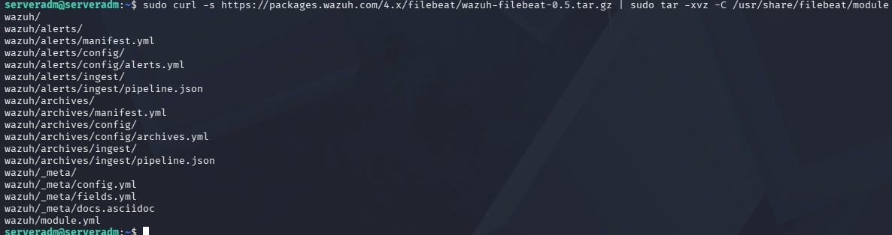

---

## 14 - Deploy the Certificates

Verify that the `wazuh-certificates.tar` file is available.

```bash
ls
```


Create the `certs` directory inside the Filebeat configuration directory.

```bash
sudo mkdir /etc/filebeat/certs
```

Verify that the directory has been created.

```bash
sudo ls /etc/filebeat
```

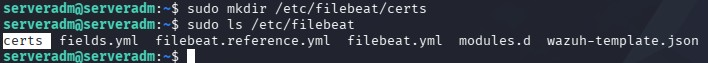

Extract the required certificates.

```bash
sudo tar -xf ./wazuh-certificates.tar \
-C /etc/filebeat/certs/ \
./node-1.pem \
./node-1-key.pem \
./root-ca.pem
```

Verify that the certificates have been extracted.

```bash
sudo ls /etc/filebeat/certs
```

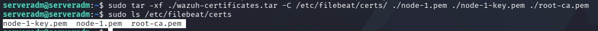

Rename `node-1.pem` to `filebeat.pem`.

```bash
sudo mv -n /etc/filebeat/certs/node-1.pem /etc/filebeat/certs/filebeat.pem
```

Verify the new filename.

```bash
sudo ls /etc/filebeat/certs
```

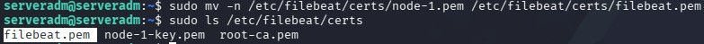

Rename `node-1-key.pem` to `filebeat-key.pem`.

```bash
sudo mv -n /etc/filebeat/certs/node-1-key.pem /etc/filebeat/certs/filebeat-key.pem
```

Verify the new filename.

```bash
sudo ls /etc/filebeat/certs
```

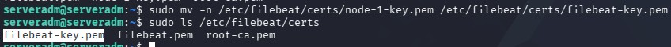

Enter a root shell.

```bash
sudo -i
```


Set the directory permissions.

```bash
chmod 500 /etc/filebeat/certs
```

Set the file permissions.

```bash
chmod 400 /etc/filebeat/certs/*
```

Set the owner of the directory and files.

```bash
chown -R root:root /etc/filebeat/certs
```

Exit the root shell.

```bash
exit
```

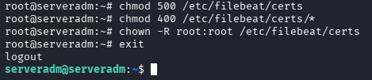

Remove the compressed certificate archive.

```bash
sudo rm -f ./wazuh-certificates.tar
ls
```

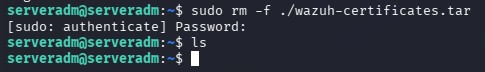

---

## 15 - Configure the Wazuh Indexer Connection

Add the Wazuh Indexer username.

```bash
echo 'admin' | sudo /var/ossec/bin/wazuh-keystore -f indexer -k username
```

Add the Wazuh Indexer password.

```bash
echo 'admin' | sudo /var/ossec/bin/wazuh-keystore -f indexer -k password
```

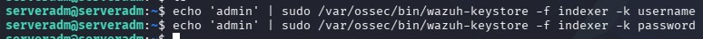

Open the Wazuh Manager configuration file.

```bash
sudo nano /var/ossec/etc/ossec.conf
```


Before editing:

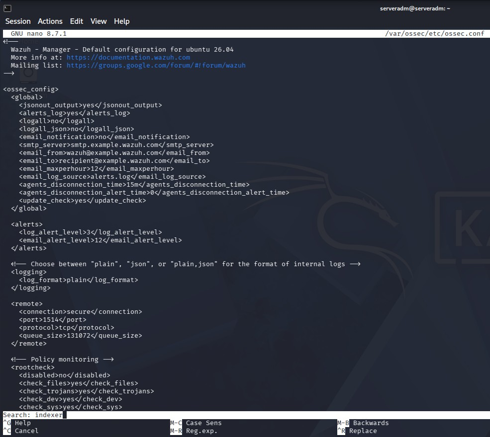

```text
Ctrl + F
indexer
Enter
```

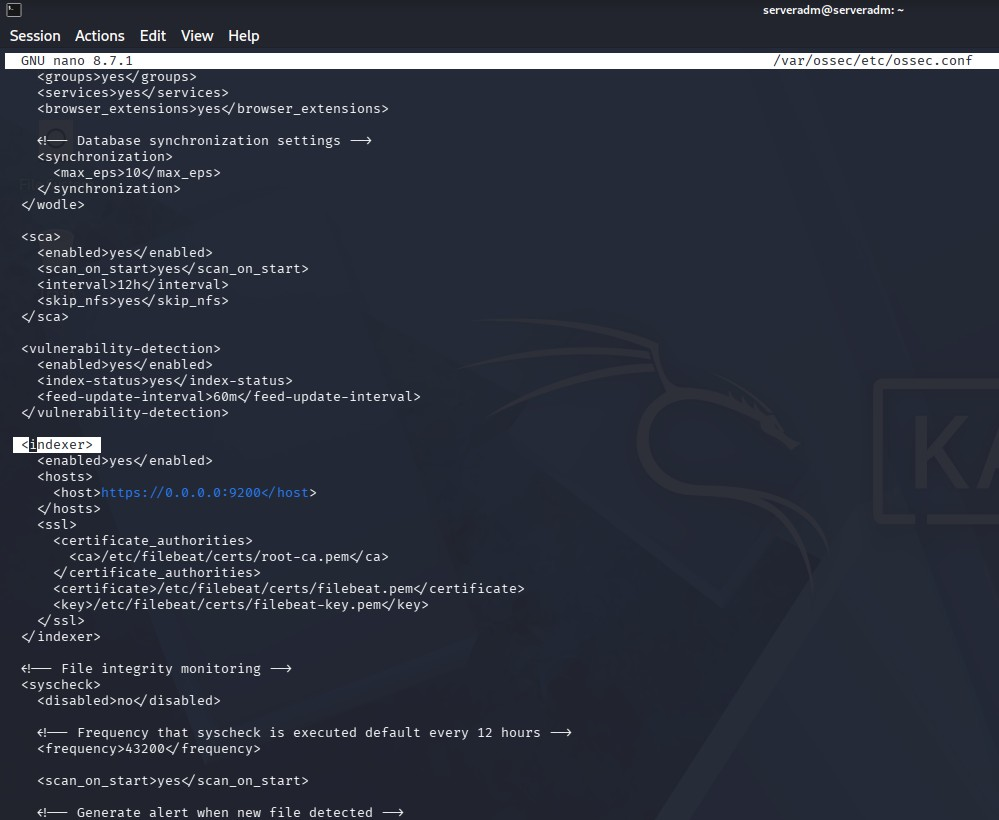

Replace the default `host` with the configured Wazuh Indexer IP address.

---

## 16 - Configure the Indexer Host

After editing:
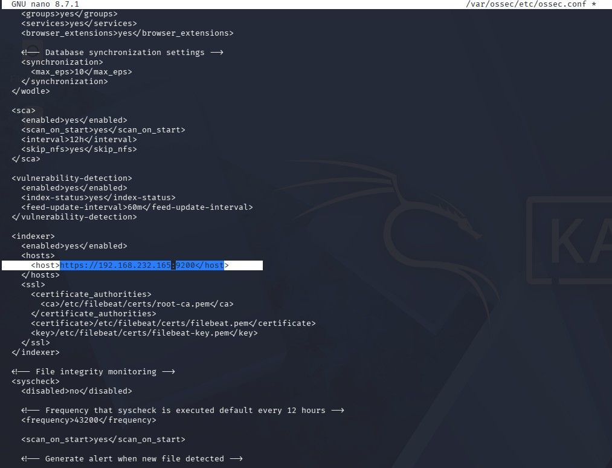
Save the file and verify that the certificate names and paths are correct.

```text
Ctrl + X
Y
Enter
```
---

## 17 - Start the Wazuh Manager Service

Reload the systemd daemon.

```bash
sudo systemctl daemon-reload
```

Enable the Wazuh Manager service.

```bash
sudo systemctl enable wazuh-manager
```

Start the Wazuh Manager service.

```bash
sudo systemctl start wazuh-manager
```

Verify the service status.

```bash
sudo systemctl status wazuh-manager
```

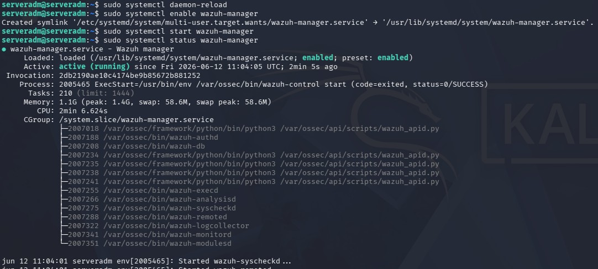

---

## 18 - Start the Filebeat Service

Reload the systemd daemon.

```bash
sudo systemctl daemon-reload
```

Enable the Filebeat service.

```bash
sudo systemctl enable filebeat
```

Start the Filebeat service.

```bash
sudo systemctl start filebeat
```

Verify the service status.

```bash
sudo systemctl status filebeat
```

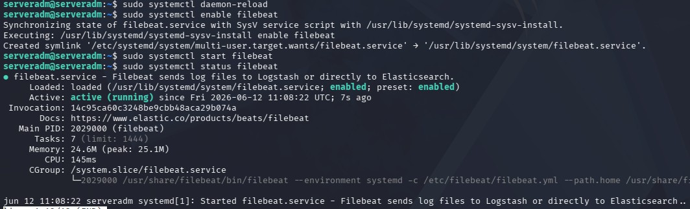

Verify that Filebeat is communicating correctly with the Wazuh Indexer.

```bash
sudo filebeat test output
```

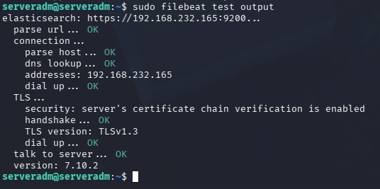

---

## 19 - Disable Wazuh Updates

Disable the Wazuh repository to prevent automatic updates.

```bash
sudo sed -i "s/^deb /#deb /" /etc/apt/sources.list.d/wazuh.list
sudo apt update
```

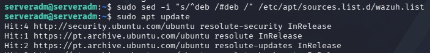

---

# Next Step

Continue with the Wazuh Dashboard installation.

[03 - Wazuh Dashboard Installation](03-wazuh-dashboard.md)