# Wazuh Dashboard Installation

---

# Table of Contents

1. Requirements
2. Install Missing Packages (Part 1)
3. Install Missing Packages (Part 2)
4. Install the GPG Key
5. Add the Official Wazuh Repository
6. Update the Package List
7. Install the Wazuh Dashboard
8. Edit the `opensearch_dashboards.yml` File
9. Configure the Firewall Ports
10. Deploy the Certificates
11. Start the Service
12. Edit the `wazuh.yml` File
13. Disable Wazuh Updates

---

## 1 - Requirements

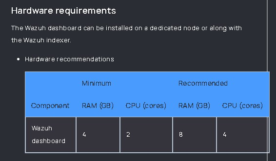

---

## 2 - Install Missing Packages (Part 1)

Run the following command to install the required packages if they are missing.

```bash
sudo apt-get install debhelper tar curl libcap2-bin
```

> **Note:** `debhelper` version 9 or later is required.

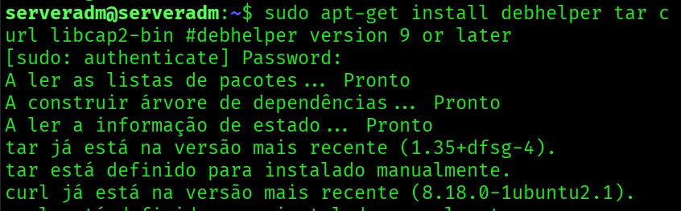

---

## 3 - Install Missing Packages (Part 2)

Run the following command to install the required packages if they are missing.

```bash
sudo apt-get install gnupg apt-transport-https
```

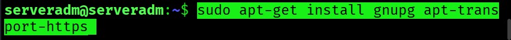

---

## 4 - Install the GPG Key

Download and import the official Wazuh GPG key.

```bash
sudo curl -s https://packages.wazuh.com/key/GPG-KEY-WAZUH | sudo gpg --no-default-keyring --keyring gnupg-ring:/usr/share/keyrings/wazuh.gpg --import && sudo chmod 644 /usr/share/keyrings/wazuh.gpg
```

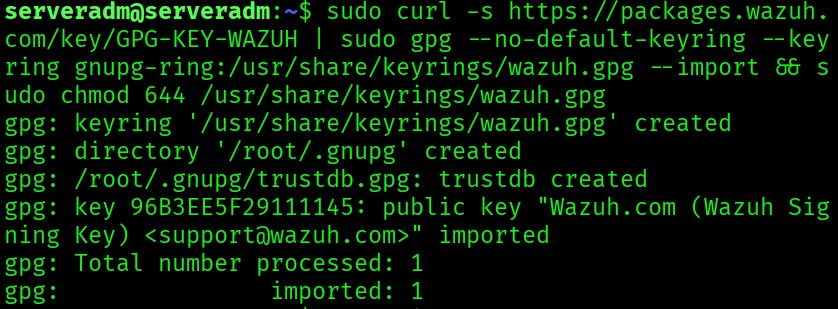

---

## 5 - Add the Official Wazuh Repository

Add the official Wazuh repository to the APT sources list.

```bash
echo "deb [signed-by=/usr/share/keyrings/wazuh.gpg] https://packages.wazuh.com/4.x/apt/ stable main" | sudo tee -a /etc/apt/sources.list.d/wazuh.list
```

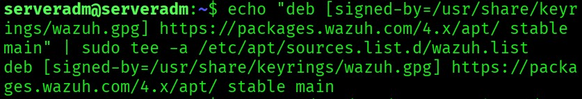

---

## 6 - Update the Package List

Update the package information.

```bash
sudo apt-get update
```

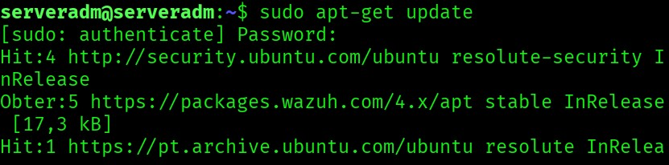

---

## 7 - Install the Wazuh Dashboard

Install the Wazuh Dashboard package.

```bash
sudo apt-get -y install wazuh-dashboard
```

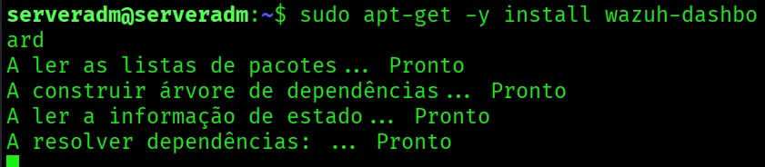

---

## 8 - Edit the `opensearch_dashboards.yml` File

Open the Wazuh Dashboard configuration file.

```bash
sudo nano /etc/wazuh-dashboard/opensearch_dashboards.yml
```

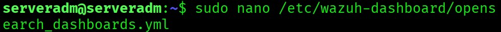

Before editing:

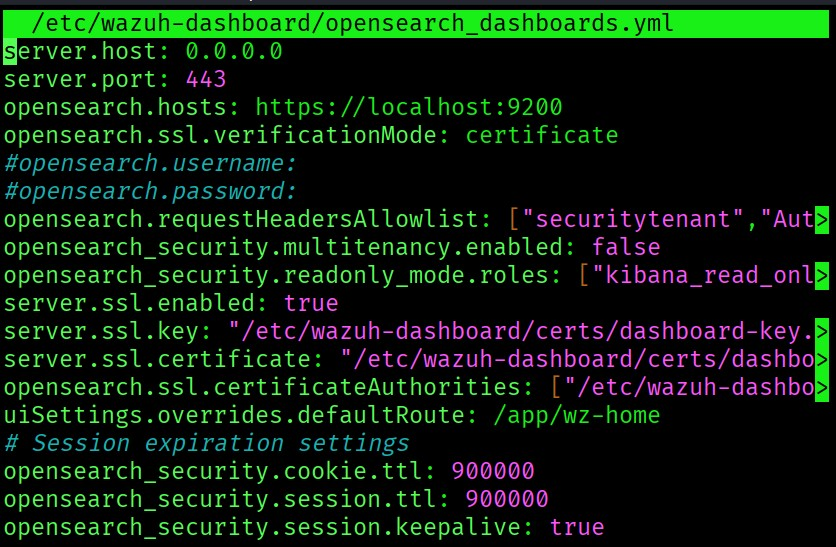

Replace the default `opensearch.hosts` value (`localhost`) with the IP address of Wazuh Indexer.

Example:

```text
https://<IP_INDEXER>:9200
```

After editing:

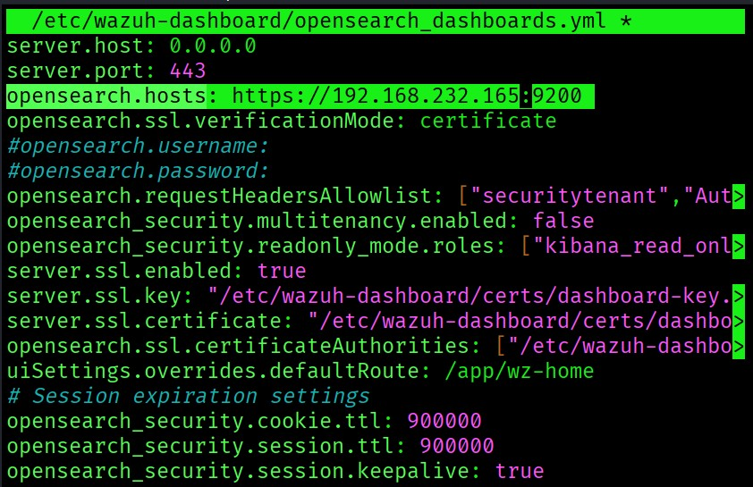

Save the file.

```text
Ctrl + X
Y
Enter
```

---

## 9 - Configure the Firewall Ports

Allow access to the Wazuh Dashboard Web User Interface (HTTPS).

```bash
sudo ufw allow from <YOUR_SUBNET>/24 to any port 443 proto tcp
```

Example:

```bash
sudo ufw allow from 192.168.232.0/24 to any port 443 proto tcp
```

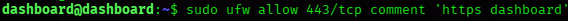

Verify that the firewall rule has been created successfully.

```bash
sudo ufw status verbose
```

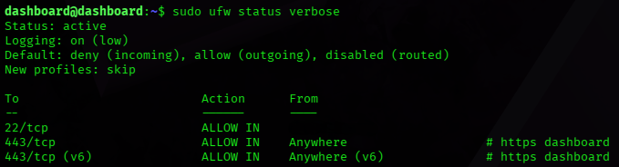

---

## 10 - Deploy the Certificates

Verify that the `wazuh-certificates.tar` file is available.

```bash
ls
```


Create the `certs` directory.

```bash
sudo mkdir /etc/wazuh-dashboard/certs
```

Verify that the directory has been created.

```bash
sudo ls /etc/wazuh-dashboard/
```

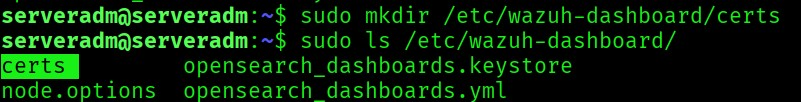

Extract the required certificates.

```bash
sudo tar -xf ./wazuh-certificates.tar \
-C /etc/wazuh-dashboard/certs/ \
./dashboard.pem \
./dashboard-key.pem \
./root-ca.pem
```

Verify that the certificates have been extracted.

```bash
sudo ls /etc/wazuh-dashboard/certs
```

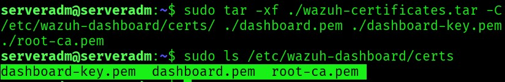

Enter a root shell.

```bash
sudo -i
```

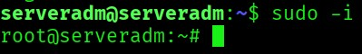

Set the appropriate permissions.

```bash
sudo chmod 500 /etc/wazuh-dashboard/certs
```

```bash
sudo chmod 400 /etc/wazuh-dashboard/certs/*
```

```bash
sudo chown -R wazuh-dashboard:wazuh-dashboard /etc/wazuh-dashboard/certs
```

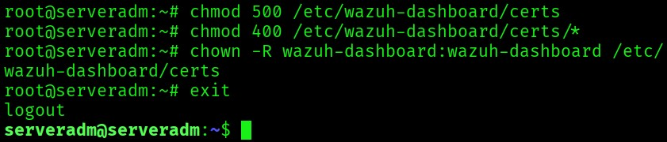

Remove the compressed certificate archive.

```bash
sudo rm -f ./wazuh-certificates.tar
```

Verify that the archive has been removed.

```bash
ls
```

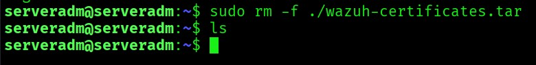

---

## 11 - Start the Wazuh Dashboard Service

Reload the systemd daemon.

```bash
sudo systemctl daemon-reload
```

Enable the Wazuh Dashboard service.

```bash
sudo systemctl enable wazuh-dashboard
```

Start the Wazuh Dashboard service.

```bash
sudo systemctl start wazuh-dashboard
```

Verify the service status.

```bash
sudo systemctl status wazuh-dashboard
```

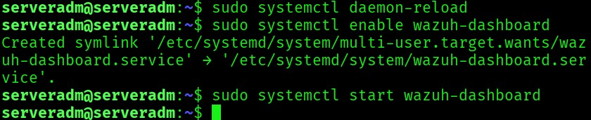

---

## 12 - Edit the `wazuh.yml` File

Open the Wazuh Dashboard plugin configuration file.

```bash
sudo nano /usr/share/wazuh-dashboard/data/wazuh/config/wazuh.yml
```

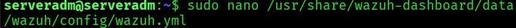

Before editing:

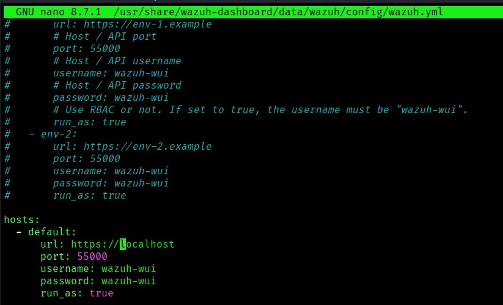

Replace the default `url` host with the IP address of your Wazuh Server.

Example:

```yaml
hosts:
  - default:
      url: https://<IP_SERVER>
      port: 55000
      username: wazuh-wui
      password: wazuh-wui
      run_as: true
```

After editing:

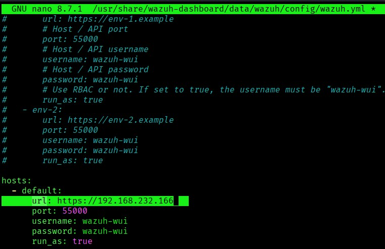

Save the file.

```text
Ctrl + X
Y
Enter
```

Restart the Wazuh Dashboard service.

```bash
sudo systemctl restart wazuh-dashboard
```

Verify that the service is running correctly.

```bash
sudo systemctl status wazuh-dashboard
```
---

## 13 - Disable Wazuh Updates

Disable the Wazuh repository to prevent automatic updates.

```bash
sudo sed -i "s/^deb /#deb /" /etc/apt/sources.list.d/wazuh.list
sudo apt update
```

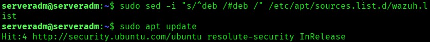

---

# Next Step

Continue with the Wazuh password management.

[04 - Change Internal Passwords](04-password-management.md)