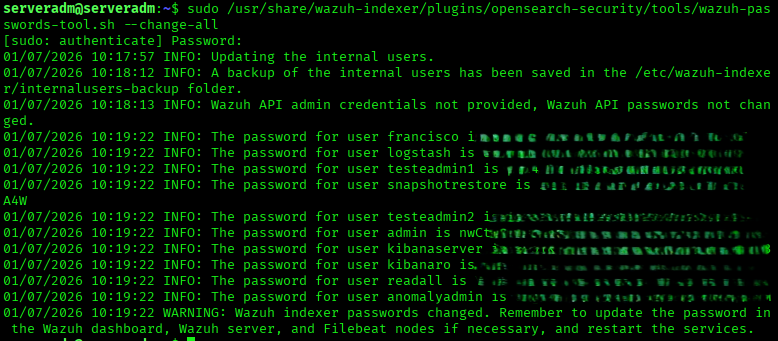
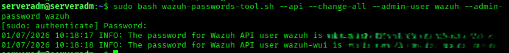
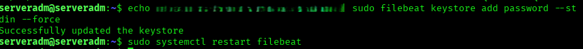
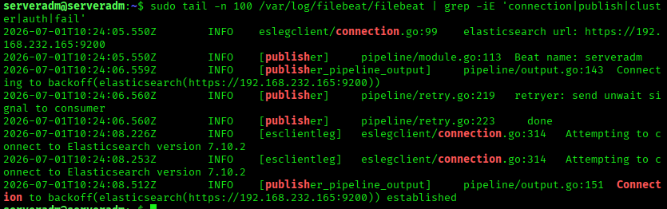
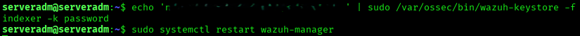
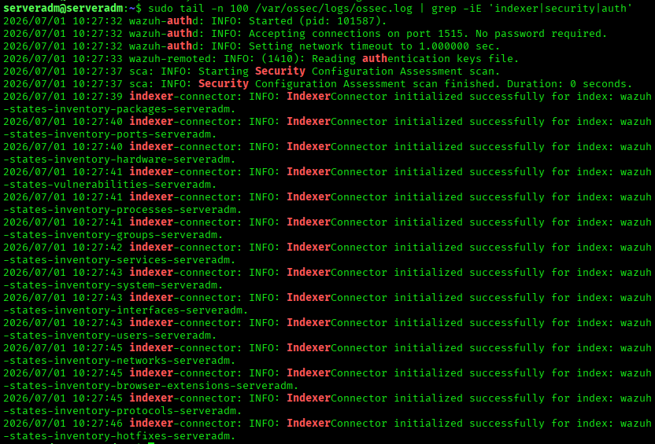
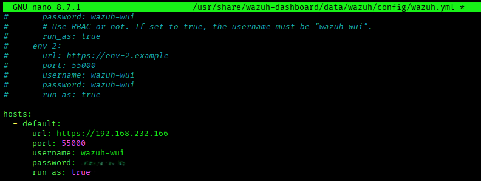
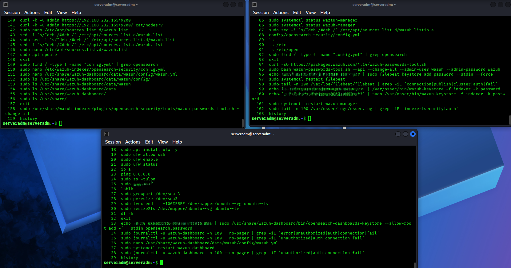
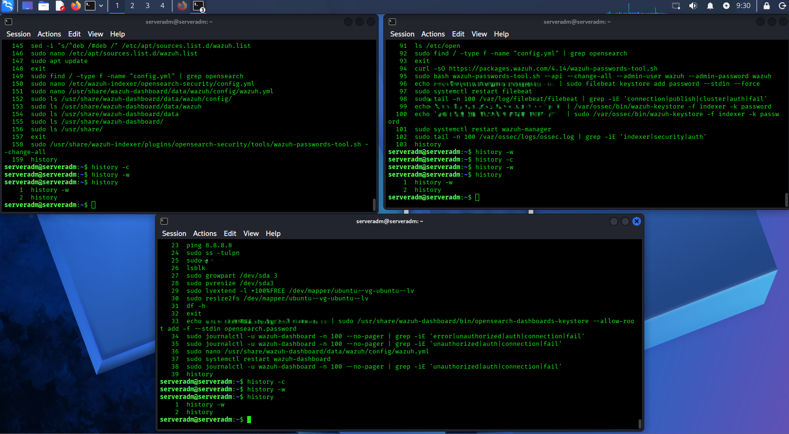

# Wazuh Password Management

---

# Table of Contents

1. Wazuh Indexer
2. Wazuh Server/Manager - Generate API Passwords
3. Wazuh Server/Manager - Update Filebeat Keystore
4. Wazuh Server/Manager - Update Wazuh Manager Keystore
5. Wazuh Dashboard
6. Clear Shell History

---

## 1 - Wazuh Indexer

Run the following command to execute the script and change the passwords of the internal users.

```bash
sudo /usr/share/wazuh-indexer/plugins/opensearch-security/tools/wazuh-passwords-tool.sh --change-all
```



The script generates new random passwords for the internal users.

Example output:

```text
01/07/2026 10:17:57 INFO: Updating the internal users.
01/07/2026 10:18:12 INFO: A backup of the internal users has been saved in the /etc/wazuh-indexer/internalusers-backup folder.
01/07/2026 10:18:13 INFO: Wazuh API admin credentials not provided, Wazuh API passwords not changed.
01/07/2026 10:19:22 INFO: The password for user ********** is **************************************
01/07/2026 10:19:22 INFO: The password for user logstash is **************************************   
01/07/2026 10:19:22 INFO: The password for user ********** is ************************************** 
01/07/2026 10:19:22 INFO: The password for user snapshotrestore is **************************************                                                                                            
01/07/2026 10:19:22 INFO: The password for user ********** is **************************************
01/07/2026 10:19:22 INFO: The password for user admin is **************************************      
01/07/2026 10:19:22 INFO: The password for user kibanaserver is **************************************
01/07/2026 10:19:22 INFO: The password for user kibanaro is **************************************   
01/07/2026 10:19:22 INFO: The password for user readall is **************************************    
01/07/2026 10:19:22 INFO: The password for user anomalyadmin is **************************************

```

The script displays the following warning after changing the passwords:

```text
WARNING: Wazuh indexer passwords changed. Remember to update the password in the Wazuh dashboard, Wazuh server, and Filebeat nodes if necessary, and restart the services.
```

---

## 2 - Wazuh Server/Manager - Generate API Passwords

Run the following commands to download the script and change the passwords of the Wazuh API users.

```bash
curl -sO https://packages.wazuh.com/4.14/wazuh-passwords-tool.sh
```

```bash
sudo bash wazuh-passwords-tool.sh --api --change-all --admin-user wazuh --admin-password wazuh
```



The script generates new random passwords for the Wazuh API users.

---

## 3 - Wazuh Server/Manager - Update the Filebeat Keystore

The passwords must now be updated.

On the Wazuh Server, run the following command to update the administrator password in the Filebeat keystore.

Replace `<ADMIN_PASSWORD>` with the randomly generated administrator password and restart the Filebeat service.

```bash
echo <ADMIN_PASSWORD> | sudo filebeat keystore add password --stdin --force
```

```bash
sudo systemctl restart filebeat
```



In case of doubt, check the logs and verify whether the service reported any errors.

```bash
sudo tail -n 100 /var/log/filebeat/filebeat | grep -iE 'connection|publish|cluster|auth|fail'
```



---

## 4 - Wazuh Server/Manager - Update the Wazuh Manager Keystore

On the Wazuh Server, run the following command to update the administrator password in the Wazuh Manager keystore.

Replace `<ADMIN_PASSWORD>` (keep the single quotes) with the randomly generated administrator password and restart the Wazuh Manager service.

```bash
echo '<ADMIN_PASSWORD>' | sudo /var/ossec/bin/wazuh-keystore -f indexer -k password
```

```bash
sudo systemctl restart wazuh-manager
```



In case of doubt, check the logs and verify whether the service reported any errors.

```bash
sudo tail -n 100 /var/ossec/logs/ossec.log | grep -iE 'indexer|security|auth'
```



---

## 5 - Wazuh Dashboard

Replace `<WAZUH_WUI_PASSWORD>` in the `/usr/share/wazuh-dashboard/data/wazuh/config/wazuh.yml` file with the new randomly generated `wazuh-wui` password.

Open the configuration file.

```bash
sudo nano /usr/share/wazuh-dashboard/data/wazuh/config/wazuh.yml
```


Replace the password.

```yaml
hosts:
  - default:
      url: https://127.0.0.1
      port: 55000
      username: wazuh-wui
      password: "<WAZUH_WUI_PASSWORD>"
      run_as: true
```



Save the file.

```text
Ctrl + X
Y
Enter
```

Restart the Wazuh Dashboard service.

```bash
sudo systemctl restart wazuh-dashboard
```


---

## 6 - Clear Shell History

Running the `history` command displays all commands executed in the terminal, including passwords.



To prevent this situation, run the following commands.

```bash
history -c
```

```bash
history -w
```



---

# Next Step

Continue with the administrator user creation.

[05 - Create Administrator Users](05-admin-users.md)