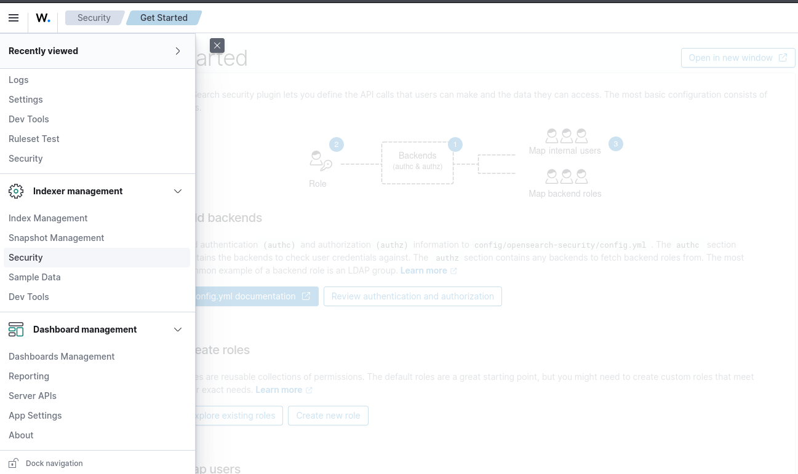
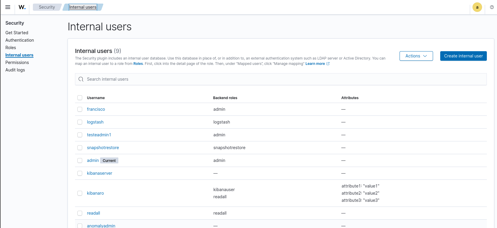
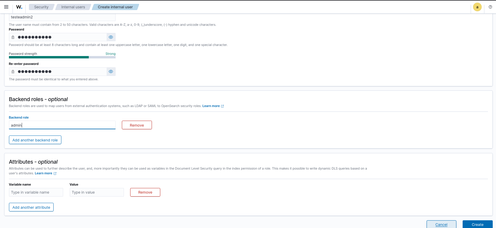
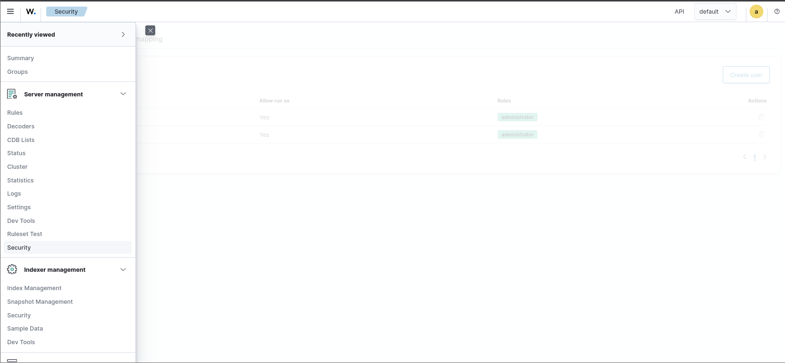
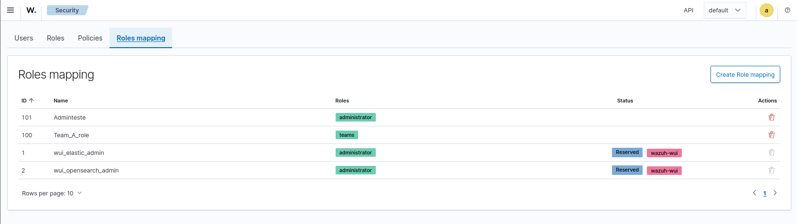
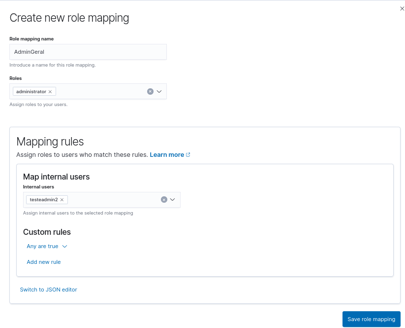
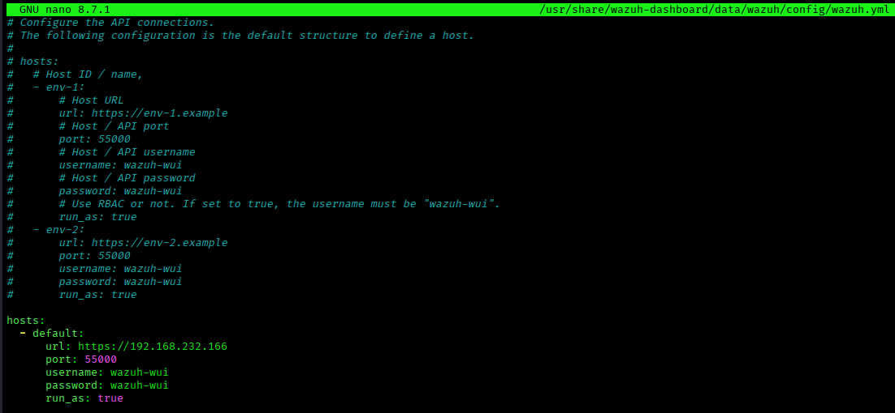
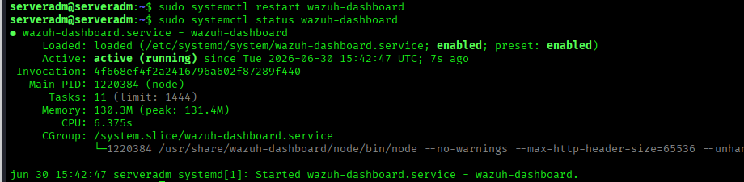

# Create Administrator Users

---

# Table of Contents

1. Overview
2. Open the Security Menu
3. Create an Internal User
4. Create a Role Mapping
5. Verify the `run_as` Setting
6. Restart the Wazuh Dashboard

---

## 1 - Overview

Create administrator users so everyone can test the platform.

These users are administrators but do not have permissions related to the security rules.

The objective is to allow everyone to test the platform and report any missing permissions so they can be added later.

In the future, access should be based on roles similar to the following:

- Administrator – full platform management.
- SOC Manager / Team Leader – operational management and validation.
- SOC Analyst – alert and incident investigation.
- Threat Intelligence – access to MISP and indicators.
- Read Only / Auditor – view-only access and reporting.

This follows the Principle of Least Privilege, which is a security best practice.

---

## 2 - Open the Security Menu

Navigate to:

**Indexer Management → Security**



---

## 3 - Create an Internal User

Inside **Security**, select:

**Internal Users → Create Internal User**



Create a new internal user.

Configure:

- Login
- Password
- Backend role: `admin`

Click **Create**.



---

## 4 - Create a Role Mapping

Navigate to:

**Server Management → Security**



Inside **Security**, select:

**Roles Mapping → Create Role Mapping**



Create a new role mapping.

Configure:

- Name
- Role: `administrator`
- Internal users: Select the internal user created in the previous step.

Click **Create**.



---

## 5 - Verify the `run_as` Setting

On the Wazuh Dashboard server, verify that the `run_as` parameter is set to `true` at the end of the `wazuh.yml` configuration file.

```bash
sudo nano /usr/share/wazuh-dashboard/data/wazuh/config/wazuh.yml
```



Verify that the following setting is present.

```yaml
run_as: true
```

---

## 6 - Restart the Wazuh Dashboard

Restart the Wazuh Dashboard service and verify its status.

```bash
sudo systemctl restart wazuh-dashboard
```

```bash
sudo systemctl status wazuh-dashboard
```



---

# Next Step

Continue with the Wazuh patch installation.

[06 - Apply Patch](06-apply-patch.md)