# Apply Patch 4.14.6

---

# Table of Contents

1. Overview
2. Prepare the Repository
3. Stop the Services
4. Backup the Indexer Security Configuration
5. Disable Cluster Allocation
6. Flush the Indexer
7. Update the Wazuh Indexer
8. Initialize the Indexer Security Configuration
9. Re-enable Cluster Allocation
10. Update the Wazuh Manager
11. Update Filebeat
12. Update the Wazuh Dashboard
13. Disable Future Updates
14. Verify the Installed Version
15.  Update Wazuh Agents
16.  Mass Update Wazuh Agents
17.  Verify Agent Versions

---

## 1 - Overview

This guide describes how to update a distributed Wazuh environment to version **4.14.6**.

The update process must be performed on the following nodes:

- Wazuh Indexer
- Wazuh Server
- Wazuh Dashboard

---

## 2 - Prepare the Repository

Perform the following steps on the **Indexer**, **Server**, and **Dashboard** nodes.

Install the required packages.

```bash
sudo apt-get install gnupg apt-transport-https
```

Import the Wazuh GPG key.

```bash
curl -s https://packages.wazuh.com/key/GPG-KEY-WAZUH | gpg --no-default-keyring --keyring gnupg-ring:/usr/share/keyrings/wazuh.gpg --import && sudo chmod 644 /usr/share/keyrings/wazuh.gpg
```

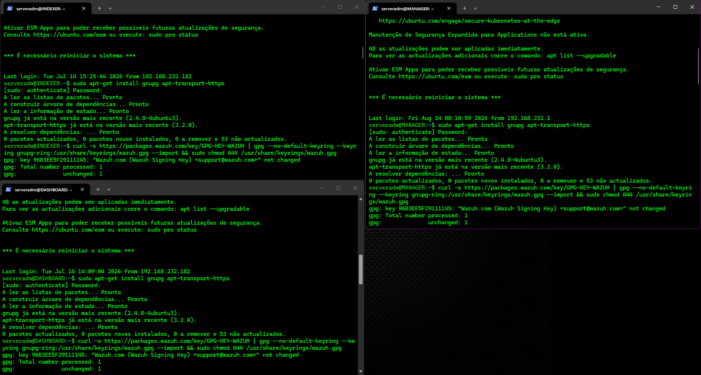

Open the Wazuh repository configuration file.

```bash
sudo nano /etc/apt/sources.list.d/wazuh.list
```

Uncomment the repository entry.

Save the file and exit Nano.

```text
Ctrl + X
Y
Enter
```

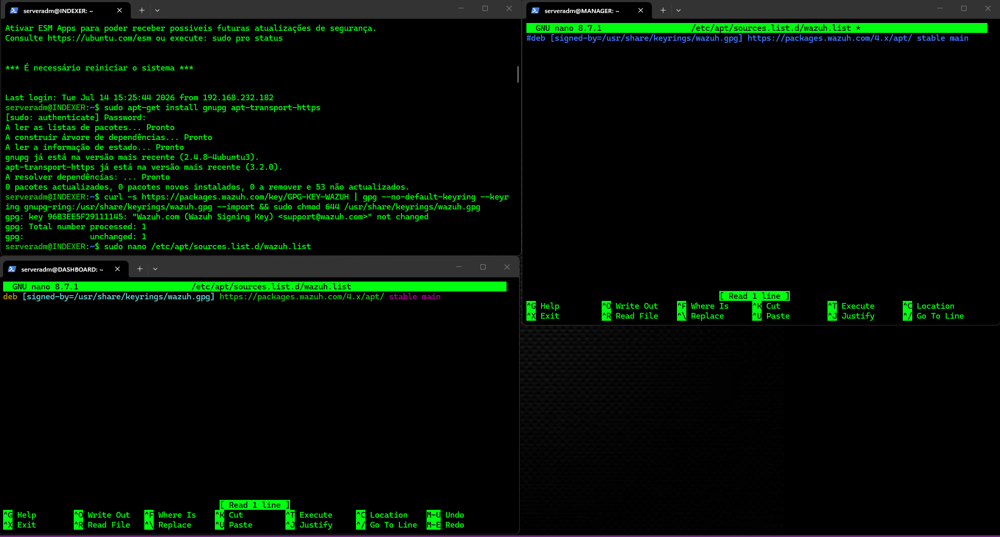

Update the package list.

```bash
sudo apt-get update
```

---

## 3 - Stop the Services

On the **Wazuh Server**, stop the Filebeat service.

```bash
sudo systemctl stop filebeat
```

On the **Wazuh Dashboard**, stop the Dashboard service.

```bash
sudo systemctl stop wazuh-dashboard
```

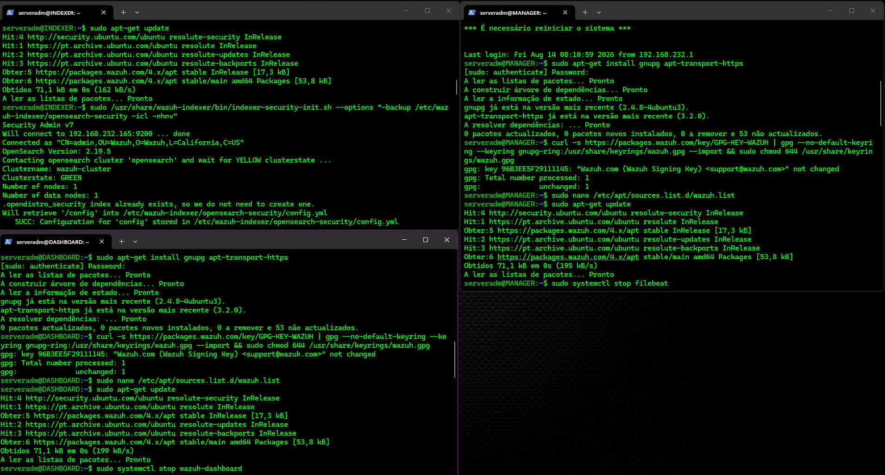

---

## 4 - Backup the Indexer Security Configuration

On the **Wazuh Indexer**, create a backup of the security configuration.

This backup includes:

- Users
- Roles
- Permissions

```bash
sudo /usr/share/wazuh-indexer/bin/indexer-security-init.sh --options "-backup /etc/wazuh-indexer/opensearch-security -icl -nhnv"
```

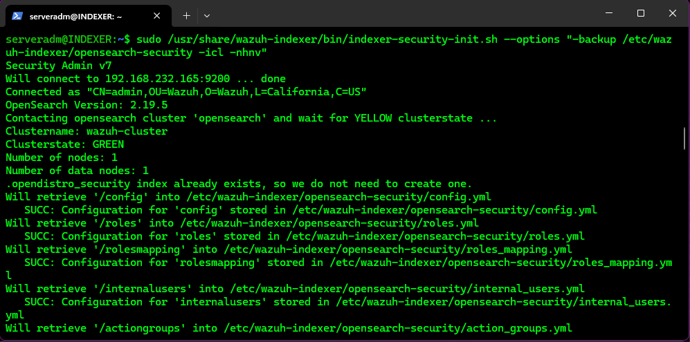

---

## 5 - Disable Cluster Allocation

Temporarily allow only primary shard allocation before upgrading the Indexer.

```bash
curl -X PUT "https://<IP_INDEXER>:9200/_cluster/settings" -u admin -k -H 'Content-Type: application/json' -d'
{
  "persistent": {
    "cluster.routing.allocation.enable": "primaries"
  }
}
'
```

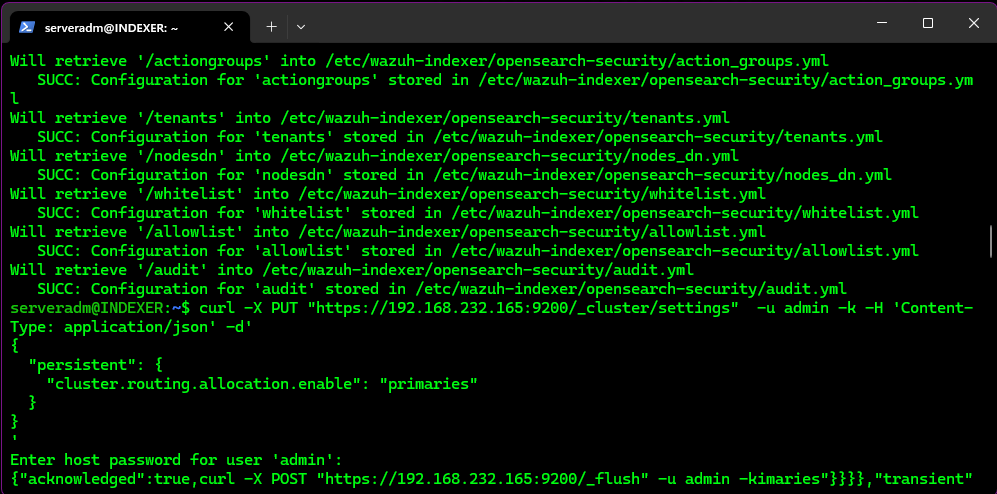

---

## 6 - Flush the Indexer

Flush all pending data from memory to disk before stopping the Indexer.

```bash
curl -X POST "https://<IP_INDEXER>:9200/_flush" -u admin -k
```

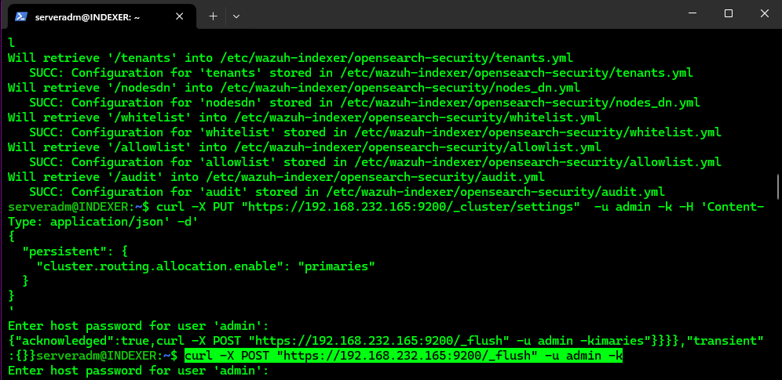

---

## 7 - Update the Wazuh Indexer

On the **Wazuh Server**, stop the Wazuh Manager service.

```bash
sudo systemctl stop wazuh-manager
```

On the **Wazuh Indexer**, stop the Indexer service.

```bash
sudo systemctl stop wazuh-indexer
```

Create a backup of the `jvm.options` file before upgrading the Indexer.

```bash
sudo cp /etc/wazuh-indexer/jvm.options /etc/wazuh-indexer/jvm.options.old
```

Install the new Wazuh Indexer package.

```bash
sudo apt-get install wazuh-indexer
```

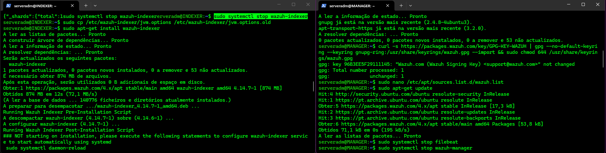

Restore the `jvm.options` configuration manually from the backup.

Compare the following files:

```text
compare

/etc/wazuh-indexer/jvm.options.old

and

/etc/wazuh-indexer/jvm.options
```

If both files are identical, no changes are required.

Reload the systemd configuration.

```bash
sudo systemctl daemon-reload
```

Enable the Wazuh Indexer service.

```bash
sudo systemctl enable wazuh-indexer
```

Start the Wazuh Indexer service.

```bash
sudo systemctl start wazuh-indexer
```

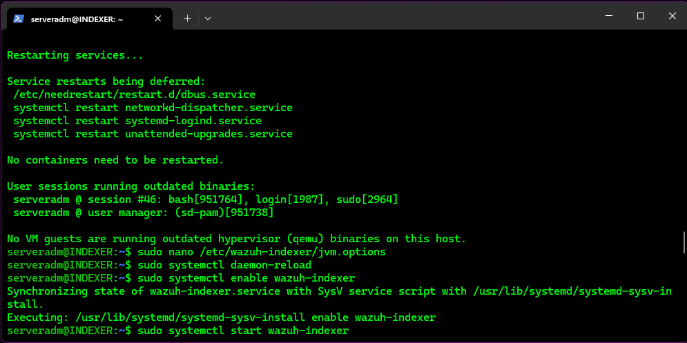

---

## 8 - Initialize the Indexer Security Configuration

Initialize the Indexer security configuration.

```bash
sudo /usr/share/wazuh-indexer/bin/indexer-security-init.sh
```

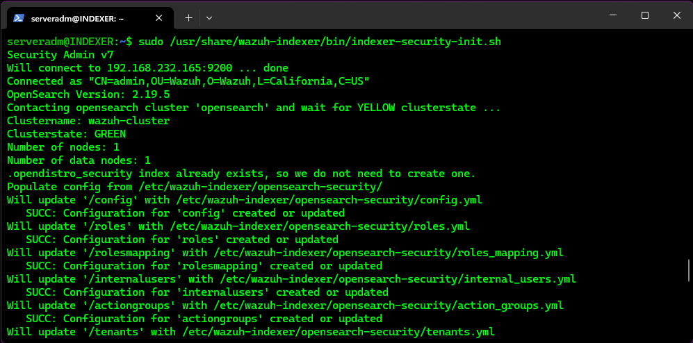

Verify that the Indexer node is online.

```bash
curl -k -u admin https://<IP_INDEXER>:9200/_cat/nodes?v
```

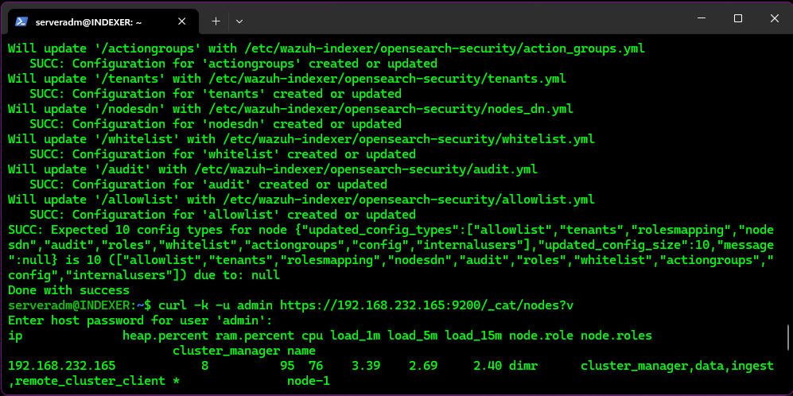

---

## 9 - Re-enable Cluster Allocation

Re-enable cluster allocation after the upgrade.

```bash
curl -X PUT "https://<IP_INDEXER>:9200/_cluster/settings" -u admin -k -H 'Content-Type: application/json' -d'
{
  "persistent": {
    "cluster.routing.allocation.enable": "all"
  }
}
'
```

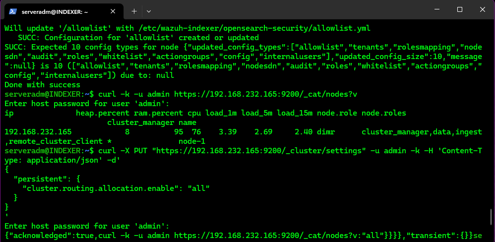

Verify that the cluster has returned to a healthy state.

```bash
curl -k -u admin https://<IP_INDEXER>:9200/_cat/nodes?v
```

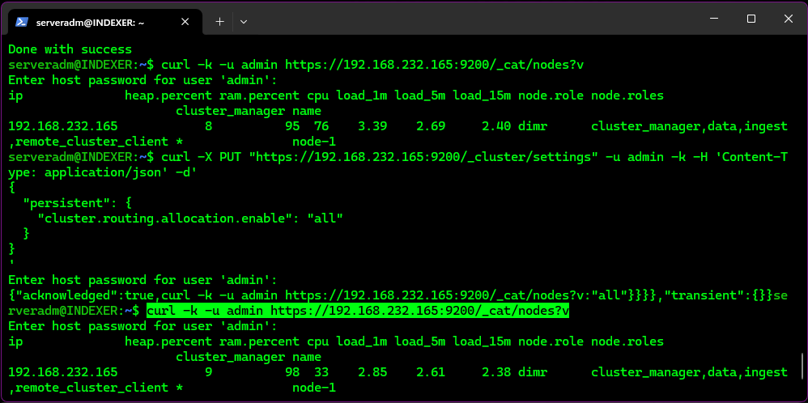

---

## 10 - Update the Wazuh Manager

Install the Wazuh Manager update.

```bash
sudo apt-get install wazuh-manager
```

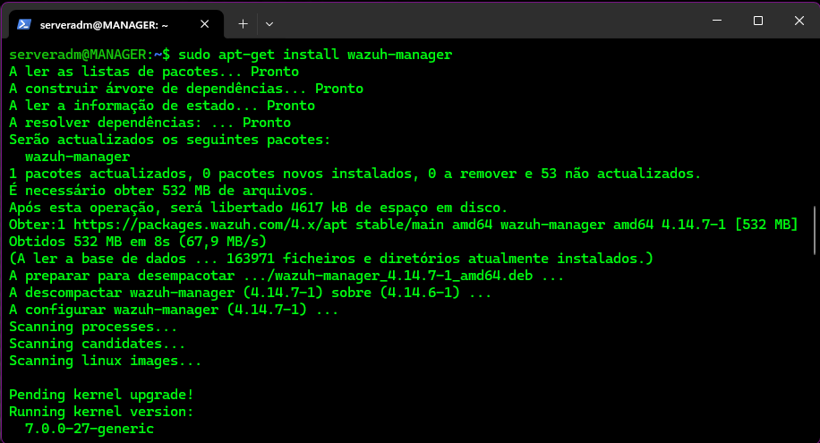

Reload the systemd configuration.

```bash
sudo systemctl daemon-reload
```

Enable the Wazuh Manager service.

```bash
sudo systemctl enable wazuh-manager
```

Start the Wazuh Manager service.

```bash
sudo systemctl start wazuh-manager
```

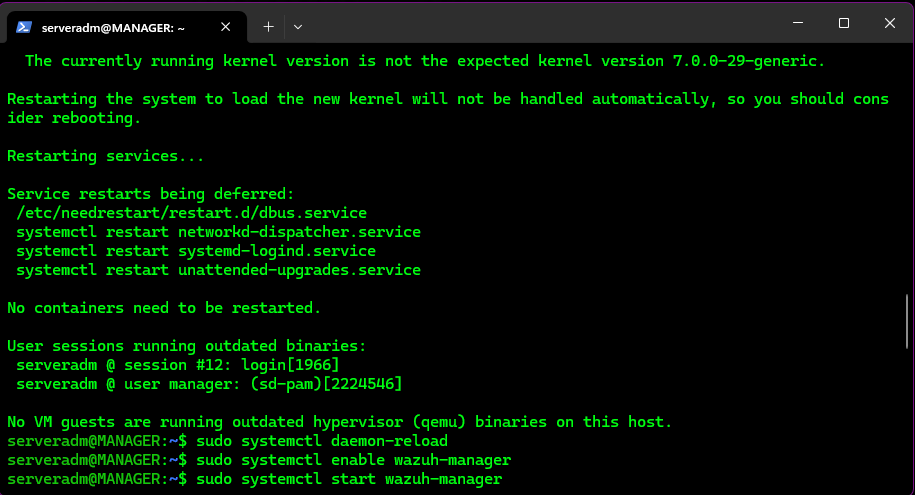

Verify that the `ossec.conf` file has not been modified.

```bash
sudo nano /var/ossec/etc/ossec.conf
```

Verify the following:

- The Indexer host is configured with the correct IP address.
- The certificate paths are correct.

---

## 11 - Update Filebeat

Download and extract the updated Wazuh Filebeat modules.

```bash
curl -s https://packages.wazuh.com/4.x/filebeat/wazuh-filebeat-0.5.tar.gz | sudo tar -xvz -C /usr/share/filebeat/module
```

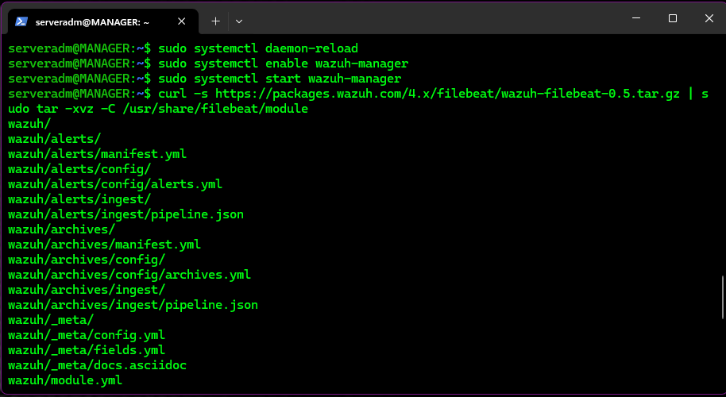

---

Download the updated Wazuh indexer template.

```bash
curl -so /etc/filebeat/wazuh-template.json https://raw.githubusercontent.com/wazuh/wazuh/v4.14.6/extensions/elasticsearch/7.x/wazuh-template.json
```

Grant read permissions to the template.

```bash
sudo chmod go+r /etc/filebeat/wazuh-template.json
```

Backup the current Filebeat configuration.

```bash
sudo cp /etc/filebeat/filebeat.yml /etc/filebeat/filebeat.yml.old
```
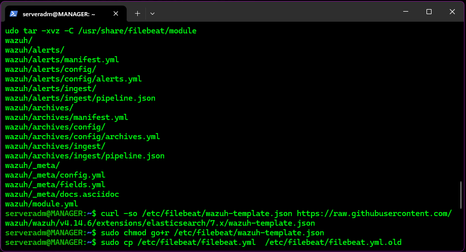

Install the Filebeat update.

```bash
sudo apt-get install filebeat
```

Reload the systemd configuration.

```bash
sudo systemctl daemon-reload
```

Enable the Filebeat service.

```bash
sudo systemctl enable filebeat
```

Start the Filebeat service.

```bash
sudo systemctl start filebeat
```
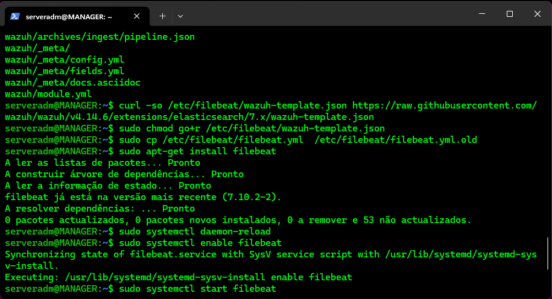

Configure the Filebeat pipelines.

```bash
sudo filebeat setup --pipelines
```

Configure index management.

```bash
sudo filebeat setup --index-management -E output.logstash.enabled=false
```
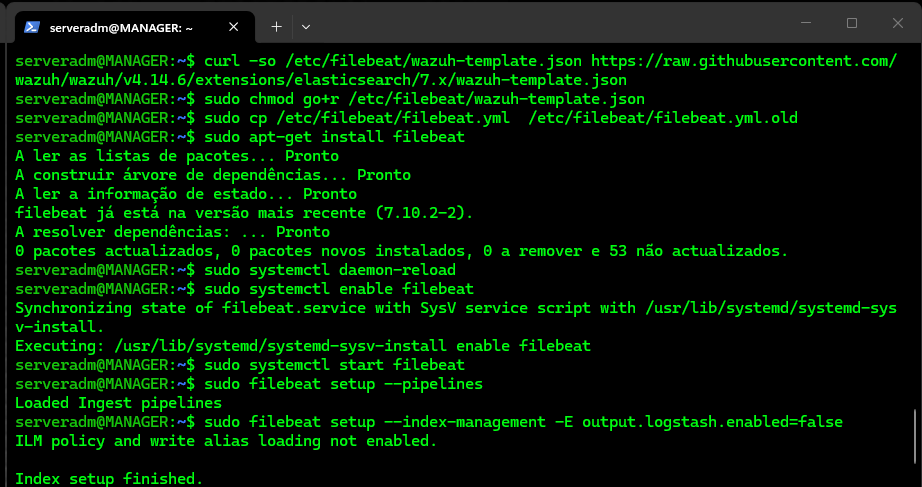
---

## 12 - Update the Wazuh Dashboard

Backup the Wazuh Dashboard configuration.

```bash
sudo cp /etc/wazuh-dashboard/opensearch_dashboards.yml /etc/wazuh-dashboard/opensearch_dashboards.yml.old
```

Install the Wazuh Dashboard update.

```bash
sudo apt-get install wazuh-dashboard
```
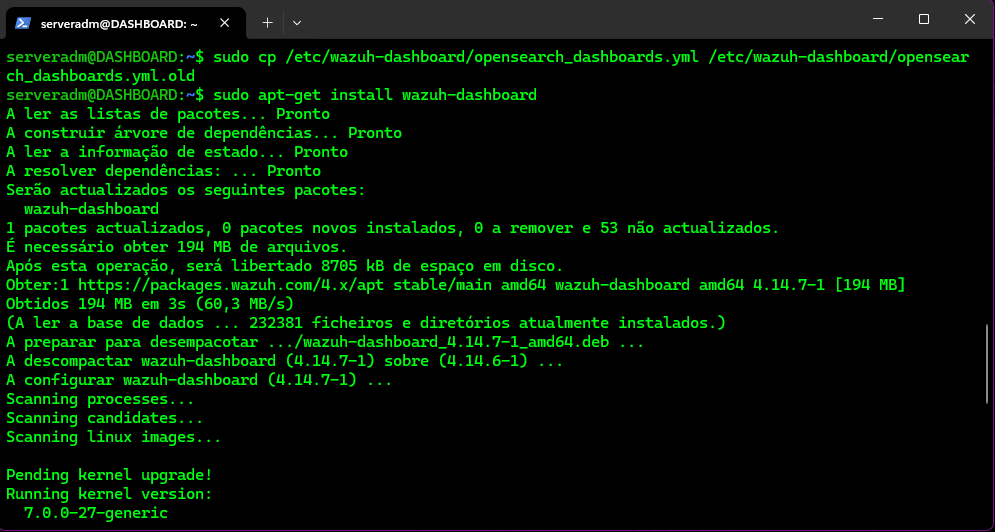

Verify the Dashboard configuration file.

```bash
sudo nano /etc/wazuh-dashboard/opensearch_dashboards.yml
```

Reload the systemd configuration.

```bash
sudo systemctl daemon-reload
```

Enable the Wazuh Dashboard service.

```bash
sudo systemctl enable wazuh-dashboard
```

Start the Wazuh Dashboard service.

```bash
sudo systemctl start wazuh-dashboard
```
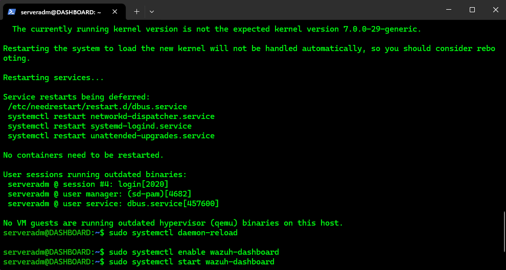
---

## 13 - Disable Future Updates

Edit the Wazuh repository configuration file.

```bash
sudo nano /etc/apt/sources.list.d/wazuh.list
```
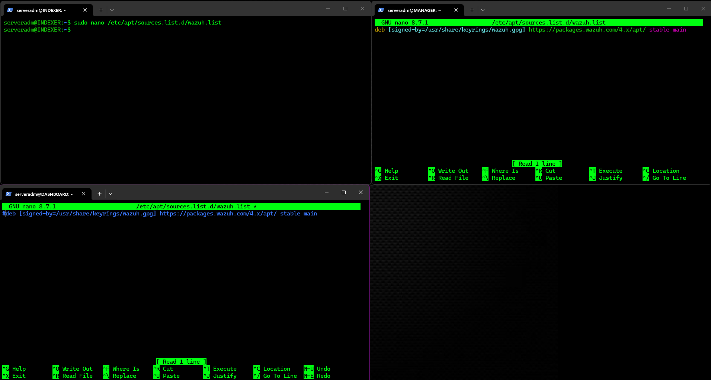
Comment the Wazuh repository entry to prevent automatic updates.

---

## 14 - Verify the Installed Version

Verify the installed Wazuh Indexer version.

```bash
sudo apt list --installed wazuh-indexer
```

Verify the installed Wazuh Manager version.

```bash
sudo apt list --installed wazuh-manager
```

Verify the installed Wazuh Dashboard version.

```bash
sudo apt list --installed wazuh-dashboard
```
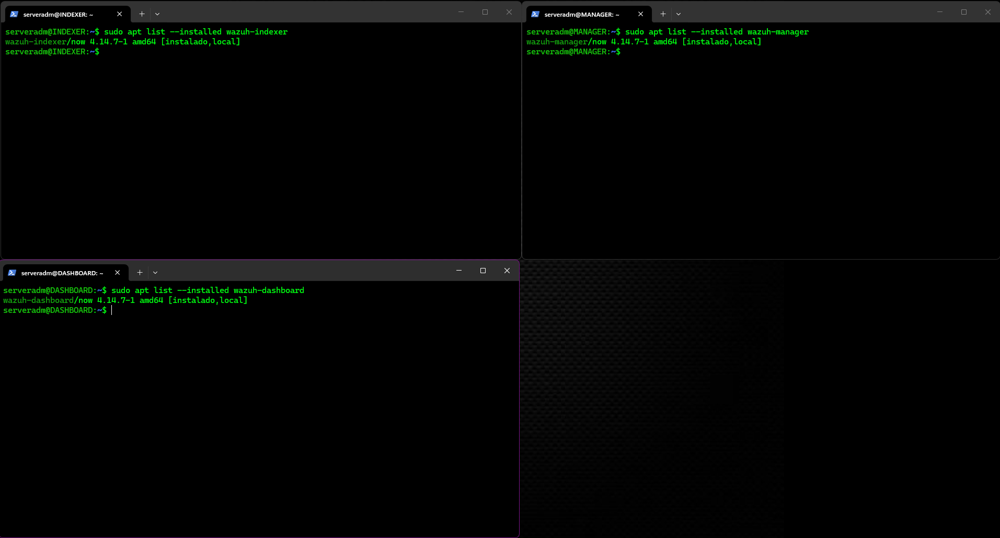
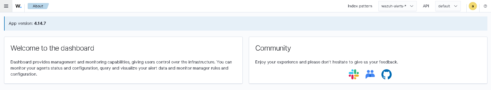

---

## 15 - Update Wazuh Agents

> [!NOTE]
> **Version-specific commands:**  
> The commands and API requests in this guide are specific to the Wazuh version documented here. Before performing a future upgrade, verify the target Wazuh version and consult the corresponding official Wazuh documentation. Do not blindly reuse the commands shown in this guide, as package names, repository URLs, API parameters, or upgrade procedures may change between versions.

Wazuh agents can be updated individually or in bulk.

### Windows Agent

Download the Wazuh Agent installer for version **4.14.6** from the official Wazuh repository.

Open PowerShell and navigate to the directory containing the installer.

```powershell
cd $env:USERPROFILE\Downloads
```

Run the installer silently.

```powershell
.\wazuh-agent-4.14.6-1.msi /q
```
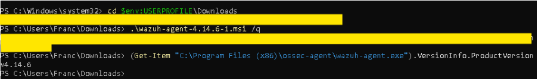

### Linux Agent

Import the Wazuh GPG key.

```bash
curl -s https://packages.wazuh.com/key/GPG-KEY-WAZUH | sudo gpg --no-default-keyring --keyring gnupg-ring:/usr/share/keyrings/wazuh.gpg --import && sudo chmod 644 /usr/share/keyrings/wazuh.gpg
```

Add the Wazuh repository.

```bash
echo "deb [signed-by=/usr/share/keyrings/wazuh.gpg] https://packages.wazuh.com/4.x/apt/stable main" | sudo tee -a /etc/apt/sources.list.d/wazuh.list
```

Update the package list.

```bash
sudo apt-get update
```

Install the Wazuh Agent update.

```bash
sudo apt-get install wazuh-agent
```

Disable the Wazuh repository again to prevent future automatic updates.

```bash
sed -i "s/^deb/#deb/" /etc/apt/sources.list.d/wazuh.list
```

Update the package list.

```bash
sudo apt-get update
```

---

## 16 - Mass Update Wazuh Agents

The Wazuh Dashboard can be used to perform a mass upgrade of connected agents.

Before starting the upgrade, verify that the agents are online.

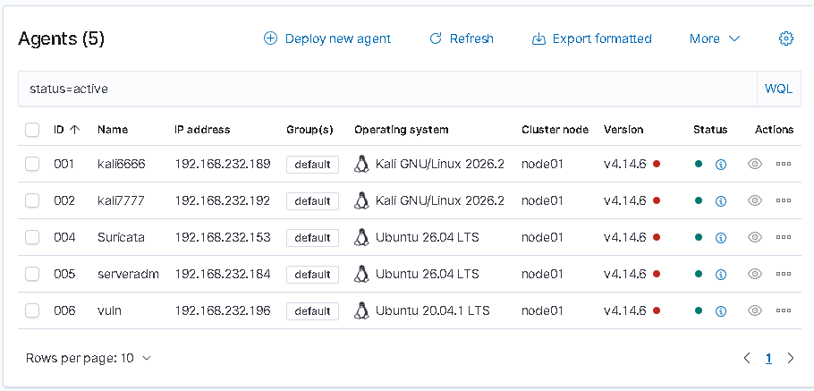

Navigate to:

```text
Wazuh Dashboard
→ Server Management
→ Dev Tools
```

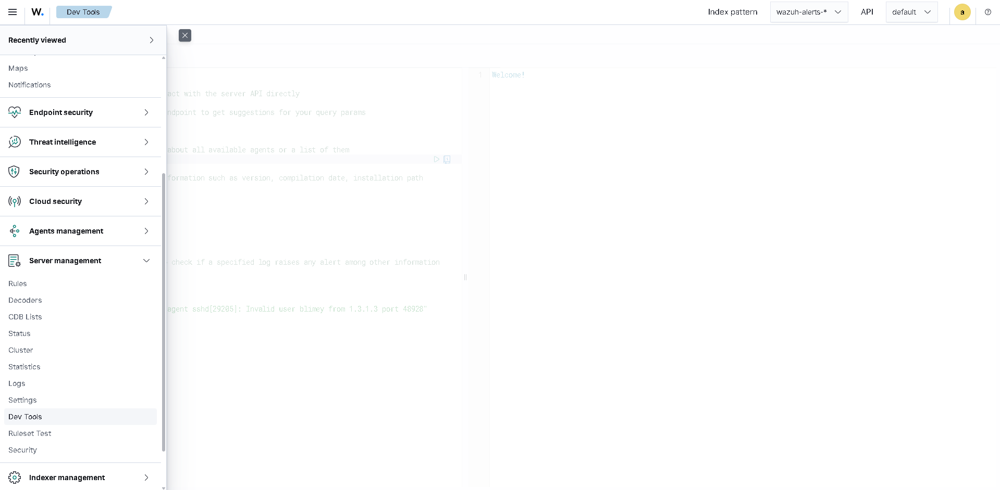

### Test the Agent Upgrade

Before upgrading all agents, perform a test upgrade against a single agent.

In Dev Tools, enter the following request:

```text
PUT /agents/upgrade?agents_list=001&upgrade_version=v4.14.7&package_type=deb
```

Execute the request and verify that the response contains:

```text
All upgrade tasks were created
```

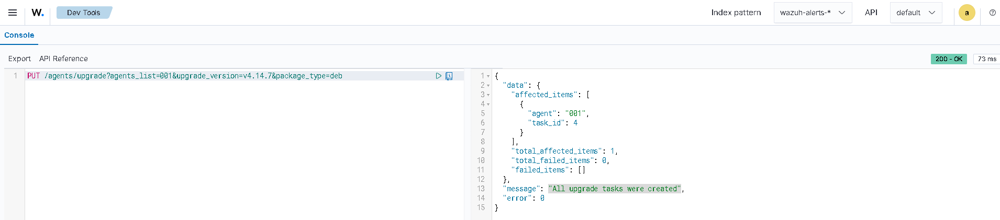

After the upgrade task has been created, return to the agent list and verify that agent 001 has been successfully updated.

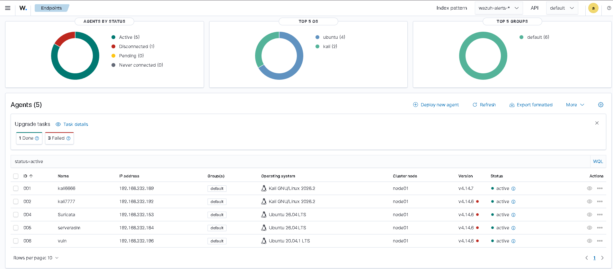

### Upgrade All Agents

Once the individual agent upgrade has been successfully validated, upgrade all agents.

In Dev Tools, execute:

```text
PUT /agents/upgrade?agents_list=all&upgrade_version=v4.14.7
```

If some agents fail to upgrade because the required WPK package is unavailable, specify the package type explicitly:

```text
PUT /agents/upgrade?agents_list=all&upgrade_version=v4.14.7&package_type=deb
```

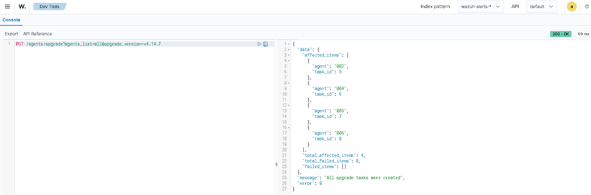

---

## 17 - Verify Agent Versions

After the upgrade tasks have completed, return to the Wazuh agent list.

Verify that all agents are:

- Online
- Active
- Running the expected Wazuh Agent version
- Successfully connected to the Wazuh Server


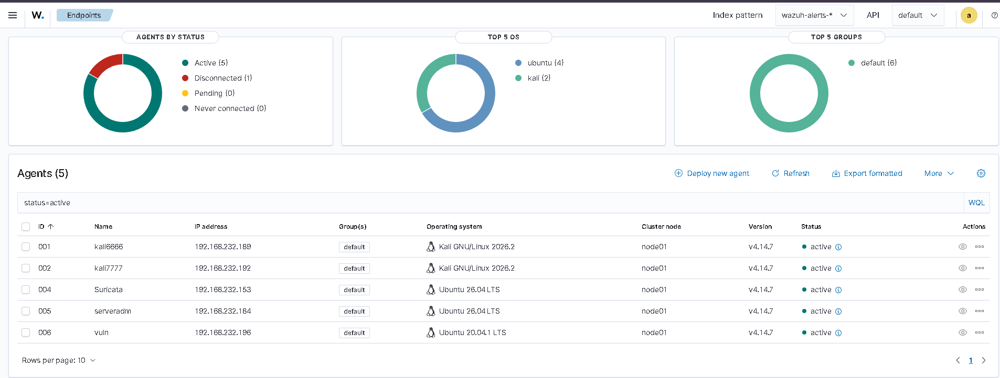