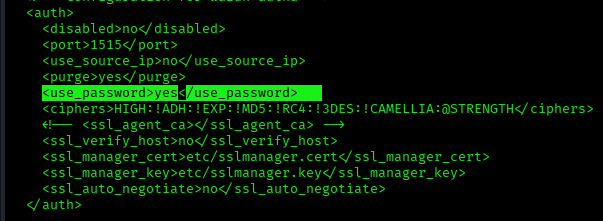
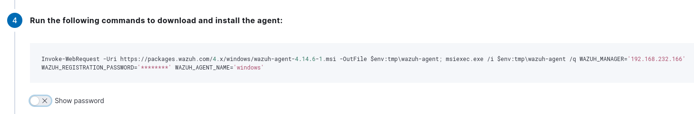
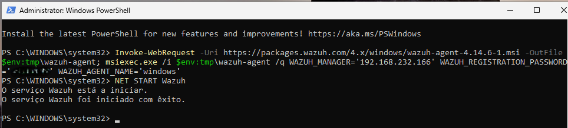

# Agent Authentication

---

# Table of Contents

1. Password Authentication
2. Certificate Authentication

---

## 1 - Password Authentication

### Manager - Enable Password Authentication

Open the Wazuh Manager configuration file.

```bash
sudo nano /var/ossec/etc/ossec.conf
```

Locate the `<auth>` section and set the `use_password` option to `yes`.

```xml
<use_password>yes</use_password>
```



Save the file.

```text
Ctrl + X
Y
Enter
```

---

### Manager - Configure the Registration Password

Open the `authd.pass` file and define the password that will be used by agents during the registration process.

```bash
sudo nano /var/ossec/etc/authd.pass
```

Set the required permissions.

```bash
sudo chmod 640 /var/ossec/etc/authd.pass
```

```bash
sudo chown root:wazuh /var/ossec/etc/authd.pass
```

Restart the Wazuh Manager service.

```bash
sudo systemctl restart wazuh-manager
```

---

### Windows Agent Registration

When generating the Windows agent installation command from the Wazuh Dashboard, the registration password is automatically included in the command.

Example:

```powershell
Invoke-WebRequest -Uri https://packages.wazuh.com/4.x/windows/wazuh-agent-4.14.6-1.msi -OutFile $env:tmp\wazuh-agent; msiexec.exe /i $env:tmp\wazuh-agent /q WAZUH_MANAGER='<IP_MANAGER>' WAZUH_REGISTRATION_PASSWORD='********' WAZUH_AGENT_NAME='windows'
```

> Replace `<IP_MANAGER>` with the IP address of your Wazuh Manager.



Execute the command on the Windows endpoint to install and register the agent.



---

## 2 - Certificate Authentication

### Manager

Become the root user.

```bash
sudo -i
```

Create a directory to store the certificates.

```bash
mkdir certs
```

Navigate to the directory.

```bash
cd certs
```

Generate the Root Certificate Authority.

```bash
openssl req -x509 -new -nodes -newkey rsa:4096 \
-keyout rootCA.key \
-out rootCA.pem \
-batch \
-subj "/C=US/ST=CA/O=Wazuh"
```

Generate the agent private key and Certificate Signing Request (CSR).

```bash
openssl req -new -nodes -newkey rsa:4096 \
-keyout sslagent.key \
-out sslagent.csr \
-batch
```

Sign the agent certificate.

```bash
openssl x509 -req -days 365 \
-in sslagent.csr \
-CA rootCA.pem \
-CAkey rootCA.key \
-out sslagent.cert \
-CAcreateserial
```

Copy the Root CA certificate.

```bash
cp rootCA.pem /var/ossec/etc
```

Open the Wazuh Manager configuration file.

```bash
nano /var/ossec/etc/ossec.conf
```

Uncomment the following line and specify the Root CA certificate path.

```xml
<ssl_agent_ca>/var/ossec/etc/rootCA.pem</ssl_agent_ca>
```
Restart the Wazuh Manager service.

```bash
sudo systemctl restart wazuh-manager
```
Install the Wazuh Agent on the endpoint, but **do not start the service**.

---

### Endpoint

Become the root user.

```bash
sudo -i
```

Navigate to the Wazuh configuration directory.

```bash
cd /var/ossec/etc
```

Create the agent certificate file.

```bash
nano sslagent.cert
```

Copy and paste the contents of the `sslagent.cert` file created on the Manager.

Create the agent private key.

```bash
nano sslagent.key
```

Copy and paste the contents of the `sslagent.key` file created on the Manager.

Open the agent configuration file.

```bash
nano ossec.conf
```

In the `<enrollment>` section, remove the password entry and add:

```xml
<agent_certificate_path>/var/ossec/etc/sslagent.cert</agent_certificate_path>
<agent_key_path>/var/ossec/etc/sslagent.key</agent_key_path>
```

Reload the systemd configuration.

```bash
sudo systemctl daemon-reload
```

Enable the Wazuh Agent service.

```bash
sudo systemctl enable wazuh-agent
```

Start the Wazuh Agent service.

```bash
sudo systemctl start wazuh-agent
```

Verify the agent authentication logs.

```bash
tail -f /var/ossec/logs/ossec.log
```

Or

```bash
tail -f /var/ossec/logs/ossec.log | grep "wazuh-agentd"
```

---

# Next Step

Continue with the agent removal procedures.

[08 - Remove Agent](08-remove-agent.md)