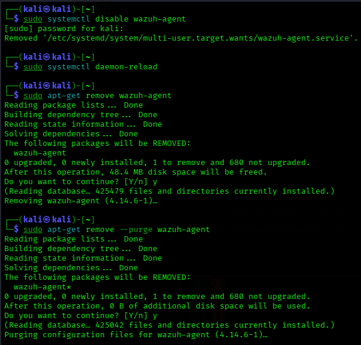
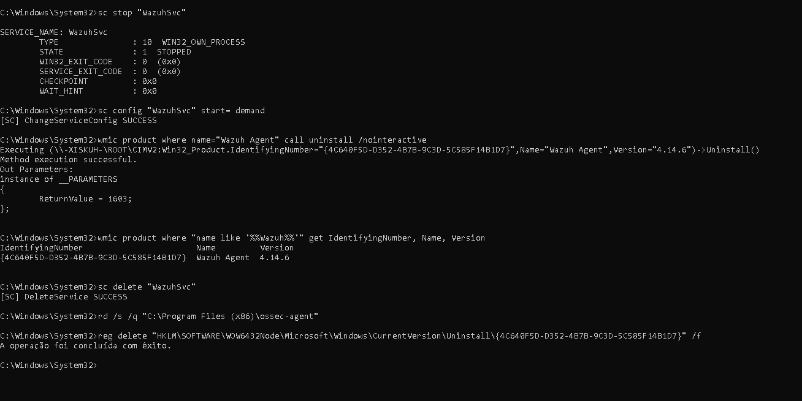
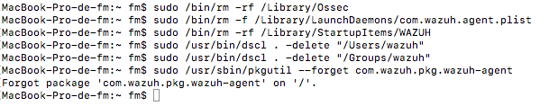
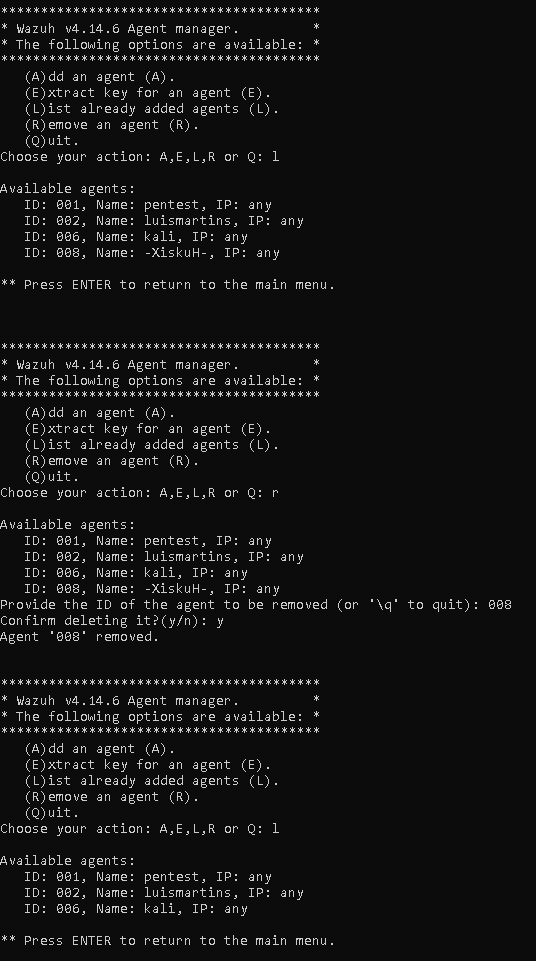
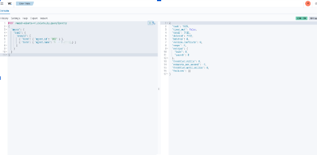

# Remove Agent

---

# Table of Contents

1. Remove the Agent from Linux
2. Remove the Agent from Windows
3. Remove the Agent from macOS
4. Remove the Agent from the Wazuh Manager
5. Remove Agent Alerts from the Dashboard

---

## 1 - Remove the Agent from Linux

If you do not want to completely remove the agent from the endpoint, at least stop the service. Otherwise, the agent will continuously attempt to register with the Wazuh Manager.

Disable the Wazuh Agent service.

```bash
sudo systemctl disable wazuh-agent
```

Reload the systemd configuration.

```bash
sudo systemctl daemon-reload
```

Remove the Wazuh Agent package.

```bash
sudo apt-get remove wazuh-agent
```

Remove the package and all configuration files.

```bash
sudo apt-get remove --purge wazuh-agent
```



---

## 2 - Remove the Agent from Windows

### Easy Uninstallation

The easiest way to remove the Wazuh Agent is through the **Installed Apps** interface in Windows.

Navigate to:

**Settings → Apps → Installed apps**

Locate **Wazuh Agent**, select **Uninstall**, and follow the on-screen instructions.


If you do not have access to the graphical interface, or if the standard uninstallation fails, continue with the **Command Prompt** method below.

---

### Command Prompt Method

If **WMIC** is not installed, enable it using one of the following methods.

From **Windows Settings**:

- Press **Windows + I**
- Go to **System**
- Select **Optional Features**
- Open **View features**
- Search for **WMIC**
- Install the feature

Or install it from **Command Prompt**.

```cmd
dism /Online /Add-Capability /CapabilityName:WMIC~~~~
```

Verify that WMIC is available.

```cmd
wmic os get caption,version,osarchitecture
```

Stop the Wazuh service.

```cmd
sc stop "WazuhSvc"
```

Set the service startup type to **Manual**.

```cmd
sc config "WazuhSvc" start= demand
```

Attempt the official uninstallation.

```cmd
wmic product where name="Wazuh Agent" call uninstall /nointeractive
```

If the command returns:

```text
ReturnValue = 0
```

The Wazuh Agent has been successfully removed.

If the command returns:

```text
ReturnValue = 1603 or other value
```

Continue with the following steps.

Retrieve the Wazuh Agent product GUID.

```cmd
wmic product where "name like '%%Wazuh%%'" get IdentifyingNumber,Name,Version
```

Remove the Windows service.

```cmd
sc delete "WazuhSvc"
```

Delete the remaining installation directory.

```cmd
rd /s /q "C:\Program Files (x86)\ossec-agent"
```

Delete the Windows Installer registry key.

```cmd
reg delete "HKLM\SOFTWARE\WOW6432Node\Microsoft\Windows\CurrentVersion\Uninstall\{WAZUH IDENTIFYING NUMBER FROM STEP Retrieve the Wazuh Agent product GUID}" /f
```



Verify that **Wazuh Agent** is no longer listed under the installed applications.

---

## 3 - Remove the Agent from macOS

Run the following commands to completely remove the Wazuh Agent from a macOS endpoint.

```bash
sudo /bin/rm -rf /Library/Ossec
```

```bash
sudo /bin/rm -f /Library/LaunchDaemons/com.wazuh.agent.plist
```

```bash
sudo /bin/rm -rf /Library/StartupItems/WAZUH
```

```bash
sudo /usr/bin/dscl . -delete "/Users/wazuh"
```

```bash
sudo /usr/bin/dscl . -delete "/Groups/wazuh"
```

```bash
sudo /usr/sbin/pkgutil --forget com.wazuh.pkg.wazuh-agent
```



---

## 4 - Remove the Agent from the Wazuh Manager

On the Wazuh Manager, open the agent management utility.

```bash
sudo /var/ossec/bin/manage_agents
```

Select the option to remove the registered agent and follow the on-screen instructions.



---

## 5 - Remove Agent Alerts from the Dashboard

To remove all alerts related to a specific agent, open **Indexer Management → Dev Tools** and execute the following query.

Replace the agent ID and agent name with the corresponding values.

```json
POST /wazuh-alerts-*/_delete_by_query?pretty
{
  "query": {
    "bool": {
      "should": [
        { "term": { "agent.id": "<AGENT_ID>" } },
        { "term": { "agent.name": "<AGENT_NAME>" } }
      ]
    }
  }
}
```



---

# Next Step

Continue with the Wazuh API token configuration.

[09 - Generate API Token](09-api-token.md)