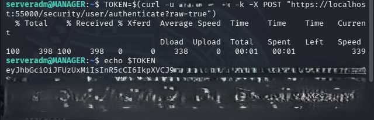
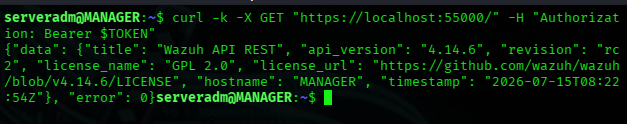

# Generate API Token

---

# Table of Contents

1. Generate the API Token
2. Validate the API Token

---

## 1 - Generate the API Token

On the Wazuh Manager, generate a JWT token using a valid Wazuh API user.

Replace the following placeholders:

- `<WAZUH_API_USER>`
- `<WAZUH_API_PASSWORD>`

```bash
TOKEN=$(curl -u <WAZUH_API_USER>:<WAZUH_API_PASSWORD> -k -X POST "https://localhost:55000/security/user/authenticate?raw=true")
```

Display the generated token.

```bash
echo $TOKEN
```



The output should be similar to the following:

```text
eyJhbGciOiJFUzUxMiIsInR5cCI6IkpXVCJ9...
```

---

## 2 - Validate the API Token

Use the generated token to authenticate against the Wazuh API.

```bash
curl -k -X GET "https://localhost:55000/" \
-H "Authorization: Bearer $TOKEN"
```



If the token is valid, the API returns the Wazuh API information.

---

# Next Step

This project is still under active development, and additional documentation will be published in future updates.

For the latest updates, follow the repository.

**Project Status:** Work in Progress (WIP)