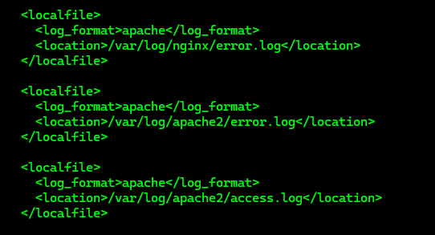
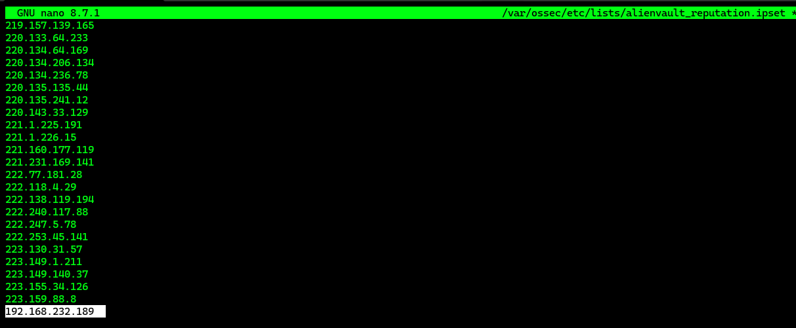
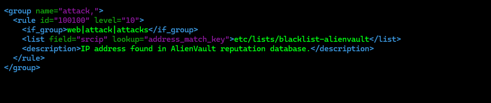
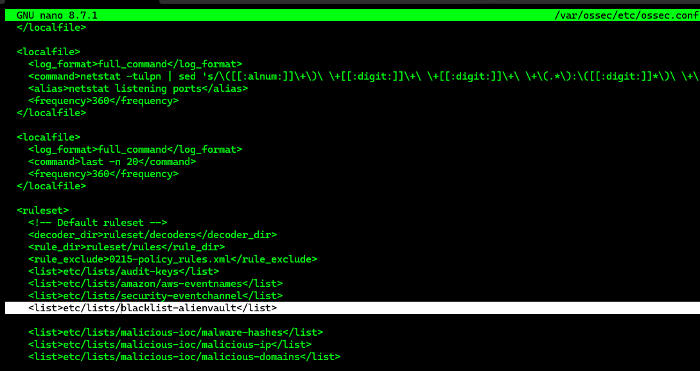
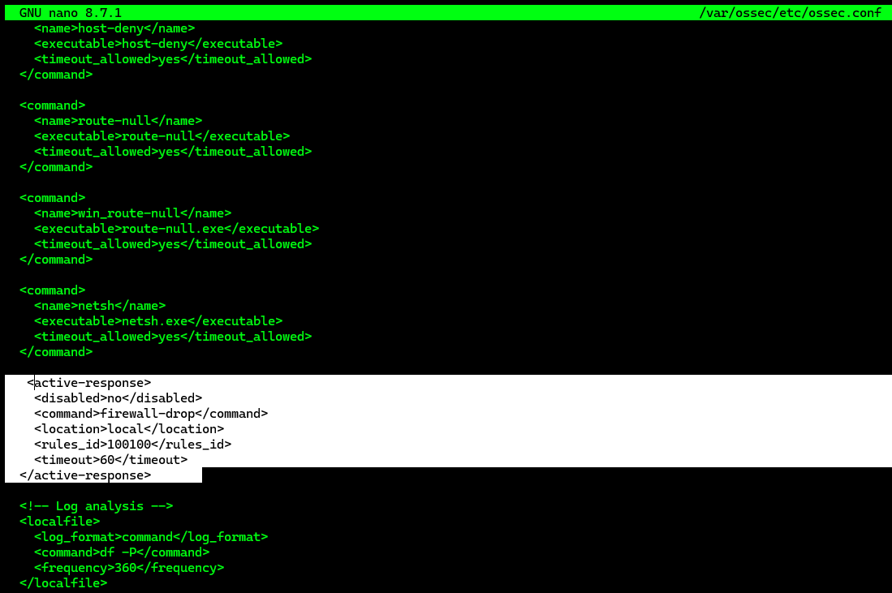
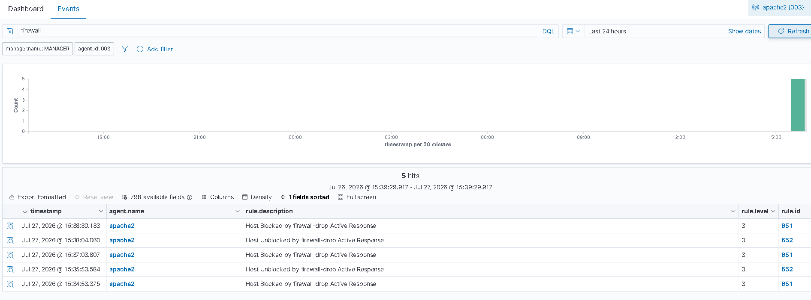

# Blocking a Known Malicious Actor

---

# Table of Contents

1. Configure the Ubuntu Endpoint
2. Configure the Wazuh Server
3. Create the Active Response Rule
4. Configure the Blacklist
5. Configure Active Response
6. Simulate the Attack
7. Verify the Alert in the Dashboard

---

## 1 - Configure the Ubuntu Endpoint

The Ubuntu endpoint must have the Wazuh Agent installed.

Update the package list.

```bash
sudo apt update
```

Install Apache2.

```bash
sudo apt install apache2
```

Allow Apache through the firewall.

```bash
sudo ufw allow 'Apache'
```

Verify the firewall status.

```bash
sudo ufw status
```

Enable the Apache service.

```bash
sudo systemctl enable apache2
```

Start the Apache service.

```bash
sudo systemctl start apache2
```

Verify the Apache service status.

```bash
sudo systemctl status apache2
```

Test the Apache web server.

Replace `<UBUNTU_IP>` with the IP address of the Ubuntu endpoint.

```bash
curl http://<UBUNTU_IP>
```

Open the Wazuh Agent configuration file.

```bash
sudo nano /var/ossec/etc/ossec.conf
```

Add the following configuration to monitor the Apache access log.

```xml
<localfile>
  <log_format>syslog</log_format>
  <location>/var/log/apache2/access.log</location>
</localfile>
```



Restart the Wazuh Agent.

```bash
sudo systemctl restart wazuh-agent
```

---

## 2 - Configure the Wazuh Server

Download the AlienVault reputation database.

```bash
sudo wget https://iplists.firehol.org/files/alienvault_reputation.ipset -O /var/ossec/etc/lists/alienvault_reputation.ipset
```

Add the attacker IP address to the database.

Open the database file.

```bash
sudo nano /var/ossec/etc/lists/alienvault_reputation.ipset
```



Download the script used to convert the `.ipset` database to `.cdb`.

```bash
sudo wget https://wazuh.com/resources/iplist-to-cdblist.py -O /tmp/iplist-to-cdblist.py
```

Convert the database.

```bash
sudo /var/ossec/framework/python/bin/python3 /tmp/iplist-to-cdblist.py /var/ossec/etc/lists/alienvault_reputation.ipset /var/ossec/etc/lists/blacklist-alienvault
```

Remove the original `.ipset` database.

```bash
sudo rm -rf /var/ossec/etc/lists/alienvault_reputation.ipset
```

Remove the conversion script.

```bash
sudo rm -rf /tmp/iplist-to-cdblist.py
```

---

## 3 - Create the Active Response Rule

Open the Wazuh local rules configuration file.

```bash
sudo nano /var/ossec/etc/rules/local_rules.xml
```

Add the following rule.

```xml
<group name="attack,">
  <rule id="100100" level="10">
    <if_group>web|attack|attacks</if_group>
    <list field="srcip" lookup="address_match_key">etc/lists/blacklist-alienvault</list>
    <description>IP address found in AlienVault reputation database.</description>
  </rule>
</group>
```



---

## 4 - Configure the Blacklist

Open the Wazuh Manager configuration file.

```bash
sudo nano /var/ossec/etc/ossec.conf
```

Add the path to the blacklist.

```xml
<list>etc/lists/blacklist-alienvault</list>
```



---

## 5 - Configure Active Response

Uncomment the Active Response block and add the following configuration.

```xml
<active-response>
  <disabled>no</disabled>
  <command>firewall-drop</command>
  <location>local</location>
  <rules_id>100100</rules_id>
  <timeout>60</timeout>
</active-response>
```



Restart the Wazuh Manager.

```bash
sudo systemctl restart wazuh-manager
```

---

## 6 - Simulate the Attack

From the attacker machine, access the Apache web server.

Replace `<WEBSERVER_IP>` with the IP address of the Ubuntu web server.

```bash
curl http://<WEBSERVER_IP>
```

---

## 7 - Verify the Alert in the Dashboard

Open the Wazuh Dashboard and verify the alert generated by the Active Response.

The attacker IP address should be blocked for **60 seconds** according to the configured timeout.



---

# Next Step

Continue with the next Proof of Concept.

[02 - File Integrity Monitoring](02-file-integrity-monitoring.md)