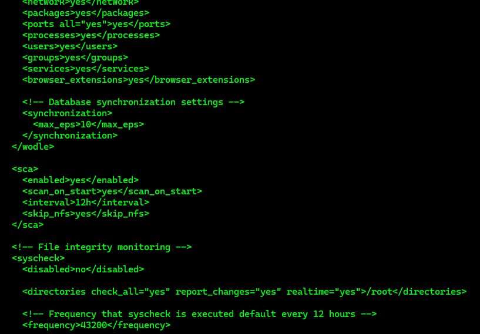
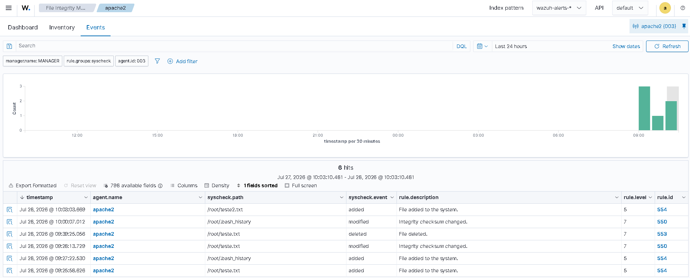

# File Integrity Monitoring

---

# Table of Contents

1. Linux Agent
2. Windows Agent
3. Visualize File Integrity Monitoring in the Dashboard

---

## 1 - Linux Agent

Open the Wazuh Agent configuration file.

```bash
sudo nano /var/ossec/etc/ossec.conf
```

Locate the File Integrity Monitoring section and add the following line.

```xml
<directories check_all="yes" report_changes="yes" realtime="yes">/root</directories>
```



You can add any directory path that you want to monitor.

Restart the Wazuh Agent.

```bash
sudo systemctl restart wazuh-agent
```
---

## 2 - Windows Agent

Open the Wazuh Agent configuration file.

```text
C:\Program Files (x86)\ossec-agent\ossec.conf
```

Locate the File Integrity Monitoring section and add the following line.

```xml
<directories check_all="yes" report_changes="yes" realtime="yes">C:\Users\<USER_NAME>\Desktop</directories>
```

Restart the Wazuh Agent.

```powershell
Restart-Service -Name wazuh
```

---

## 3 - Visualize File Integrity Monitoring in the Dashboard

Open the Wazuh Dashboard and verify the File Integrity Monitoring events.


---

# Next Step

Continue with the next Proof of Concept.

[03 - Detecting a Brute-Force Attack](03-brute-force-detection.md)