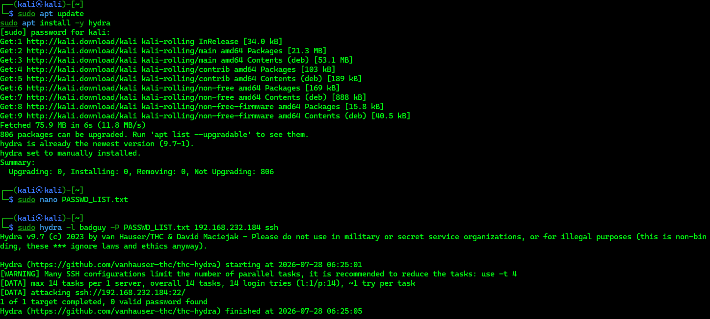
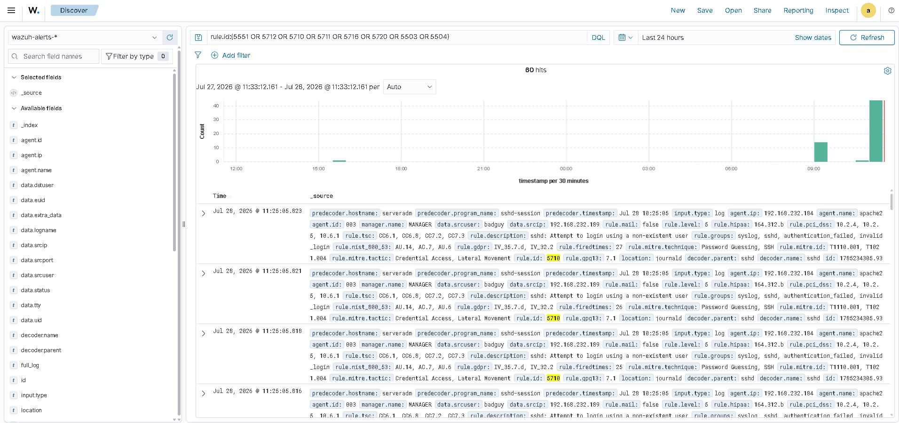

# Detecting a Brute-Force Attack

---

# Table of Contents

1. Simulate the Brute-Force Attack
2. Visualize the Attack in the Dashboard

---

## 1 - Simulate the Brute-Force Attack

On the attacker machine, install Hydra.

Update the package list.

```bash
sudo apt update
```

Install Hydra.

```bash
sudo apt install -y hydra
```

Create a file containing multiple random passwords.

```bash
sudo nano PASSWD_LIST.txt
```

Perform the brute-force attack against the SSH service.

Replace `<ENDPOINT_IP>` with the IP address of the target endpoint.

```bash
sudo hydra -l badguy -P PASSWD_LIST.txt <ENDPOINT_IP> ssh
```



---

## 2 - Visualize the Attack in the Dashboard

Open the Wazuh Dashboard and apply the following filter to visualize the brute-force attack alerts.

```text
rule.id:(5551 OR 5712 OR 5710 OR 5711 OR 5716 OR 5720 OR 5503 OR 5504)
```



---

# Next Step

Continue with the next Proof of Concept.

[04 - Detecting Unauthorized Processes](04-unauthorized-processes.md)