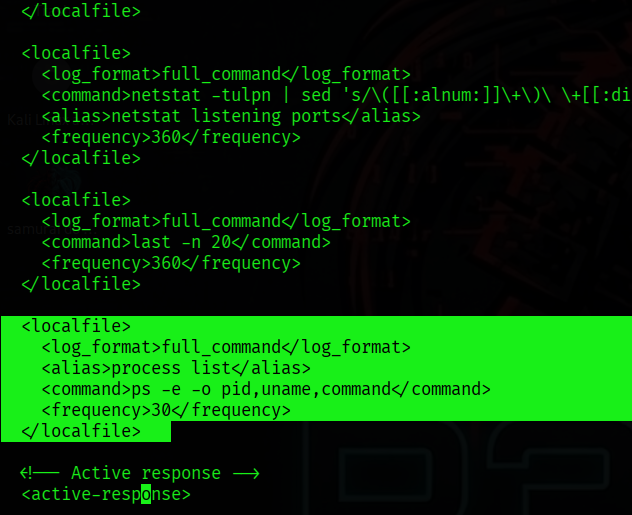
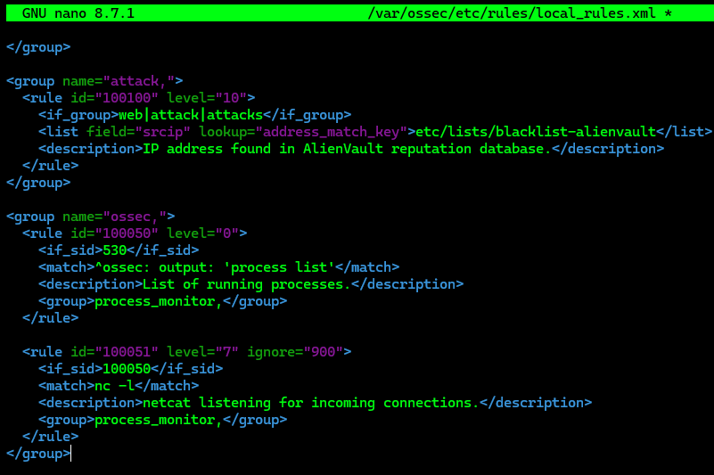
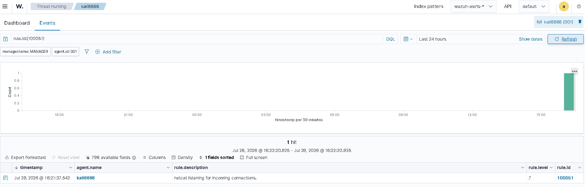

# Detecting Unauthorized Processes

---

# Table of Contents

1. Configure Process Monitoring on the Linux Agent
2. Configure the Detection Rules on the Wazuh Server
3. Simulate the Attack
4. Visualize the Alert in the Dashboard

---

## 1 - Configure Process Monitoring on the Linux Agent

On the Linux endpoint, open the Wazuh Agent configuration file.

```bash
sudo nano /var/ossec/etc/ossec.conf
```

Add the following configuration to the file.

```xml
<localfile>
  <log_format>full_command</log_format>
  <alias>process list</alias>
  <command>ps -e -o pid,uname,command</command>
  <frequency>30</frequency>
</localfile>
```



Restart the Wazuh Agent.

```bash
sudo systemctl restart wazuh-agent
```

Install `ncat` and `nmap`.

```bash
sudo apt install ncat nmap -y
```

---

## 2 - Configure the Detection Rules on the Wazuh Server

Open the Wazuh local rules configuration file.

```bash
sudo nano /var/ossec/etc/rules/local_rules.xml
```

Add the following rules.

```xml
<group name="ossec,">
  <rule id="100050" level="0">
    <if_sid>530</if_sid>
    <match>^ossec: output: 'process list'</match>
    <description>List of running processes.</description>
    <group>process_monitor,</group>
  </rule>

  <rule id="100051" level="7" ignore="900">
    <if_sid>100050</if_sid>
    <match>nc -l</match>
    <description>netcat listening for incoming connections.</description>
    <group>process_monitor,</group>
  </rule>
</group>
```



Restart the Wazuh Manager.

```bash
sudo systemctl restart wazuh-manager
```

---

## 3 - Simulate the Attack

On the endpoint, execute the following command for 30 seconds.

```bash
nc -l 8000
```

---

## 4 - Visualize the Alert in the Dashboard

Open the Wazuh Dashboard and use the following filter to display the alert.

```text
rule.id:(100051)
```



---

# Next Step

Continue with the next Proof of Concept.

[05 - Network IDS Integration](05-network-ids-integration.md)