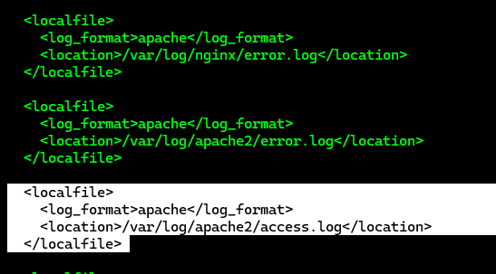
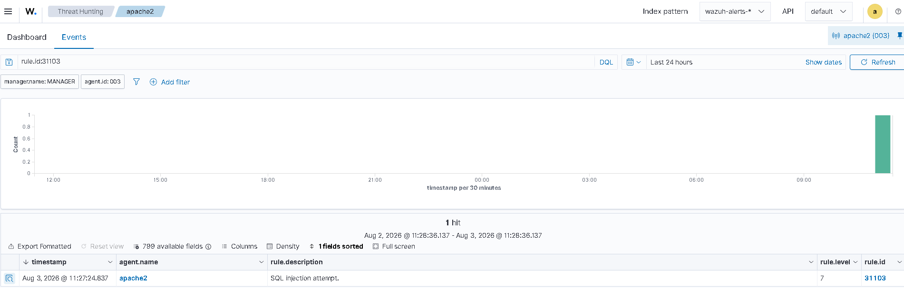

# Detecting an SQL Injection Attack

---

# Table of Contents

1. Configure the Ubuntu Endpoint
2. Simulate the SQL Injection Attack
3. Verify the Alert in the Wazuh Dashboard

---

## 1 - Configure the Ubuntu Endpoint

The Ubuntu endpoint must have the Wazuh Agent installed.

Update the package list.

```bash
sudo apt update
```

Install Apache2.

```bash
sudo apt install apache2
```

List the available UFW application profiles.

```bash
sudo ufw app list
```

Allow Apache through the firewall.

```bash
sudo ufw allow 'Apache'
```

Verify the firewall status.

```bash
sudo ufw status
```

Verify the Apache service status.

```bash
sudo systemctl status apache2
```

Test the Apache web server.

Replace `<UBUNTU_IP>` with the IP address of the Ubuntu endpoint.

```bash
curl http://<UBUNTU_IP>
```

Open the Wazuh Agent configuration file.

```bash
sudo nano /var/ossec/etc/ossec.conf
```

Add the following configuration to monitor the Apache access log.

```xml
<localfile>
  <log_format>apache</log_format>
  <location>/var/log/apache2/access.log</location>
</localfile>
```



Save the file.

```text
Ctrl + X
Y
Enter
```

Restart the Wazuh Agent.

```bash
sudo systemctl restart wazuh-agent
```

---

## 2 - Simulate the SQL Injection Attack

From the attacker machine, send the following request to the Ubuntu endpoint.

```bash
curl -XGET "http://192.168.232.184/users/?id=SELECT+*+FROM+users";
```

---

## 3 - Verify the Alert in the Wazuh Dashboard

Open the Wazuh Dashboard and verify the SQL injection alert.

Use the following rule IDs to identify the alert:

```text
rule.id:31103
```

or

```text
rule.id:31106
```



---

# Next Step

Continue with the next Proof of Concept.

[07 - Detecting Suspicious Binaries](07-detecting-suspicious-binaries.md)