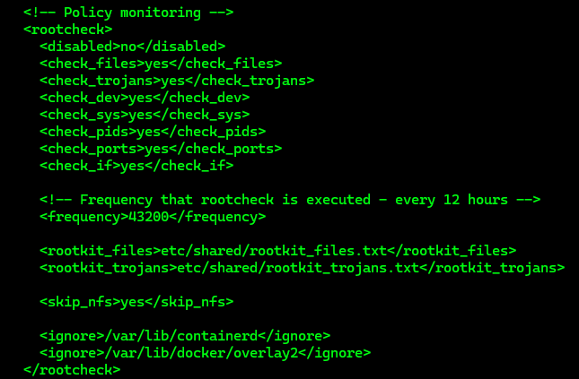
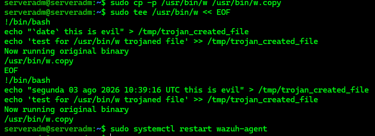
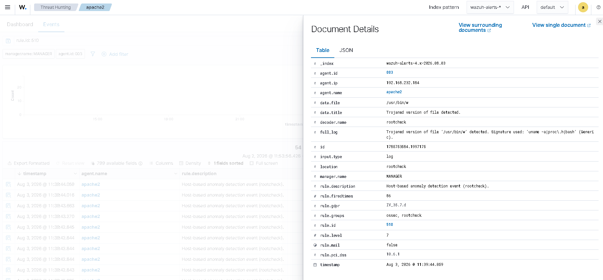

# Detecting Suspicious Binaries

---

# Table of Contents

1. Configure Rootcheck
2. Simulate the Attack
3. Verify the Alert in the Dashboard
4. Restore the Original Binary

---

## 1 - Configure Rootcheck

On the Ubuntu endpoint with the Wazuh Agent installed, open the Wazuh Agent configuration file.

```bash
sudo nano /var/ossec/etc/ossec.conf
```

Search for the `rootcheck` section.

```text
Ctrl + F
```

Search for:

```text
rootcheck
```

Verify that the Rootcheck module is enabled.

The following configuration should be present:

```xml
<rootcheck>
  <disabled>no</disabled>
  <check_files>yes</check_files>
  <!-- Line for trojans detection -->
  <check_trojans>yes</check_trojans>
  <check_dev>yes</check_dev>
  <check_sys>yes</check_sys>
  <check_pids>yes</check_pids>
  <check_ports>yes</check_ports>
  <check_if>yes</check_if>
  <!-- Frequency that rootcheck is executed - every 12 hours -->
  <frequency>43200</frequency>
  <rootkit_files>/var/ossec/etc/shared/rootkit_files.txt</rootkit_files>
  <rootkit_trojans>/var/ossec/etc/shared/rootkit_trojans.txt</rootkit_trojans>
  <skip_nfs>yes</skip_nfs>
</rootcheck>
```



---

## 2 - Simulate the Attack

Create a copy of the original system binary.

```bash
sudo cp -p /usr/bin/w /usr/bin/w.copy
```

Replace the original system binary `/usr/bin/w` with the following shell script.

```bash
sudo tee /usr/bin/w << EOF
!/bin/bash
echo "`date` this is evil" > /tmp/trojan_created_file
echo 'test for /usr/bin/w trojaned file' >> /tmp/trojan_created_file
Now running original binary
/usr/bin/w.copy
EOF
```

The Rootcheck scan runs every 12 hours by default.

Force a Rootcheck scan by restarting the Wazuh Agent to see the relevant alert.

```bash
sudo systemctl restart wazuh-agent
```

---

## 3 - Verify the Alert in the Dashboard

Open the Wazuh Dashboard and verify the following alert:

```text
Host-based anomaly detection event (rootcheck)
```

Use the following rule ID to identify the alert:

```text
rule.id: 510
```

Verify that the `rule.id: 510` alert is generated correctly.



---

## 4 - Restore the Original Binary

After verifying that the Rootcheck detection is working correctly, restore the original `/usr/bin/w` system binary.

```bash
sudo cp -p /usr/bin/w.copy /usr/bin/w
```

Remove the backup copy.

```bash
sudo rm -f /usr/bin/w.copy
```

---

# Next Step

Continue with the next Proof of Concept.

[08 - Detecting and Removing Malware Using VirusTotal](08-detecting-and-removing-malware-using-virustotal-integration.md)