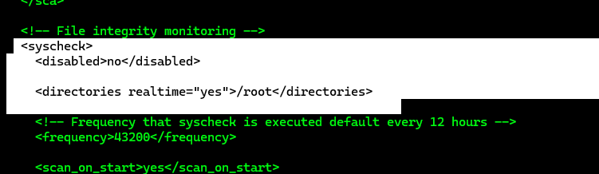
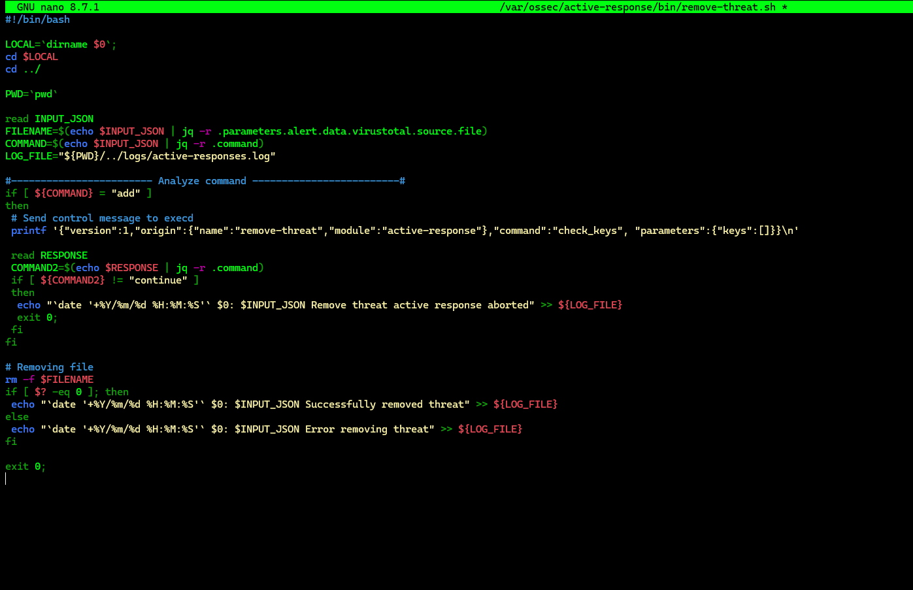
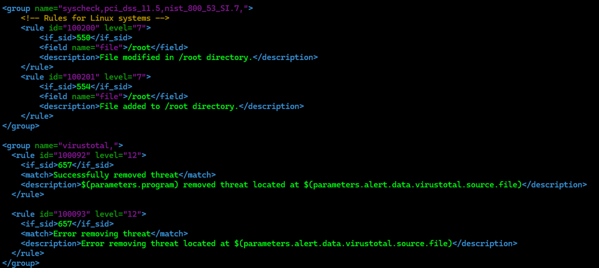
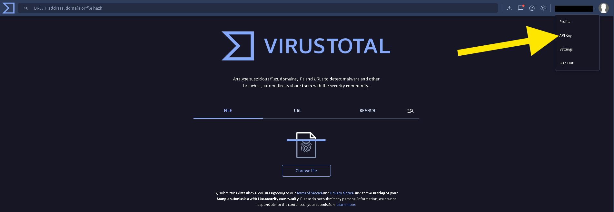
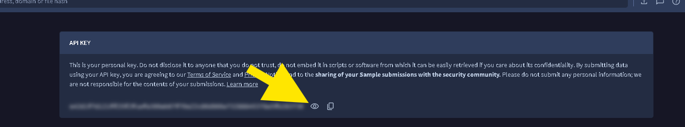
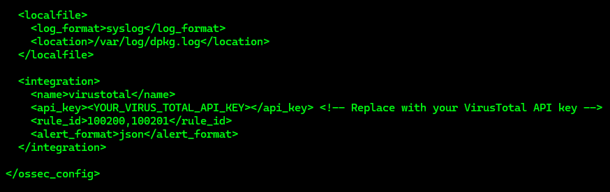
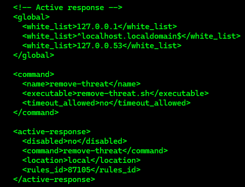
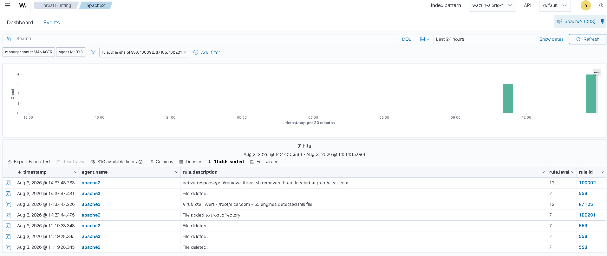

# Detecting and Removing Malware Using VirusTotal Integration

---

# Table of Contents

1. Configure File Integrity Monitoring
2. Create the Active Response Script
3. Configure Wazuh Detection Rules
4. Obtain the VirusTotal API Key
5. Configure the VirusTotal Integration
6. Configure Active Response
7. Restart the Wazuh Manager
8. Simulate the Attack
9. Verify the Alert in the Dashboard

---

## 1 - Configure File Integrity Monitoring

On the Ubuntu endpoint with the Wazuh Agent installed, open the Wazuh Agent configuration file.

```bash
sudo nano /var/ossec/etc/ossec.conf
```

Search for the `syscheck` section.

```text
Ctrl + F
```

Search for:

```text
syscheck
```

Make sure that `<disabled>` is set to `no`.

This enables the Wazuh File Integrity Monitoring module to monitor directory changes.

Add the following configuration:

```xml
<directories realtime="yes">/root</directories>
```



---

## 2 - Create the Active Response Script

Install `jq`.

`jq` is used by the Active Response script to process JSON input.

```bash
sudo apt update
```

```bash
sudo apt -y install jq
```

Create the Active Response script.

```bash
sudo nano /var/ossec/active-response/bin/remove-threat.sh
```

Add the following script:

```bash
#!/bin/bash

LOCAL=`dirname $0`;
cd $LOCAL
cd ../

PWD=`pwd`

read INPUT_JSON
FILENAME=$(echo $INPUT_JSON | jq -r .parameters.alert.data.virustotal.source.file)
COMMAND=$(echo $INPUT_JSON | jq -r .command)
LOG_FILE="${PWD}/../logs/active-responses.log"

#------------------------ Analyze command -------------------------#
if [ ${COMMAND} = "add" ]
then
 # Send control message to execd
 printf '{"version":1,"origin":{"name":"remove-threat","module":"active-response"},"command":"check_keys", "parameters":{"keys":[]}}\n'

 read RESPONSE
 COMMAND2=$(echo $RESPONSE | jq -r .command)
 if [ ${COMMAND2} != "continue" ]
 then
  echo "`date '+%Y/%m/%d %H:%M:%S'` $0: $INPUT_JSON Remove threat active response aborted" >> ${LOG_FILE}
  exit 0;
 fi
fi

# Removing file
rm -f $FILENAME
if [ $? -eq 0 ]; then
 echo "`date '+%Y/%m/%d %H:%M:%S'` $0: $INPUT_JSON Successfully removed threat" >> ${LOG_FILE}
else
 echo "`date '+%Y/%m/%d %H:%M:%S'` $0: $INPUT_JSON Error removing threat" >> ${LOG_FILE}
fi

exit 0;
```



Change the ownership and permissions of the script.

```bash
sudo chmod 750 /var/ossec/active-response/bin/remove-threat.sh
```

```bash
sudo chown root:wazuh /var/ossec/active-response/bin/remove-threat.sh
```

Restart the Wazuh Agent.

```bash
sudo systemctl restart wazuh-agent
```

---

## 3 - Configure Wazuh Detection Rules

On the Wazuh Server, open the local rules configuration file.

```bash
sudo nano /var/ossec/etc/rules/local_rules.xml
```

Add the following rules.

These rules generate alerts when changes in the `/root` directory are detected by File Integrity Monitoring scans.

```xml
<group name="syscheck,pci_dss_11.5,nist_800_53_SI.7,">
    <!-- Rules for Linux systems -->
    <rule id="100200" level="7">
        <if_sid>550</if_sid>
        <field name="file">/root</field>
        <description>File modified in /root directory.</description>
    </rule>

    <rule id="100201" level="7">
        <if_sid>554</if_sid>
        <field name="file">/root</field>
        <description>File added to /root directory.</description>
    </rule>
</group>

<group name="virustotal,">
  <rule id="100092" level="12">
    <if_sid>657</if_sid>
    <match>Successfully removed threat</match>
    <description>$(parameters.program) removed threat located at $(parameters.alert.data.virustotal.source.file)</description>
  </rule>

  <rule id="100093" level="12">
    <if_sid>657</if_sid>
    <match>Error removing threat</match>
    <description>Error removing threat located at $(parameters.alert.data.virustotal.source.file)</description>
  </rule>
</group>
```



---

## 4 - Obtain the VirusTotal API Key

Register for a VirusTotal account.

```text
https://www.virustotal.com/
```

Request an API key.



Store the generated API key securely.

---

## 5 - Configure the VirusTotal Integration

On the Wazuh Server, open the main Wazuh configuration file.

```bash
sudo nano /var/ossec/etc/ossec.conf
```

Go to the end of the file and add the following integration module.

Replace `<YOUR_VIRUS_TOTAL_API_KEY>` with your VirusTotal API key.

This configuration triggers a VirusTotal query whenever rules `100200` or `100201` are triggered.

```xml
<integration>
    <name>virustotal</name>
    <api_key><YOUR_VIRUS_TOTAL_API_KEY></api_key>
    <rule_id>100200,100201</rule_id>
    <alert_format>json</alert_format>
</integration>
```



---

## 6 - Configure Active Response

In the Wazuh Server `/var/ossec/etc/ossec.conf` file, locate the Active Response section.

```text
Ctrl + F
```

Search for:

```text
Active response
```

Add the following command configuration:

```xml
<command>
    <name>remove-threat</name>
    <executable>remove-threat.sh</executable>
    <timeout_allowed>no</timeout_allowed>
</command>
```

Add the following Active Response configuration:

```xml
<active-response>
    <disabled>no</disabled>
    <command>remove-threat</command>
    <location>local</location>
    <rules_id>87105</rules_id>
</active-response>
```


This configuration enables Active Response and triggers the `remove-threat.sh` script when VirusTotal flags a file as malicious.


---

## 7 - Restart the Wazuh Manager

Restart the Wazuh Manager service to apply the configuration changes.

```bash
sudo systemctl restart wazuh-manager
```

---

## 8 - Simulate the Attack

Download an EICAR test file to the `/root` directory on the Ubuntu endpoint.

```bash
sudo curl -Lo /root/eicar.com https://secure.eicar.org/eicar.com && sudo ls -lah /root/eicar.com
```

The EICAR test file is used to simulate the presence of a malicious file without using real malware.

---

## 9 - Verify the Alert in the Dashboard

Open the Wazuh Dashboard and verify the generated alerts.

Use the following filter:

```text
rule.id: is one of 553,100092,87105,100201
```



---

# Next Step

Continue with the vulnerability detection Proof of Concept.

[09 - Vulnerability Detection](09-vulnerability-detection.md)