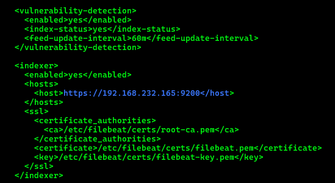
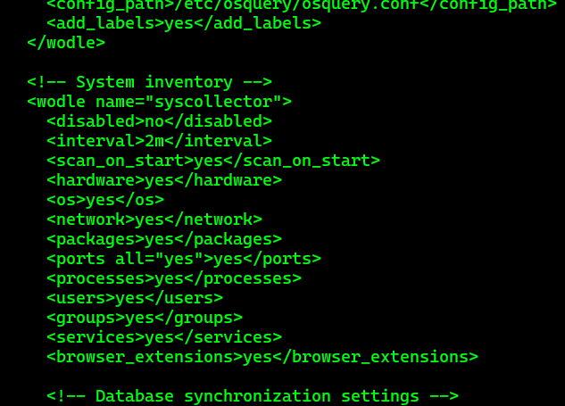
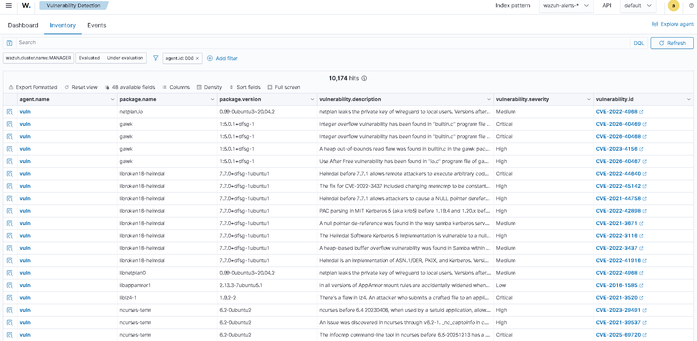
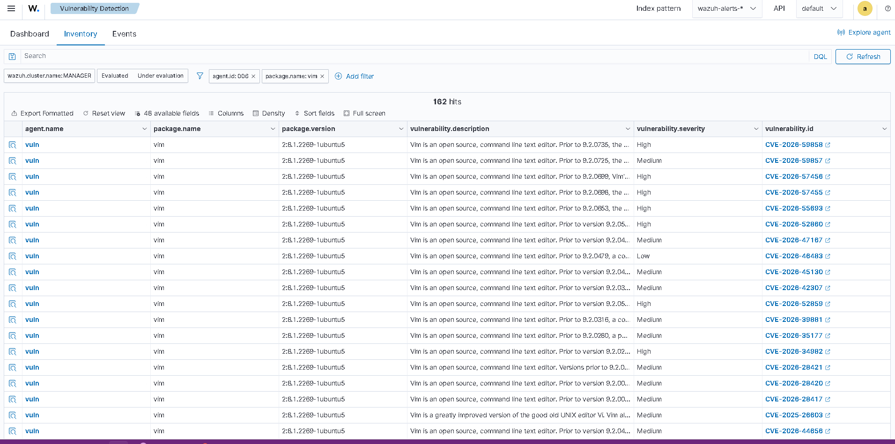
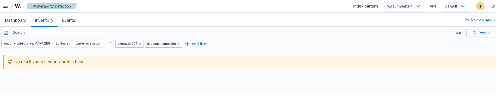
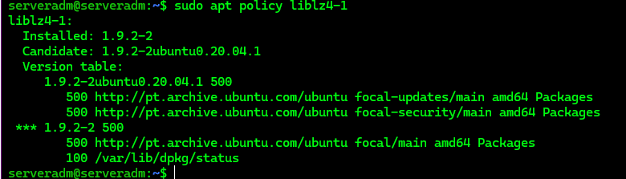
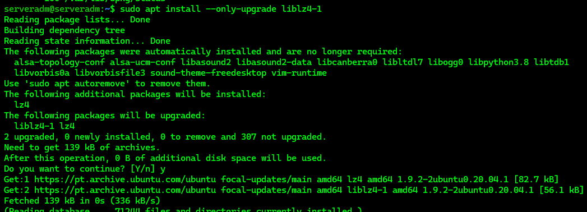
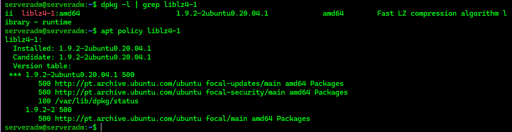
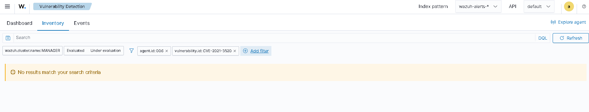

# Vulnerability Detection

---

# Table of Contents

1. Configure Vulnerability Detection
2. Configure the Syscollector Interval
3. Test the Configuration
4. Identify Vulnerable Packages
5. Validate Vulnerability Removal
6. Validate Vulnerability Remediation Through Package Update

---

## 1 - Configure Vulnerability Detection

On the Wazuh Server, open the Wazuh Manager configuration file.

```bash
sudo nano /var/ossec/etc/ossec.conf
```

Verify that Vulnerability Detection is enabled.

The following configuration should be present:

```xml
<vulnerability-detection>
  <enabled>yes</enabled>
  <index-status>yes</index-status>
  <feed-update-interval>60m</feed-update-interval>
</vulnerability-detection>
```

Verify that the Wazuh Indexer connection is properly configured.

The Indexer node used in this laboratory is:

```text
192.168.232.165
```

The following configuration should be present:

```xml
<indexer>
  <enabled>yes</enabled>
  <hosts>
    <host>https://192.168.232.165:9200</host>
  </hosts>
  <ssl>
    <certificate_authorities>
      <ca>/etc/filebeat/certs/root-ca.pem</ca>
    </certificate_authorities>
    <certificate>/etc/filebeat/certs/filebeat.pem</certificate>
    <key>/etc/filebeat/certs/filebeat-key.pem</key>
  </ssl>
</indexer>
```

Replace `192.168.232.165` with your Wazuh Indexer node IP address or hostname.

The Indexer address can be found in the Filebeat configuration file:

```bash
/etc/filebeat/filebeat.yml
```



If changes were made to the Wazuh Manager configuration, restart the service.

```bash
sudo systemctl restart wazuh-manager
```

---

## 2 - Configure the Syscollector Interval

The time required to detect vulnerabilities depends on the `<interval>` value configured in the Syscollector module on the Wazuh Agent.

For this Proof of Concept, the Syscollector interval is reduced from **1 hour to 2 minutes** to allow vulnerability changes to be detected more quickly.

Open the Wazuh Agent configuration file.

```bash
sudo nano /var/ossec/etc/ossec.conf
```

Locate the Syscollector module and change the interval to:

```xml
<interval>2m</interval>
```


Restart the Wazuh Agent if changes were made to the configuration.

```bash
sudo systemctl restart wazuh-agent
```

---

## 3 - Test the Configuration

To validate the Vulnerability Detection capability without manually installing individual vulnerable packages, a dedicated test endpoint running an older Ubuntu release was deployed.

The test environment uses:

```text
Ubuntu Server 20.04.1 LTS
```

The endpoint was deployed specifically as an isolated test endpoint and contains packages with known security vulnerabilities.

The endpoint is connected to the Wazuh Manager, and the Syscollector module is configured with a reduced scan interval to allow vulnerability changes to be detected more quickly.

---

## 4 - Identify Vulnerable Packages

Navigate to:

**Vulnerability Detection → Inventory**

Select the test endpoint.

The Dashboard displays vulnerabilities detected in packages installed on the endpoint, including:

- Package name
- Installed package version
- Vulnerability description
- Severity
- CVE identifier

Several vulnerabilities were detected on the Ubuntu 20.04.1 endpoint.

Examples include:

```text
gawk
libroken18-heimdal
liblz4-1
netplan.io
ncurses-term
```

This confirms that Wazuh is correlating the installed software inventory with its vulnerability intelligence.

---

## 5 - Validate Vulnerability Removal

To validate the vulnerability detection and remediation workflow, the `vim` package was selected from the vulnerabilities identified by Wazuh.

The installed version of `vim` was associated with multiple vulnerabilities reported by Wazuh.

Instead of documenting all vulnerabilities individually, a representative CVE was selected.

Before remediation, the following information was recorded from the Wazuh Dashboard:

```text
Affected package: vim
Installed version: 2:8.1.2269-1ubuntu5
Representative CVE: CVE-2022-0318
Severity: Critical
```

The vulnerability description was:

```text
Heap-based Buffer Overflow in vim/vim prior to 8.2.
```

The complete list of vulnerabilities associated with the package was retained in the Wazuh Dashboard for reference.

For this test, the `vim` package was removed from the endpoint to verify whether Wazuh would update its vulnerability inventory after the affected package was no longer installed.

```bash
sudo apt remove vim
```

After removing the `vim` package, the Wazuh Dashboard was checked again to verify the vulnerability inventory.

All **163 vulnerabilities associated with the `vim` package** were no longer reported for the endpoint.

This confirms that Wazuh updated the vulnerability inventory after the affected package was removed.

---

## 6 - Validate Vulnerability Remediation Through Package Update

To validate the complete vulnerability detection and remediation workflow, a vulnerability affecting an installed package was selected from the Wazuh Dashboard.

For this test, the `liblz4-1` package was selected as the affected package.

Before applying the remediation, the following information was recorded from the Wazuh Dashboard:

```text
Affected package: liblz4-1
Installed version: 1.9.2-2
CVE: CVE-2021-3520
Severity: Critical
```

The vulnerability description was:

```text
There's a flaw in lz4. An attacker who submits a crafted file to an application linked with lz4 may be able to trigger an integer overflow, leading to calling of memmove() on a negative size argument, causing an out-of-bounds write and/or a crash. The greatest impact of this flaw is to availability, with some potential impact to confidentiality and integrity as well.
```

Verify the installed package version and the available candidate version.

```bash
sudo apt update
```

```bash
sudo apt policy liblz4-1
```


A security-fixed candidate version was available, allowing the package to be updated without removing the software.

Update the package.

```bash
sudo apt install --only-upgrade liblz4-1
```


After the update, verify the installed version.

```bash
dpkg -l | grep liblz4-1
```

Check the available package versions again.

```bash
sudo apt policy liblz4-1
```


After the package update, allow the endpoint to perform a new Syscollector inventory scan.

For this Proof of Concept, the Syscollector interval is configured to **2 minutes** to reduce the time required to detect changes.

After the new inventory scan completes, refresh the Wazuh Dashboard and access:

**Vulnerability Detection → Inventory**

Filter the results using the agent ID and the vulnerability ID associated with the previously identified vulnerability.

Use the following filter:

```text
agent.id: 006 AND vulnerability.id: CVE-2021-3520
```



Before remediation, the query returned `CVE-2021-3520` for the test endpoint.

After upgrading `liblz4-1` to the security-fixed version and completing the subsequent Syscollector inventory scan, the same query was executed again.

The vulnerability was no longer returned for agent `006`.

This confirms that Wazuh detected the package update and no longer reported `CVE-2021-3520` as an active vulnerability for the endpoint.

---

## Validation Result

The remediation was successfully detected by Wazuh.

The vulnerability was present before the package update and was no longer reported after the endpoint inventory was refreshed.

---

# Next Step

Continue with the next Proof of Concept.
[10 - Detecting Malware Using YARA Integration](10-detecting-malware-using-yara-integration.md)