# Detecting Malware Using YARA Integration

---

# Table of Contents

1. Install and Validate YARA
2. Download YARA Detection Rules
3. Configure Wazuh Server
4. Attack Emulation
5. Custom YARA Rules
6. Detection Workflow

---

YARA is a malware detection tool that can be integrated with Wazuh to analyze files on endpoints.

It uses predefined rules to identify patterns associated with malware and other suspicious artifacts.

When a file is created or modified, Wazuh can trigger a YARA scan to determine whether the file contains known malicious characteristics.

This provides an additional layer of security and helps detect potential threats quickly on monitored systems.

---

## 1 - Install and Validate YARA

Update the package list and install the required dependencies:

```bash
sudo apt update
sudo apt install -y make gcc autoconf libtool libssl-dev pkg-config jq
```

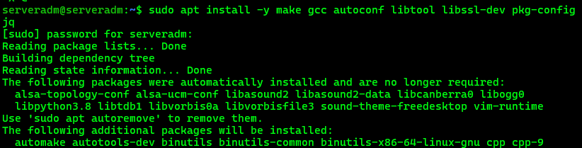

Download YARA version 4.5.5:

```bash
sudo curl -LO https://github.com/VirusTotal/yara/archive/v4.5.5.tar.gz
```

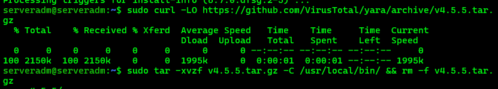

Extract the YARA source archive:

```bash
sudo tar -xvzf v4.5.5.tar.gz -C /usr/local/bin/ && rm -f v4.5.5.tar.gz
```

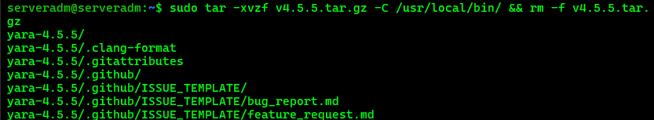

Navigate to the YARA source directory:

```bash
cd /usr/local/bin/yara-4.5.5/
```

Build, install, and test YARA:

```bash
sudo ./bootstrap.sh && sudo ./configure && sudo make && sudo make install && sudo make check
```

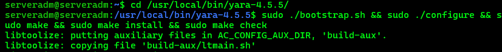

### Verify YARA Version

```bash
yara --version
```

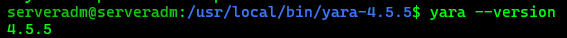

### Test YARA

Run YARA without specifying a rule or target file:

```bash
yara
```

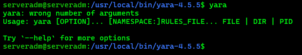

YARA is correctly installed and running. The displayed message is expected because no rule file or target file was provided.

A custom YARA rule was created to detect the string `YARA_TEST`.

Create the rule file:

```bash
sudo nano test.yar
```

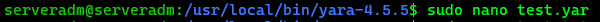

Add the following rule:

```yara
rule Test_YARA
{
    meta:
        description = "Simple YARA test rule"

    strings:
        $test = "YARA_TEST"

    condition:
        $test
}
```

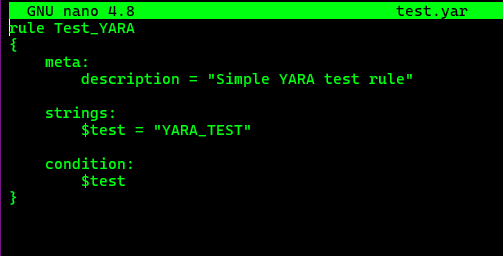

Create the test file:

```bash
sudo nano test.txt
```

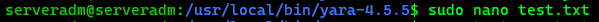

Add:

```text
This is a YARA_TEST file
```

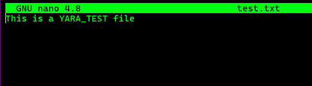

Scan the test file using the YARA rule:

```bash
yara test.yar test.txt
```

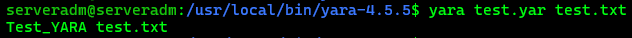

The rule should successfully match the file.

### Test a Non-Matching File

Create a second file:

```bash
sudo nano normal.txt
```

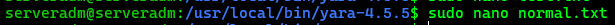

Add:

```text
This is a normal file
```

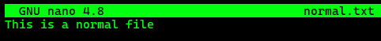

Run YARA against the non-matching file:

```bash
yara test.yar normal.txt
```

No results should appear because the file does not contain the string required by the rule.

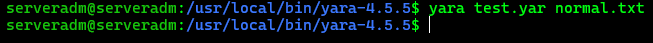

Remove the test files:

```bash
sudo rm normal.txt test.txt
```

---

## 2 - Download YARA Detection Rules

Create the directory used to store the YARA rules:

```bash
sudo mkdir -p /tmp/yara/rules
```

Download the YARA detection rules:

```bash
sudo curl 'https://valhalla.nextron-systems.com/api/v1/get' \
-H 'Accept: text/html,application/xhtml+xml,application/xml;q=0.9,*/*;q=0.8' \
-H 'Accept-Language: en-US,en;q=0.5' \
--compressed \
-H 'Referer: https://valhalla.nextron-systems.com/' \
-H 'Content-Type: application/x-www-form-urlencoded' \
-H 'DNT: 1' \
-H 'Connection: keep-alive' \
-H 'Upgrade-Insecure-Requests: 1' \
--data 'demo=demo&apikey=1111111111111111111111111111111111111111111111111111111111111111&format=text' \
-o /tmp/yara/rules/yara_rules.yar
```

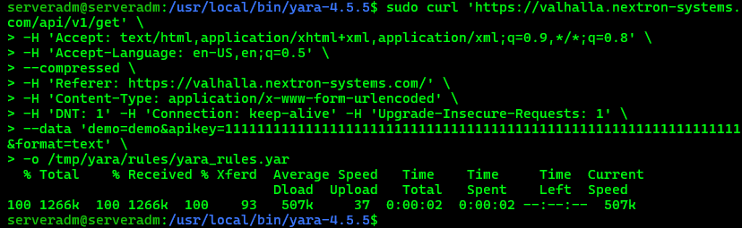

Create the `yara.sh` script in the Wazuh Active Response directory:

```bash
sudo nano /var/ossec/active-response/bin/yara.sh
```

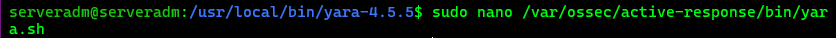

Add the following script:

```bash
#!/bin/bash

# Wazuh - Yara active response
# Copyright (C) 2015-2022, Wazuh Inc.
#
# This program is free software; you can redistribute it
# and/or modify it under the terms of the GNU General Public
# License (version 2) as published by the FSF - Free Software
# Foundation.

#------------------------- Gather parameters -------------------------#

# Extra arguments
read INPUT_JSON

YARA_PATH=$(echo $INPUT_JSON | jq -r .parameters.extra_args[1])
YARA_RULES=$(echo $INPUT_JSON | jq -r .parameters.extra_args[3])
FILENAME=$(echo $INPUT_JSON | jq -r .parameters.alert.syscheck.path)

# Set LOG_FILE path
LOG_FILE="/var/ossec/logs/active-responses.log"

size=0
actual_size=$(stat -c %s ${FILENAME})

while [ ${size} -ne ${actual_size} ]; do
    sleep 1
    size=${actual_size}
    actual_size=$(stat -c %s ${FILENAME})
done

#----------------------- Analyze parameters -----------------------#

if [[ ! $YARA_PATH ]] || [[ ! $YARA_RULES ]]
then
    echo "wazuh-yara: ERROR - Yara active response error. Yara path and rules parameters are mandatory." >> ${LOG_FILE}
    exit 1
fi

#------------------------- Main workflow --------------------------#

# Execute Yara scan on the specified filename
yara_output="$("${YARA_PATH}"/yara -w -r "$YARA_RULES" "$FILENAME")"

if [[ $yara_output != "" ]]
then
    # Iterate every detected rule and append it to the LOG_FILE
    while read -r line; do
        echo "wazuh-yara: INFO - Scan result: $line" >> ${LOG_FILE}
    done <<< "$yara_output"
fi

exit 0
```
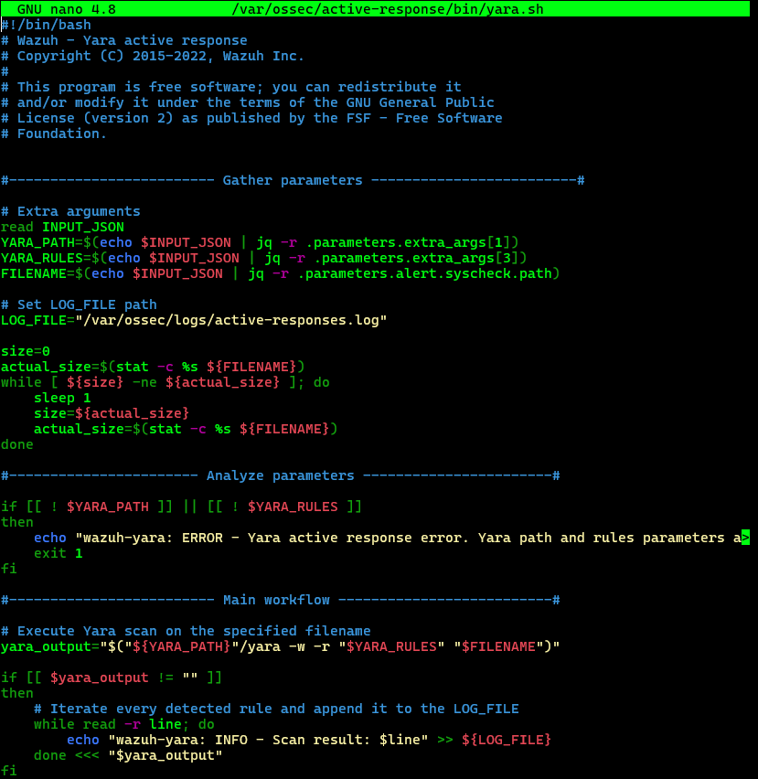
Set the ownership and permissions:

```bash
sudo chown root:wazuh /var/ossec/active-response/bin/yara.sh
sudo chmod 750 /var/ossec/active-response/bin/yara.sh
```
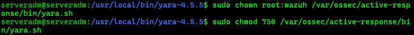
---

## 3 - Configure Wazuh Server

The Wazuh Server can monitor changes made to files in a specific directory on an endpoint.

When a file is created or modified, Wazuh detects the event and can trigger an Active Response to perform additional analysis, such as scanning the file with YARA.

If the file is identified as suspicious, Wazuh can generate an alert and take the configured response action.

### Configure File Integrity Monitoring

On the Wazuh Agent, open the configuration file:

```bash
sudo nano /var/ossec/etc/ossec.conf
```

Locate the `<syscheck>` section.

Add:

```xml
<directories realtime="yes">/tmp/yara/malware</directories>
```

Save the configuration:

```text
Ctrl + X
Y
Enter
```
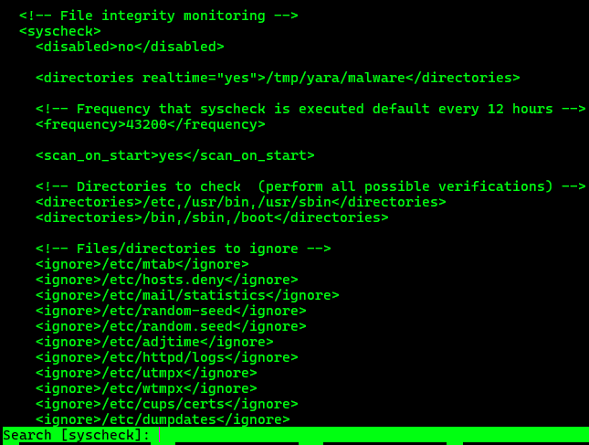

Restart the Wazuh Agent:

```bash
sudo systemctl restart wazuh-agent
```

### Configure Wazuh Detection Rules

On the Wazuh Server, open:

```bash
sudo nano /var/ossec/etc/rules/local_rules.xml
```

Add the following rules:

```xml
<group name="syscheck,">

    <rule id="100300" level="7">
        <if_sid>550</if_sid>
        <field name="file">/tmp/yara/malware/</field>
        <description>File modified in /tmp/yara/malware/ directory.</description>
    </rule>

    <rule id="100301" level="7">
        <if_sid>554</if_sid>
        <field name="file">/tmp/yara/malware/</field>
        <description>File added to /tmp/yara/malware/ directory.</description>
    </rule>

</group>

<group name="yara,">

    <rule id="108000" level="0">
        <decoded_as>yara_decoder</decoded_as>
        <description>Yara grouping rule</description>
    </rule>

    <rule id="108001" level="12">
        <if_sid>108000</if_sid>
        <match>wazuh-yara: INFO - Scan result: </match>
        <description>File "$(yara_scanned_file)" is a positive match. Yara rule: $(yara_rule)</description>
    </rule>

</group>
```

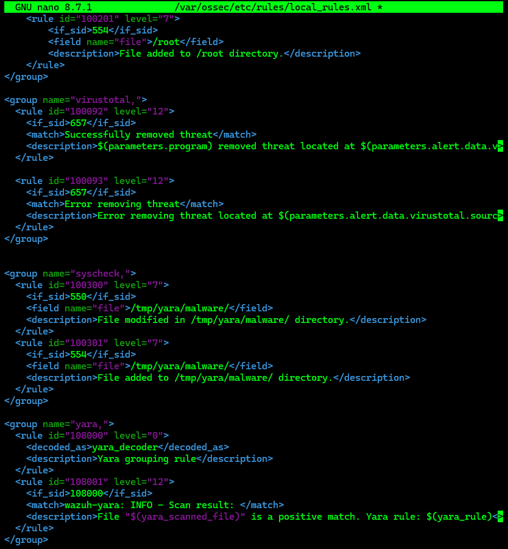

Save the file:

```text
Ctrl + X
Y
Enter
```

### Configure YARA Decoders

Open the decoder configuration:

```bash
sudo nano /var/ossec/etc/decoders/local_decoder.xml
```

Add:

```xml
<decoder name="yara_decoder">
    <prematch>wazuh-yara:</prematch>
</decoder>

<decoder name="yara_decoder1">
    <parent>yara_decoder</parent>
    <regex>wazuh-yara: (\S+) - Scan result: (\S+) (\S+)</regex>
    <order>log_type, yara_rule, yara_scanned_file</order>
</decoder>
```

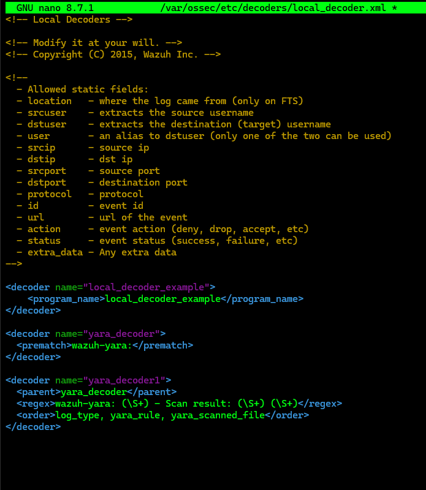

Save the file:

```text
Ctrl + X
Y
Enter
```

### Configure Wazuh Active Response

Open the Wazuh Server configuration:

```bash
sudo nano /var/ossec/etc/ossec.conf
```

Search for:

```text
active-response
```

Add:

```xml
<command>
    <name>yara_linux</name>
    <executable>yara.sh</executable>
    <extra_args>-yara_path /usr/local/bin -yara_rules /tmp/yara/rules/yara_rules.yar</extra_args>
    <timeout_allowed>no</timeout_allowed>
</command>

<active-response>
    <disabled>no</disabled>
    <command>yara_linux</command>
    <location>local</location>
    <rules_id>100300,100301</rules_id>
</active-response>
```

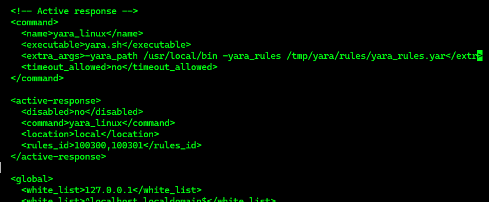

Save the file:

```text
Ctrl + X
Y
Enter
```

Restart the Wazuh Manager:

```bash
sudo systemctl restart wazuh-manager
```

---

## 4 - Attack Emulation

On the monitored endpoint, create the directory:

```bash
sudo mkdir /tmp/yara/malware
```

Create the malware downloader script:

```bash
sudo nano /tmp/yara/malware/malware_downloader.sh
```

Add:

```bash
#!/bin/bash

# Wazuh - Malware Downloader for test purposes
# Copyright (C) 2015-2022, Wazuh Inc.
#
# This program is free software; you can redistribute it
# and/or modify it under the terms of the GNU General Public
# License (version 2) as published by the FSF - Free Software
# Foundation.

function fetch_sample(){
    curl -s -XGET "$1" -o "$2"
}

echo "WARNING: Downloading Malware samples, please use this script with caution."
read -p "  Do you want to continue? (y/n)" -n 1 -r ANSWER
echo

if [[ $ANSWER =~ ^[Yy]$ ]]
then

    echo

    # Mirai
    echo "# Mirai: https://en.wikipedia.org/wiki/Mirai_(malware)"
    echo "Downloading malware sample..."
    fetch_sample "https://raw.githubusercontent.com/wazuh/wazuh-documentation/refs/heads/4.14/resources/samples/mirai" "/tmp/yara/malware/mirai" && echo "Done!" || echo "Error while downloading."

    echo

    # Xbash
    echo "# Xbash: https://unit42.paloaltonetworks.com/unit42-xbash-combines-botnet-ransomware-coinmining-worm-targets-linux-windows/"
    echo "Downloading malware sample..."
    fetch_sample "https://raw.githubusercontent.com/wazuh/wazuh-documentation/refs/heads/4.14/resources/samples/xbash" "/tmp/yara/malware/xbash" && echo "Done!" || echo "Error while downloading."

    echo

    # VPNFilter
    echo "# VPNFilter: https://news.sophos.com/en-us/2018/05/24/vpnfilter-botnet-a-sophoslabs-analysis/"
    echo "Downloading malware sample..."
    fetch_sample "https://raw.githubusercontent.com/wazuh/wazuh-documentation/refs/heads/4.14/resources/samples/vpn_filter" "/tmp/yara/malware/vpn_filter" && echo "Done!" || echo "Error while downloading."

    echo

    # Webshell
    echo "# WebShell: https://github.com/SecWiki/WebShell-2/blob/master/Php/Worse%20Linux%20Shell.php"
    echo "Downloading malware sample..."
    fetch_sample "https://raw.githubusercontent.com/wazuh/wazuh-documentation/refs/heads/4.14/resources/samples/webshell" "/tmp/yara/malware/webshell" && echo "Done!" || echo "Error while downloading."

    echo

fi
```

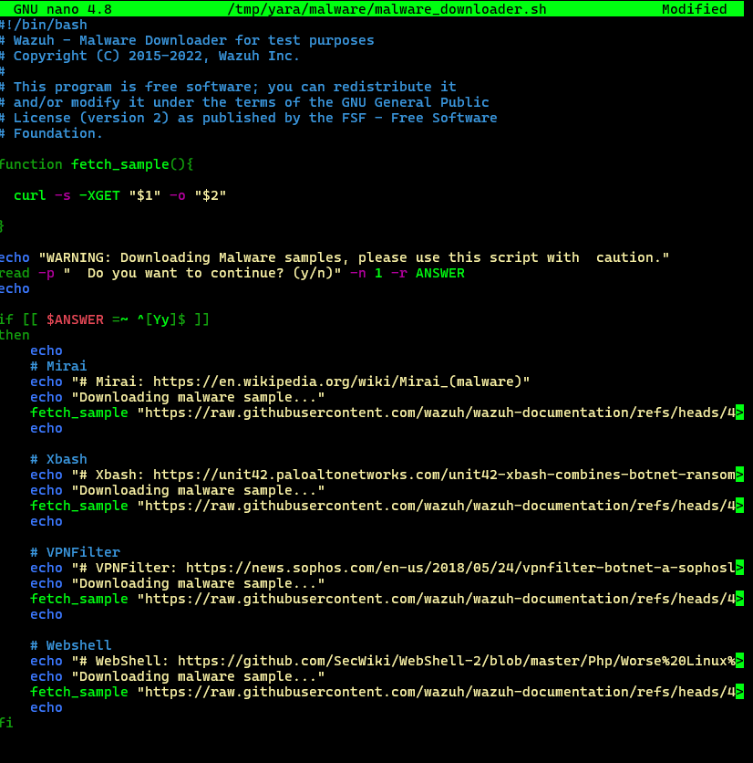

Save the file:

```text
Ctrl + X
Y
Enter
```

Run the downloader script:

```bash
sudo bash /tmp/yara/malware/malware_downloader.sh
```

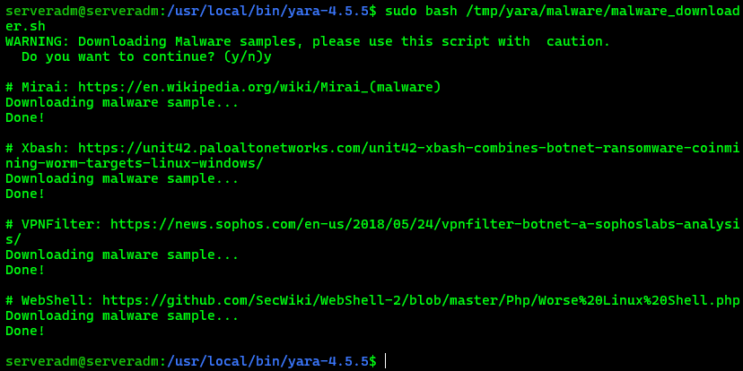

The malware samples are downloaded to:

```text
/tmp/yara/malware/
```

### Visualize the Alerts

You can visualize the alert data in the Wazuh Dashboard.

Go to the **Threat Hunting** module and add the following filter:

```text
rule.groups:yara
```

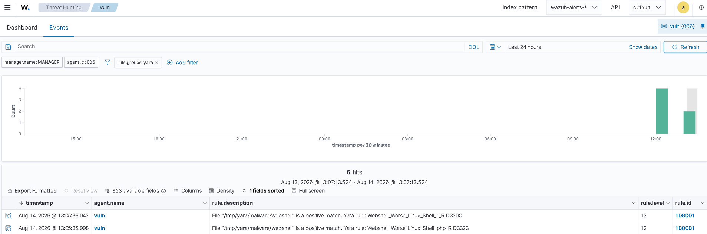

### YARA Detection Results

During the initial testing phase, several malware samples were placed in the monitored directory to validate the Wazuh and YARA integration.

The **WebShell** sample was successfully detected by the existing YARA rule set, generating a positive match in the Wazuh Dashboard.

However, the **Mirai**, **Xbash**, and **VPNFilter** samples did not generate a YARA match using the current rule set.

This does not indicate a problem with the YARA integration.

YARA was successfully executed and the existing rules correctly detected the WebShell sample.

The results indicate that the current rule set does not contain signatures that match these specific malware samples.

To improve detection coverage, custom YARA rules will be created for the Mirai, Xbash, and VPNFilter samples.

These rules will then be tested independently with YARA and integrated into the Wazuh Active Response workflow.

The final validation will confirm that each custom rule can detect its corresponding malware sample and generate an alert in the Wazuh Dashboard.

---

## 5 - Custom YARA Rules

After confirming that the existing YARA rule set did not detect the Mirai, Xbash, and VPNFilter samples, the characteristics and integrity of each malware sample were verified using `sha256sum` and `file`.

The samples were identified as different ELF binaries:

- **Mirai** — 32-bit MIPS, statically linked and stripped.
- **Xbash** — 64-bit x86-64, dynamically linked.
- **VPNFilter** — 32-bit Intel 80386, statically linked and stripped.

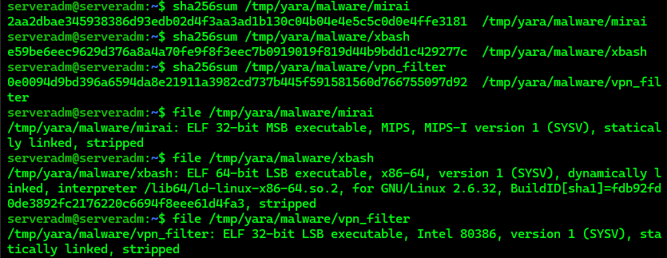

Create the custom YARA rule file:

```bash
sudo nano /tmp/yara/rules/custom_malware.yar
```

Add:

```yara
import "hash"

rule Mirai_Wazuh_PoC
{
    meta:
        description = "Detects the Mirai sample used in the Wazuh YARA PoC"
        author = "FMartinsCyberSec"
        purpose = "Wazuh YARA integration testing"

    condition:
        hash.sha256(0, filesize) == "2aa2dbae345938386d93edb02d4f3aa3ad1b130c04b04e4e5c5c0d0e4ffe3181"
}

rule Xbash_Wazuh_PoC
{
    meta:
        description = "Detects the Xbash sample used in the Wazuh YARA PoC"
        author = "FMartinsCyberSec"
        purpose = "Wazuh YARA integration testing"

    condition:
        hash.sha256(0, filesize) == "e59be6eec9629d376a8a4a70fe9f8f3eec7b0919019f819d44b9bdd1c429277c"
}

rule VPNFilter_Wazuh_PoC
{
    meta:
        description = "Detects the VPNFilter sample used in the Wazuh YARA PoC"
        author = "FMartinsCyberSec"
        purpose = "Wazuh YARA integration testing"

    condition:
        hash.sha256(0, filesize) == "0e0094d9bd396a6594da8e21911a3982cd737b445f591581560d766755097d92"
}
```

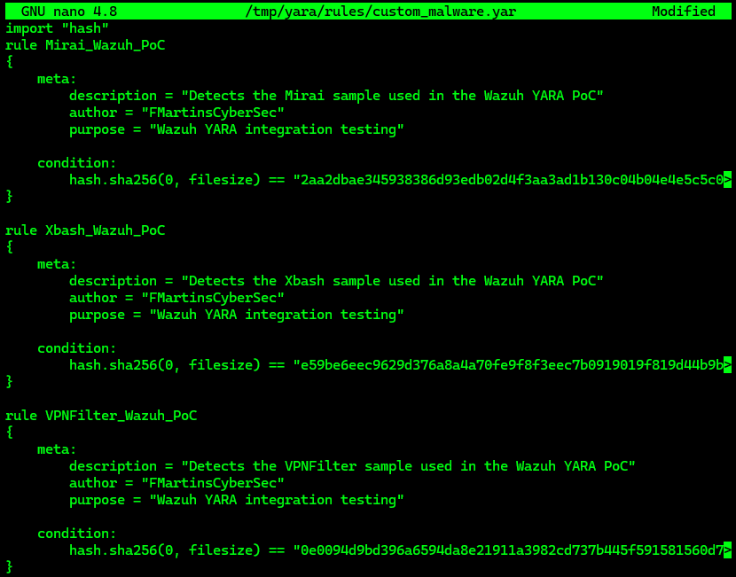

Save the file:

```text
Ctrl + X
Y
Enter
```

The custom rules were created specifically to identify the three samples.

Before integrating them with Wazuh, validate each rule directly with YARA.

### 5.1 Validate the Custom YARA Rules

Validate the Mirai sample:

```bash
sudo /usr/local/bin/yara -r /tmp/yara/rules/custom_malware.yar /tmp/yara/malware/mirai
```

Validate the Xbash sample:

```bash
sudo /usr/local/bin/yara -r /tmp/yara/rules/custom_malware.yar /tmp/yara/malware/xbash
```

Validate the VPNFilter sample:

```bash
sudo /usr/local/bin/yara -r /tmp/yara/rules/custom_malware.yar /tmp/yara/malware/vpn_filter
```

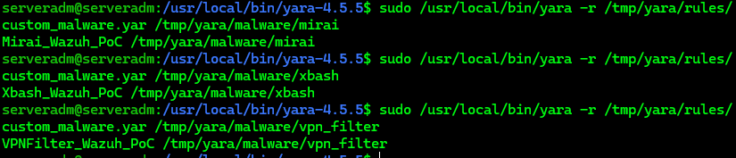

### Verify the Number of Rules

Check the current number of rules:

```bash
sudo grep -c "^rule " /tmp/yara/rules/yara_rules.yar
```

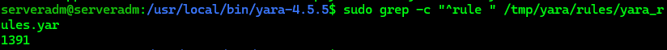

### Combine the Two Files

Append the custom rules to the existing YARA rules:

```bash
sudo sh -c 'printf "\n\n" >> /tmp/yara/rules/yara_rules.yar && cat /tmp/yara/rules/custom_malware.yar >> /tmp/yara/rules/yara_rules.yar'
```

Verify the number of rules again:

```bash
sudo grep -c "^rule " /tmp/yara/rules/yara_rules.yar
```

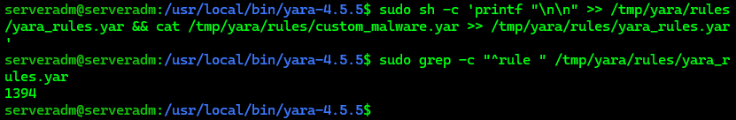

The three custom rules are now included in the existing YARA rule set.

### Final Malware Detection Test

Delete everything from `/tmp/yara/malware/` except `malware_downloader.sh`:

```bash
sudo find /tmp/yara/malware/ -mindepth 1 ! -name 'malware_downloader.sh' -delete
```

Run the malware downloader again:

```bash
sudo bash /tmp/yara/malware/malware_downloader.sh
```

### Visualize the Alerts

Go to the **Threat Hunting** module in the Wazuh Dashboard and add:

```text
rule.groups:yara
```

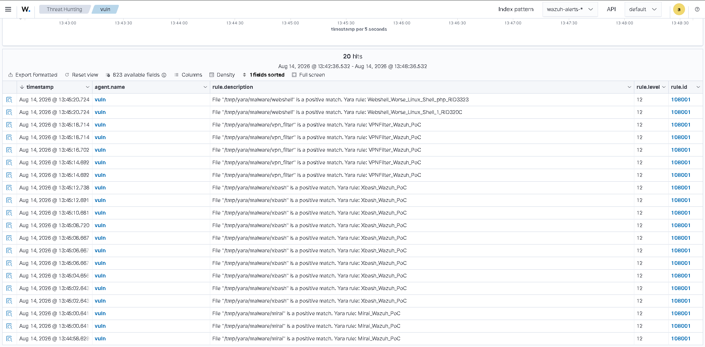

---

## 6 - Detection Workflow

The complete detection workflow implemented in this Proof of Concept is:

```text
Malware sample
      ↓
File Integrity Monitoring
      ↓
Custom Wazuh rule
      ↓
Active Response
      ↓
YARA
      ↓
Custom YARA rule
      ↓
Wazuh alert
```

---

## Conclusion

This Proof of Concept demonstrates the integration of **Wazuh**, **File Integrity Monitoring**, **Active Response**, and **YARA** to detect malware samples on a monitored endpoint.

The initial validation confirmed that the existing YARA rule set successfully detected the **WebShell** sample, while the **Mirai**, **Xbash**, and **VPNFilter** samples were not detected by the existing rules.

Custom YARA rules were then created using SHA-256 hashes specific to the three test samples.

Each custom rule was independently validated with YARA before being added to the existing rule set.

The final validation confirmed that the custom rules were integrated into the Wazuh-YARA workflow and generated alerts in the Wazuh Dashboard.

This demonstrates how custom YARA signatures can extend the detection coverage of a Wazuh environment.

---

> **Security Note:** This Proof of Concept uses malware samples for controlled security testing. Perform this procedure only in an isolated and authorized laboratory environment.

---

## Next Step

Additional Proofs of Concept and detection scenarios will be added to the project progressively.

**Status: Work in Progress (WIP)**